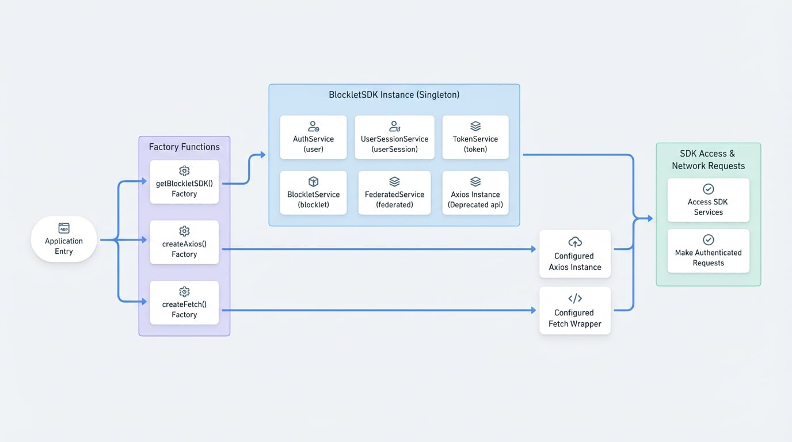

# SDK 用戶端

SDK 用戶端提供了與 `@blocklet/js-sdk` 互動的主要入口點。它提供了一個主要的 `BlockletSDK` 類別，該類別捆綁了所有可用的服務，以及幾個工廠函數（`getBlockletSDK`、`createAxios`、`createFetch`），以便於存取和實例化。

本節為這些核心元件提供了詳細的參考。有關實際範例，請參閱 [發送 API 請求](./guides-making-api-requests.md) 指南。

<!-- DIAGRAM_IMAGE_START:architecture:16:9 -->

<!-- DIAGRAM_IMAGE_END -->

## BlockletSDK 類別

`BlockletSDK` 類別是一個容器，它持有所有不同服務的實例，為 SDK 的功能提供單一存取點。

雖然您可以直接實例化它，但建議的獲取實例方法是透過 `getBlockletSDK()` 工廠函數，這能確保在您的應用程式中只有一個共享的實例。

### 屬性

在 `BlockletSDK` 實例上，可透過屬性存取以下服務：

| 屬性 | 服務 | 描述 |
|---------------|------------------------------------------------------------|--------------------------------------------------------------|
| `user` | [AuthService](./api-services-auth.md) | 管理使用者個人資料、設定和驗證操作。 |
| `userSession` | [UserSessionService](./api-services-user-session.md) | 獲取並管理跨裝置的使用者登入會話。 |
| `token` | [TokenService](./api-services-token.md) | 用於管理會話和刷新權杖的低階服務。 |
| `blocklet` | [BlockletService](./api-services-blocklet.md) | 獲取並載入 blocklet 元資料。 |
| `federated` | [FederatedService](./api-services-federated.md) | 與聯合登入群組設定互動。 |
| `api` | `Axios` | **已棄用。** 一個 Axios 實例。請改用 `createAxios()`。 |

## 工廠函數

這些輔助函數提供了建立 SDK 用戶端和 HTTP 請求處理器的便利方法。

### getBlockletSDK()

`getBlockletSDK()`

此函數返回 `BlockletSDK` 類別的單例實例。使用單例模式可確保應用程式的所有部分共享相同的 SDK 狀態，包括權杖資訊和服務設定。

**返回**

一個 `BlockletSDK` 單例實例。

```javascript 使用 getBlockletSDK icon=logos:javascript
import { getBlockletSDK } from '@blocklet/js-sdk';

const sdk = getBlockletSDK();

async function fetchUserProfile() {
  try {
    const profile = await sdk.user.getProfile();
    console.log('User Profile:', profile);
  } catch (error) {
    console.error('Failed to fetch profile:', error);
  }
}

fetchUserProfile();
```

### createAxios()

`createAxios(config, requestParams)`

這是建立預先設定的 [Axios](https://axios-http.com/) 實例的推薦工廠函數。該實例會自動處理在發送的請求中加入授權標頭，並在會話權杖過期時自動刷新。

**參數**

<x-field-group>
  <x-field data-name="config" data-type="AxiosRequestConfig" data-required="false" data-desc="可選。一個標準的 Axios 設定物件。任何有效的 Axios 選項都可以在此傳入。"></x-field>
  <x-field data-name="requestParams" data-type="RequestParams" data-required="false" data-desc="可選。用於 SDK 特定請求處理的額外參數。"></x-field>
</x-field-group>

**返回**

一個已設定自動權杖管理攔截器的 `Axios` 實例。

```javascript 建立 Axios 用戶端 icon=logos:javascript
import { createAxios } from '@blocklet/js-sdk';

// Create an API client with a base URL
const apiClient = createAxios({
  baseURL: '/api/v1',
});

async function getItems() {
  try {
    // The Authorization header is automatically added
    const response = await apiClient.get('/items');
    return response.data;
  } catch (error) {
    console.error('Error fetching items:', error);
    throw error;
  }
}
```

### createFetch()

`createFetch(options, requestParams)`

對於偏好原生 [Fetch API](https://developer.mozilla.org/en-US/docs/Web/API/Fetch_API) 的開發者，此函數會返回一個包裝過的 `fetch` 函數，提供與 `createAxios` 相同的自動權杖管理功能。

**參數**

<x-field-group>
  <x-field data-name="options" data-type="RequestInit" data-required="false" data-desc="可選。Fetch API 的預設選項，例如標頭，定義在標準的 RequestInit 類型中。"></x-field>
  <x-field data-name="requestParams" data-type="RequestParams" data-required="false" data-desc="可選。用於 SDK 特定請求處理的額外參數。"></x-field>
</x-field-group>

**返回**

一個與 `fetch` 相容且能自動處理驗證的函數。

```javascript 建立 Fetch 用戶端 icon=logos:javascript
import { createFetch } from '@blocklet/js-sdk';

// Create a fetcher with default JSON headers
const apiFetcher = createFetch({
  headers: {
    'Content-Type': 'application/json',
  },
});

async function postItem(item) {
  try {
    const response = await apiFetcher('/api/v1/items', {
      method: 'POST',
      body: JSON.stringify(item),
    });

    if (!response.ok) {
      throw new Error(`HTTP error! status: ${response.status}`);
    }

    return await response.json();
  } catch (error) {
    console.error('Error posting item:', error);
    throw error;
  }
}
```

---

SDK 用戶端初始化後，您現在可以探索它提供的各種服務，以與 Blocklet 生態系統互動。

<x-cards>
  <x-card data-title="驗證指南" data-icon="lucide:key-round" data-href="/guides/authentication">
    了解 SDK 如何簡化使用者驗證和權杖管理。
  </x-card>
  <x-card data-title="服務 API 參考" data-icon="lucide:book-open" data-href="/api/services">
    深入了解每個服務的詳細 API 文件。
  </x-card>
</x-cards>