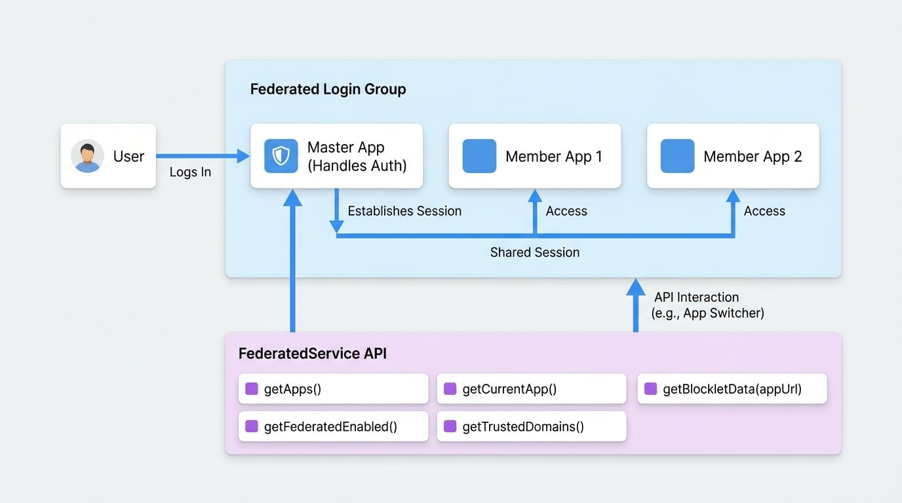

# FederatedService

`FederatedService` 提供了一個用於與統一登入站點群設定互動的 API。它允許您檢索有關控制登入會話的「主」應用程式和使用者正在互動的「目前」應用程式的資訊。這對於建立像統一應用程式切換器這樣的功能，或了解使用者在相互連接的 Blocklet 群組中的會話上下文至關重要。

統一登入站點群 (Federated Login Group) 允許多個 Blocklet 共享單一使用者會話，在使用者於它們之間導覽時提供無縫體驗。其中一個 Blocklet 作為主應用程式，處理身份驗證，而其他則是成員。

<!-- DIAGRAM_IMAGE_START:architecture:16:9 -->

<!-- DIAGRAM_IMAGE_END -->

## 常見使用案例：建立應用程式切換器

`FederatedService` 最常見的使用案例是建立一個 UI 元件，列出群組中的所有應用程式，讓使用者可以輕鬆地在它們之間切換。`getApps()` 方法就是專為此目的設計的。

```javascript Example: Fetching Apps for a UI Component icon=logos:javascript
import { getBlockletSDK } from '@blocklet/js-sdk';

const sdk = getBlockletSDK();

// 取得統一登入群組中所有應用程式的列表
// 主應用程式將永遠是列表中的第一個。
const apps = sdk.federated.getApps();

console.log('Available apps:', apps);

// 然後，您可以使用這個 'apps' 陣列來呈現下拉式選單、
// 側邊欄或任何其他導覽元件。
apps.forEach(app => {
  console.log(`App Name: ${app.appName}, URL: ${app.appUrl}`);
});
```

## API 參考

### getApps()

檢索與目前統一登入上下文相關的應用程式列表。它會智慧地結合主應用程式和目前應用程式，確保在啟用統一登入時，主應用程式始終列在第一位。

**回傳值**

<x-field data-name="" data-type="Array<AppInfo | ServerInfo>">
  <x-field-desc markdown>一個包含應用程式資訊物件的陣列。如果啟用統一登入，主應用程式永遠是第一個元素。</x-field-desc>
</x-field>

**範例**

```javascript icon=logos:javascript
const appList = sdk.federated.getApps();
console.log(appList);
```

**範例回應**

```json
[
  {
    "appId": "z1masterAppDid",
    "appName": "主應用程式",
    "appDescription": "群組的主要應用程式。",
    "appLogo": "/assets/logo.png",
    "appPid": "z8tmasterAppPid",
    "appUrl": "https://master.example.com",
    "version": "1.2.0",
    "sourceAppPid": "z8tmasterAppPid",
    "provider": "wallet"
  },
  {
    "appId": "z1currentAppDid",
    "appName": "目前成員應用程式",
    "appDescription": "您目前正在使用的應用程式。",
    "appLogo": "/assets/logo.png",
    "appPid": "z8tcurrentAppPid",
    "appUrl": "https://member.example.com",
    "version": "1.0.0",
    "sourceAppPid": null,
    "provider": "wallet"
  }
]
```

### getCurrentApp()

取得目前正在執行的應用程式的資訊。這可以是一個標準的 Blocklet 或 Blocklet Server 本身。

**回傳值**

<x-field data-name="" data-type="AppInfo | ServerInfo | null">
  <x-field-desc markdown>一個包含目前應用程式詳細資訊的物件，如果無法確定，則為 `null`。</x-field-desc>
</x-field>

**範例**

```javascript icon=logos:javascript
const currentApp = sdk.federated.getCurrentApp();
if (currentApp) {
  console.log(`You are currently on: ${currentApp.appName}`);
}
```

### getFederatedApp()

取得統一登入站點群中主應用程式的資訊。如果目前應用程式不屬於統一登入群組，此方法將回傳 `null`。

**回傳值**

<x-field data-name="" data-type="AppInfo | null">
  <x-field-desc markdown>一個包含主應用程式詳細資訊的物件，如果不在統一登入模式下，則為 `null`。</x-field-desc>
</x-field>

**範例**

```javascript icon=logos:javascript
const masterApp = sdk.federated.getFederatedApp();
if (masterApp) {
  console.log(`The master app is: ${masterApp.appName}`);
}
```

### getFederatedEnabled()

檢查統一登入站點群功能是否已啟用並經使用者批准。

**回傳值**

<x-field data-name="" data-type="boolean">
  <x-field-desc markdown>如果已配置統一登入且狀態為「已批准」，則回傳 `true`，否則回傳 `false`。</x-field-desc>
</x-field>

**範例**

```javascript icon=logos:javascript
const isFederated = sdk.federated.getFederatedEnabled();
if (isFederated) {
  console.log('Federated login is active.');
} else {
  console.log('This is a standalone application.');
}
```

### getTrustedDomains()

非同步地獲取為統一登入站點群配置的受信任網域列表。

**回傳值**

<x-field data-name="" data-type="Promise<Array<string>>">
  <x-field-desc markdown>一個解析為受信任網域字串陣列的 promise。</x-field-desc>
</x-field>

**範例**

```javascript icon=logos:javascript
async function logTrustedDomains() {
  try {
    const domains = await sdk.federated.getTrustedDomains();
    console.log('Trusted domains:', domains);
  } catch (error) {
    console.error('Failed to get trusted domains:', error);
  }
}

logTrustedDomains();
```

### getBlockletData()

從給定的應用程式 URL 非同步地獲取並解析 `__blocklet__.js` 中繼資料檔案。此方法包含快取以避免多餘的網路請求。

**參數**

<x-field-group>
  <x-field data-name="appUrl" data-type="string" data-required="true" data-desc="您想獲取其資料的 Blocklet 的基本 URL。"></x-field>
  <x-field data-name="force" data-type="boolean" data-default="false" data-required="false" data-desc="如果為 true，則繞過快取並獲取新資料。"></x-field>
</x-field-group>

**回傳值**

<x-field data-name="" data-type="Promise<any | null>">
  <x-field-desc markdown>一個解析為 `__blocklet__.js` 中解析出的 JSON 資料的 promise，失敗時為 `null`。</x-field-desc>
</x-field>

**範例**

```javascript icon=logos:javascript
async function fetchMetadata(url) {
  const metadata = await sdk.federated.getBlockletData(url);
  if (metadata) {
    console.log(`Metadata for ${url}:`, metadata.name, metadata.version);
  }
}

fetchMetadata('https://some-blocklet.example.com');
```

## 類型

這些是 `FederatedService` 方法回傳的主要資料結構。

### AppInfo

代表一個標準的 Blocklet 應用程式。

```typescript AppInfo Type icon=material-symbols:data-object-outline
type AppInfo = {
  appId: string;
  appName: string;
  appDescription: string;
  appLogo: string;
  appPid: string;
  appUrl: string;
  version: string;
  sourceAppPid: string;
  provider: string;
};
```

### ServerInfo

代表 Blocklet Server 實例。

```typescript ServerInfo Type icon=material-symbols:data-object-outline
type ServerInfo = {
  appId: string;
  appName: string;
  appDescription: string;
  appUrl: string;
  sourceAppPid: string;
  provider: string;
  type: 'server';
};
```

---

現在您已了解如何使用統一登入的應用程式，您可能會想管理使用者在不同裝置上的登入會話。請前往 [UserSessionService](./api-services-user-session.md) 文件以了解更多資訊。