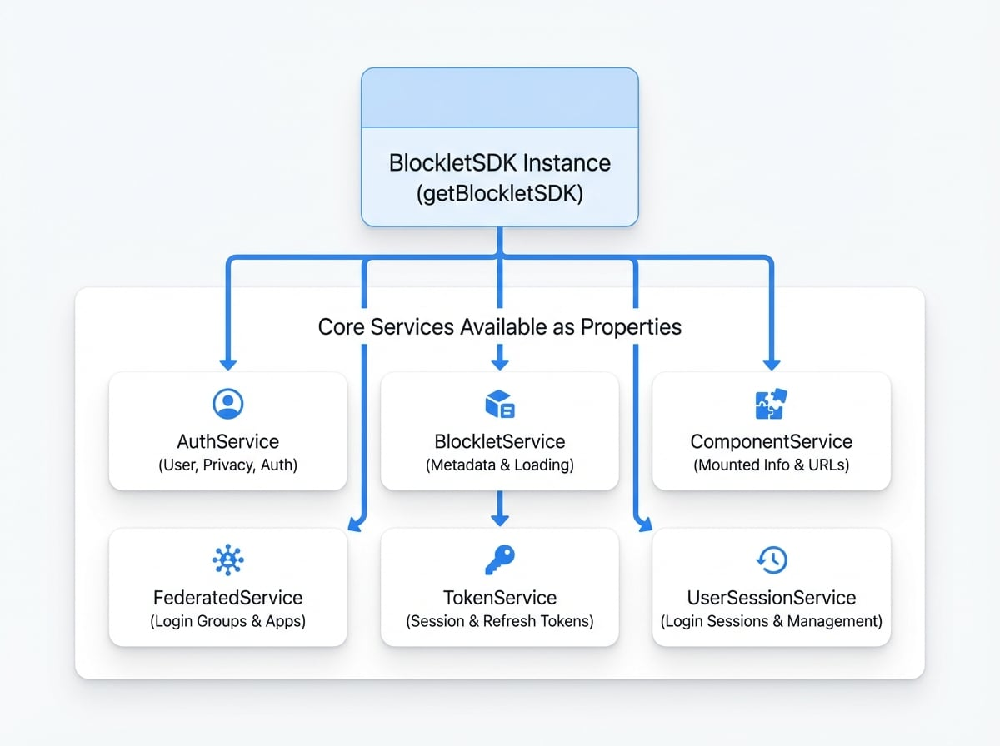

# サービス

`@blocklet/js-sdk`は、いくつかのサービスクラスに編成されており、それぞれが特定の機能ドメインを担当しています。これらのサービスは、さまざまなBlocklet APIエンドポイントの専用クライアントとして機能し、プラットフォームの機能と対話するための構造化された直感的な方法を提供します。

ほとんどのコアサービスは、`getBlockletSDK()`関数を使用して取得できるメインの`BlockletSDK`インスタンスのプロパティとして事前に初期化され、利用可能です。

```javascript Accessing a Service icon=logos:javascript
import { getBlockletSDK } from '@blocklet/js-sdk';

const sdk = getBlockletSDK();

// AuthServiceにアクセスしてユーザー情報を取得
async function getUserProfile() {
  const profile = await sdk.user.getProfile();
  console.log(profile);
}

// BlockletServiceにアクセスしてblocklet情報を取得
async function getBlockletMeta() {
  const meta = await sdk.blocklet.getMeta();
  console.log(meta);
}
```

下の図は、`BlockletSDK`インスタンスの構造とコアサービスとの関係を示しています。

<!-- DIAGRAM_IMAGE_START:architecture:1:1 -->

<!-- DIAGRAM_IMAGE_END -->

以下は、利用可能なサービスの完全なリストです。任意のサービスをクリックすると、その詳細なAPIリファレンスが表示されます。

<x-cards data-columns="2">
  <x-card data-title="AuthService" data-href="/api/services/auth" data-icon="lucide:user-cog">
    ユーザープロファイル、プライバシー設定、通知、およびログアウトなどの認証アクションを管理するためのAPI。
  </x-card>
  <x-card data-title="BlockletService" data-href="/api/services/blocklet" data-icon="lucide:box">
    `window.blocklet`またはリモートURLからblockletメタデータを取得およびロードするためのAPI。
  </x-card>
  <x-card data-title="ComponentService" data-href="/api/services/component" data-icon="lucide:layout-template">
    マウントされたコンポーネントに関する情報を取得し、それらのURLを構築するためのAPI。
  </x-card>
  <x-card data-title="FederatedService" data-href="/api/services/federated" data-icon="lucide:network">
    Federated Login Group設定と対話し、マスターアプリと現在のアプリに関する情報を取得するためのAPI。
  </x-card>
  <x-card data-title="TokenService" data-href="/api/services/token" data-icon="lucide:key-round">
    ストレージ（CookiesおよびLocalStorage）からセッショントークンとリフレッシュトークンを取得、設定、削除するための低レベルAPI。
  </x-card>
  <x-card data-title="UserSessionService" data-href="/api/services/user-session" data-icon="lucide:users">
    ユーザーログインセッションを取得および管理するためのAPI。
  </x-card>
</x-cards>

各サービスは、Blockletプラットフォームの特定の部分に焦点を当てたメソッドのセットを提供します。これらのサービスによって返されるデータ構造と型を理解するには、[型](./api-types.md)のリファレンスを参照してください。