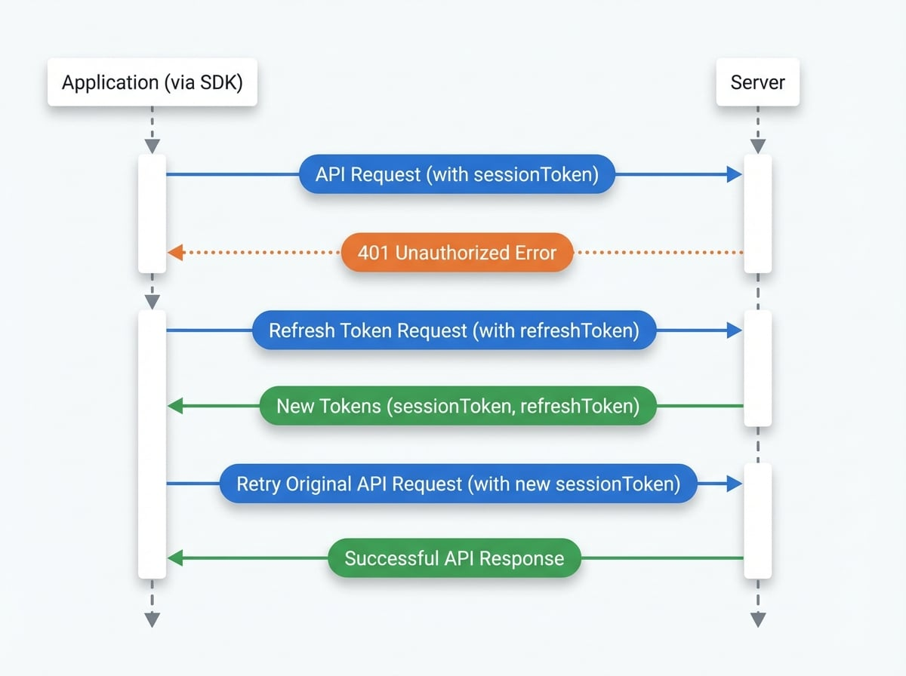

# 驗證

`@blocklet/js-sdk` 旨在透過自動處理基於權杖的安全性的複雜性，使驗證過程無縫接軌。它在背景管理會話權杖和刷新權杖，讓您可以專注於建構應用程式的功能。

本指南將解釋自動權杖更新的過程，並示範如何使用 `AuthService` 來管理使用者驗證狀態，例如獲取個人資料和登出。有關所有可用方法的詳細列表，請參閱 [AuthService API 參考](./api-services-auth.md)。

## 自動會話權杖更新

SDK 採用一個標準且安全的驗證流程，使用短期的會話權杖和長期的刷新權杖。當您使用 SDK 的請求輔助工具（參見 [發送 API 請求](./guides-making-api-requests.md)）發起 API 呼叫時，此過程是完全自動化的：

1.  **請求發起**：SDK 會將目前的 `sessionToken` 附加到您 API 請求的授權標頭中。
2.  **權杖過期**：如果 `sessionToken` 已過期，伺服器會回應 `401 Unauthorized` 錯誤。
3.  **自動刷新**：SDK 的請求攔截器會捕捉到這個 `401` 錯誤。然後，它會自動將儲存的 `refreshToken` 發送到驗證端點，以獲取新的 `sessionToken` 和 `refreshToken`。
4.  **請求重試**：一旦接收並儲存了新的權杖，SDK 會透明地重試先前失敗的原始 API 請求。這次會使用新的、有效的 `sessionToken`。
5.  **成功回應**：伺服器驗證新權杖並返回成功的回應，然後將其傳回您的應用程式程式碼。

這整個過程對您的應用程式邏輯是透明的，確保使用者會話在不中斷使用者體驗的情況下保持活動狀態。

下圖說明了此流程：

<!-- DIAGRAM_IMAGE_START:sequence:4:3 -->

<!-- DIAGRAM_IMAGE_END -->

## 使用 AuthService 管理使用者狀態

`AuthService` 為常見的驗證和使用者管理任務提供了一個高階 API。您可以透過主 SDK 實例存取它。

### 獲取目前使用者的個人資料

若要獲取目前登入使用者的個人資料資訊，請使用 `getProfile` 方法。

```javascript 獲取使用者個人資料 icon=logos:javascript
import { getBlockletSDK } from '@blocklet/js-sdk';

const sdk = getBlockletSDK();

async function fetchUserProfile() {
  try {
    const profile = await sdk.auth.getProfile();
    console.log('使用者個人資料:', profile);
    return profile;
  } catch (error) {
    console.error('獲取個人資料失敗:', error);
  }
}

fetchUserProfile();
```

### 登出

`logout` 方法會使伺服器上使用者的目前會話失效。您可以不帶參數地呼叫它以登出目前設備，或傳入 `visitorId` 來登出特定會話，這對於管理跨多個設備的會話很有用。

```javascript 登出使用者 icon=logos:javascript
import { getBlockletSDK } from '@blocklet/js-sdk';

const sdk = getBlockletSDK();

async function handleLogout() {
  try {
    // 登出目前會話
    await sdk.auth.logout();
    console.log('成功登出。');
    // 重定向到登入頁面或更新 UI 狀態
  } catch (error) {
    console.error('登出失敗:', error);
  }
}
```

### 刪除使用者帳戶

對於希望刪除其帳戶的使用者，SDK 提供了 `destroyMyself` 方法。這是一個破壞性且不可逆的操作，會永久刪除使用者的資料。

```javascript 刪除目前使用者的帳戶 icon=logos:javascript
import { getBlockletSDK } from '@blocklet/js-sdk';

const sdk = getBlockletSDK();

async function deleteAccount() {
  // 向使用者確認此操作至關重要
  if (window.confirm('您確定要刪除您的帳戶嗎？此操作不可逆。')) {
    try {
      const result = await sdk.auth.destroyMyself();
      console.log(`DID 為 ${result.did} 的帳戶已被刪除。`);
      // 執行清理並重定向使用者
    } catch (error) {
      console.error('刪除帳戶失敗:', error);
    }
  }
}
```

## 後續步驟

現在您已經了解 `@blocklet/js-sdk` 中的驗證機制，您可能會想探索如何管理使用者的所有活動會話。

<x-card data-title="管理使用者會話" data-icon="lucide:user-cog" data-href="/guides/managing-user-sessions" data-cta="閱讀指南">
了解如何使用 UserSessionService 獲取和管理使用者在不同設備上的登入會話。
</x-card>