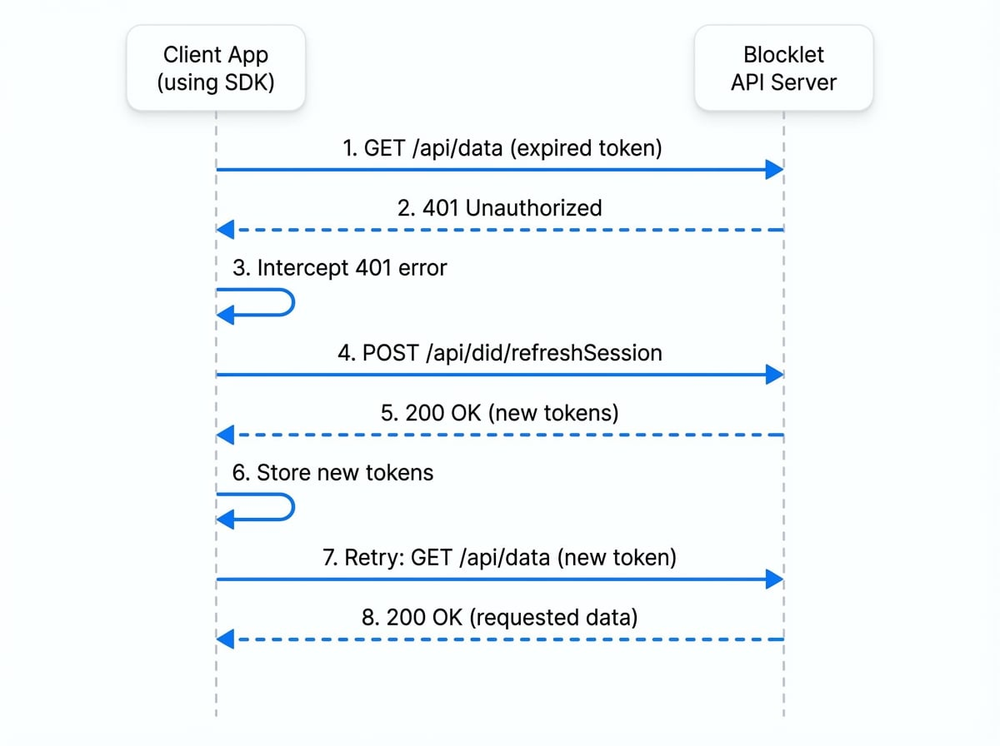

# 發送 API 請求

`@blocklet/js-sdk` 提供了強大、預先配置的輔助工具，用於向您的 Blocklet 服務發送 API 請求。這些輔助工具，`createAxios` 和 `createFetch`，旨在自動處理身份驗證和會話管理的複雜性，讓您可以專注於建構應用程式的功能。

主要功能包括：
- **自動注入權杖**：會話權杖會自動包含在 `Authorization` 標頭中。
- **自動刷新權杖**：如果請求因 401 未授權錯誤而失敗，SDK 會自動嘗試刷新會話權杖並重試原始請求一次。
- **CSRF 保護**：`x-csrf-token` 標頭會附加到每個請求中，以增強安全性。
- **基礎 URL 處理**：請求會自動加上正確的元件掛載點前綴，無需手動建構 URL。
- **安全回應驗證**：一個可選的安全層，用於驗證來自 Blocklet 伺服器的回應完整性。

---

## 使用 `createAxios`

對於偏好使用 `axios` 函式庫的開發者，`createAxios` 函式會返回一個 `axios` 實例，其中內建了 SDK 請求處理的所有優點。它支援所有標準的 `axios` 配置和功能。

### 基本用法

以下是如何建立一個實例並發出一個簡單的 `GET` 請求：

```javascript Basic Axios Request icon=logos:javascript
import { createAxios } from '@blocklet/js-sdk';

// 建立一個由 SDK 管理的 axios 實例
const api = createAxios();

async function fetchData() {
  try {
    const response = await api.get('/api/users/profile');
    console.log('使用者個人資料：', response.data);
  } catch (error) {
    console.error('無法取得使用者個人資料：', error);
  }
}

fetchData();
```

在此範例中，`createAxios` 配置了該實例以自動處理身份驗證標頭和權杖刷新邏輯。對 `/api/users/profile` 的請求將被正確路由到元件的後端。

### 自訂配置

您可以將任何有效的 `axios` 配置物件傳遞給 `createAxios` 來客製化其行為，例如設定自訂的基礎 URL 或新增預設標頭。

```javascript Custom Axios Configuration icon=logos:javascript
import { createAxios } from '@blocklet/js-sdk';

const customApi = createAxios({
  baseURL: '/api/v2/',
  timeout: 10000, // 10 秒
  headers: { 'X-Custom-Header': 'MyValue' },
});

async function postData() {
  const response = await customApi.post('/items', { name: 'New Item' });
  console.log('項目已建立：', response.data);
}
```

---

## 使用 `createFetch`

如果您偏好基於標準 Web `fetch` API 的更輕量級解決方案，`createFetch` 函式是完美的選擇。它提供了一個 `fetch` 的包裝器，包含了與 `axios` 輔助工具相同的自動權杖管理和安全功能。

### 基本用法

`createFetch` 函式返回一個非同步函式，其簽章與原生的 `fetch` 相似。

```javascript Basic Fetch Request icon=logos:javascript
import { createFetch } from '@blocklet/js-sdk';

// 建立一個由 SDK 管理的 fetch 實例
const fetcher = createFetch();

async function fetchData() {
  try {
    const response = await fetcher('/api/users/profile');
    if (!response.ok) {
      throw new Error(`HTTP 錯誤！狀態碼：${response.status}`);
    }
    const data = await response.json();
    console.log('使用者個人資料：', data);
  } catch (error) {
    console.error('無法取得使用者個人資料：', error);
  }
}

fetchData();
```

### 自訂配置

您可以將一個預設的 `RequestInit` 物件傳遞給 `createFetch`，為使用該實例發出的所有請求設定全域選項。您也可以在每個請求的基礎上覆寫這些選項。

```javascript Custom Fetch Configuration icon=logos:javascript
import { createFetch } from '@blocklet/js-sdk';

// 設定全域選項
const fetcher = createFetch({
  headers: {
    'Content-Type': 'application/json',
  },
});

async function postData() {
  const response = await fetcher('/api/items', {
    method: 'POST',
    body: JSON.stringify({ name: 'New Item' }),
  });
  const data = await response.json();
  console.log('項目已建立：', data);
}
```

## 自動權杖更新流程

`createAxios` 和 `createFetch` 都能優雅地處理會話過期。下圖說明了當使用過期權杖進行 API 呼叫時發生的自動化過程。

<!-- DIAGRAM_IMAGE_START:sequence:4:3 -->

<!-- DIAGRAM_IMAGE_END -->

整個流程對您的應用程式碼是透明的，確保了無縫的使用者體驗，無需手動干預。

---

## 安全請求

對於敏感操作，您可以透過驗證 API 回應的簽章來啟用額外的安全層。這可以確保回應在伺服器和用戶端之間未被竄改。要啟用此功能，請在您的請求配置中將 `secure` 選項設定為 `true`。

### 使用 `createAxios`

```javascript Axios Secure Request icon=logos:javascript
import { createAxios } from '@blocklet/js-sdk';
const api = createAxios();

// SDK 將驗證回應簽章。
// 如果驗證失敗，promise 將被拒絕並回傳一個錯誤。
const response = await api.get('/api/billing/details', { secure: true });
```

### 使用 `createFetch`

```javascript Fetch Secure Request icon=logos:javascript
import { createFetch } from '@blocklet/js-sdk';
const fetcher = createFetch();

const response = await fetcher('/api/billing/details', { secure: true });
// 只有在簽章有效時才會返回回應物件。
const data = await response.json();
```

## 後續步驟

現在您已經知道如何發送經過身份驗證的 API 請求，您可能會想更深入地了解 SDK 如何管理使用者身份和會話。

<x-cards>
  <x-card data-title="身份驗證" data-icon="lucide:key-round" data-href="/guides/authentication">
    了解會話權杖和刷新權杖的概念，以及如何管理使用者身份驗證狀態。
  </x-card>
  <x-card data-title="API 參考" data-icon="lucide:book-open" data-href="/api/client">
    探索 `createAxios`、`createFetch` 和其他 SDK 元件的詳細 API 文件。
  </x-card>
</x-cards>