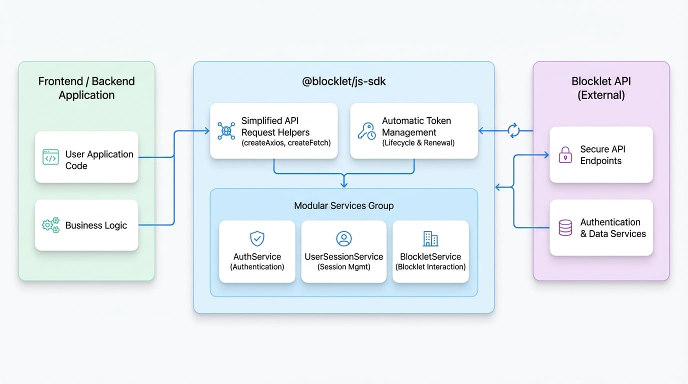

# Overview

The `@blocklet/js-sdk` is a comprehensive JavaScript library designed to streamline interactions with Blocklet services. Whether you're building a front-end application or a back-end service, this SDK provides a robust set of tools to handle authentication, session management, and API communication, allowing you to focus on building features rather than wrestling with low-level details.

It simplifies the entire process by abstracting away the complexities of token management and providing intuitive, high-level services for common tasks.

## Core Features

The SDK is built around a few key principles to make your development experience as smooth as possible.

<x-cards data-columns="3">
  <x-card data-title="Simplified API Requests" data-icon="lucide:send">
    Provides `createAxios` and `createFetch` helpers that come pre-configured with everything needed for authenticated API calls, including base URLs and interceptors.
  </x-card>
  <x-card data-title="Automatic Token Management" data-icon="lucide:key-round">
    Automatically handles the lifecycle of session and refresh tokens. It transparently renews expired tokens, ensuring your application remains authenticated without manual intervention.
  </x-card>
  <x-card data-title="Modular Service Architecture" data-icon="lucide:blocks">
    Organizes functionality into distinct services like `AuthService`, `UserSessionService`, and `BlockletService`, offering a clean and organized API surface.
  </x-card>
</x-cards>

## How It Works

Your application interacts with the SDK's services and request helpers. The SDK, in turn, manages all communication with the Blocklet API, handling the complexities of authentication and token renewal under the hood. This architecture ensures that your application code remains clean and focused on business logic. The following diagram illustrates this relationship:

<!-- DIAGRAM_IMAGE_START:architecture:16:9 -->

<!-- DIAGRAM_IMAGE_END -->

## Get Started

Ready to integrate the SDK into your project? Our Getting Started guide will walk you through the installation process and help you make your first API call in minutes.

<x-card data-title="Getting Started" data-icon="lucide:rocket" data-href="/getting-started" data-cta="Start Building">
  Follow our step-by-step guide to install the SDK and configure your application.
</x-card>