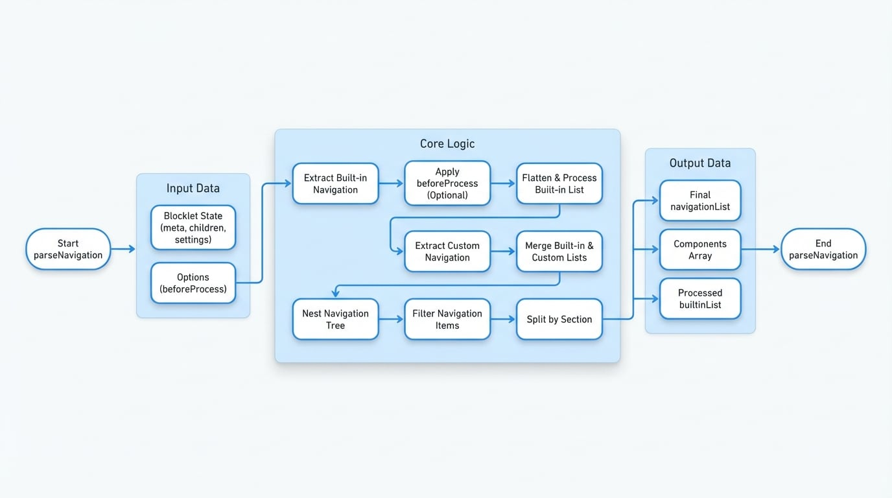

# ナビゲーションユーティリティ

これらの関数は、Blockletベースのアプリケーションで動的なユーザーインターフェースを構築するためのエンジンです。これらは、blockletのメタデータ（`blocklet.yml`）とその現在の状態から`navigation`プロパティを解析および処理し、メインのblockletとそのすべての子コンポーネントからのナビゲーション項目を、統一されたレンダリング可能な構造に集約します。

これらのユーティリティが解決する中心的な課題は、複雑さの管理です。複合アプリケーションでは、各コンポーネントが独自のナビゲーション項目を宣言できます。これらのユーティリティは、これらの宣言をインテリジェントにマージし、各コンポーネントのマウントポイントに基づいてパスプレフィックスを解決し、国際化（i18n）を処理し、重複またはアクセス不能な項目を除外し、すべてを論理的なセクション（`header`、`footer`、`userCenter`など）に整理します。

## コア処理フロー

以下の図は、さまざまなソースからの生のナビゲーションメタデータが、UI用の最終的な構造化されたリストに変換される高レベルのプロセスを示しています。

<!-- DIAGRAM_IMAGE_START:flowchart:16:9 -->

<!-- DIAGRAM_IMAGE_END -->

## メイン関数

### `parseNavigation(blocklet, options)`

これはナビゲーションデータを処理するための主要な関数です。`blocklet.yml`ファイルからのビルトインナビゲーションの解析から、データベースに保存されているユーザー定義のカスタマイズとのマージまで、ワークフロー全体を統括します。

**パラメータ**

<x-field-group>
  <x-field data-name="blocklet" data-type="object" data-required="true" data-desc="`meta`、`children`、および`settings.navigations`を含む、完全なblockletの状態オブジェクト。"></x-field>
  <x-field data-name="options" data-type="object" data-required="false" data-desc="解析プロセス用のオプション設定。">
    <x-field data-name="beforeProcess" data-type="(data: any) => any" data-required="false" data-desc="ビルトインナビゲーションリストが圧縮されパッチが適用される前に、それを前処理するためのオプションの関数。"></x-field>
  </x-field>
</x-field-group>

**戻り値**

処理されたナビゲーションデータを含むオブジェクト：

<x-field-group>
  <x-field data-name="navigationList" data-type="NavigationItem[]" data-desc="最終的にマージされ、クリーンアップされたレンダリング可能なナビゲーション項目のリスト。これが主要な出力です。"></x-field>
  <x-field data-name="components" data-type="ComponentItem[]" data-desc="ナビゲーションを宣言するすべての子コンポーネントの配列。名前、リンク、タイトルが含まれます。"></x-field>
  <x-field data-name="builtinList" data-type="NavigationItem[]" data-desc="設定からのカスタムナビゲーションとマージされる前の、`blocklet.yml`ファイルから純粋に派生した処理済みのナビゲーション項目のリスト。"></x-field>
</x-field-group>

**使用例**

```javascript 基本的な使用法 icon=logos:javascript
import { parseNavigation } from '@blocklet/meta/lib/navigation';

// 単純化されたblockletの状態オブジェクト
const blockletState = {
  did: 'z1...',
  meta: {
    name: 'my-app',
    title: 'My App',
    navigation: [
      { id: 'home', title: 'Home', link: '/' },
      { id: 'dashboard', title: 'Dashboard', component: 'dashboard-blocklet' },
    ],
  },
  children: [
    {
      did: 'z2...',
      mountPoint: '/dashboard',
      meta: {
        name: 'dashboard-blocklet',
        title: 'Dashboard',
        navigation: [
          { id: 'overview', title: 'Overview', link: '/overview' },
        ],
      },
    },
  ],
  settings: {
    // データベースからのカスタムナビゲーション項目
    navigations: [
      {
        id: 'external-link',
        title: 'External Site',
        link: 'https://example.com',
        section: 'header',
        from: 'db',
        visible: true,
      },
    ],
  },
};

const { navigationList, components } = parseNavigation(blockletState);

console.log(navigationList);
/*
以下のような構造化された配列を出力します:
[
  { id: '/home', title: 'Home', link: '/', ... },
  {
    id: '/dashboard/overview',
    title: 'Overview',
    link: '/dashboard/overview',
    component: 'dashboard-blocklet',
    ...
  },
  { id: 'external-link', title: 'External Site', ... }
]
*/
console.log(components);
/*
コンポーネント情報を出力します:
[
  {
    did: 'z2...',
    name: 'dashboard-blocklet',
    link: '/dashboard',
    title: 'Dashboard',
    ...
  }
]
*/
```

## ヘルパー関数

`parseNavigation`はオールインワンのソリューションですが、ライブラリはいくつかの基礎となるヘルパー関数もエクスポートしています。これらは、ナビゲーションデータに対してカスタム操作を実行する必要がある高度なユースケースで役立ちます。

<x-cards data-columns="2">
  <x-card data-title="deepWalk" data-icon="lucide:git-commit">
    ツリー状のオブジェクトを再帰的に走査し、各ノードにコールバックを適用する汎用ユーティリティ。
  </x-card>
  <x-card data-title="flattenNavigation" data-icon="lucide:merge">
    ネストされたナビゲーションツリーをフラットな配列に変換します。オプションで指定された深さまで変換できます。
  </x-card>
  <x-card data-title="nestNavigationList" data-icon="lucide:git-branch-plus">
    項目が`parent` IDプロパティを持つフラットな配列から、ネストされたナビゲーションツリーを再構築します。
  </x-card>
  <x-card data-title="splitNavigationBySection" data-icon="lucide:columns">
    複数のセクションに属するナビゲーション項目を、各セクションごとの個別の項目に分解します。
  </x-card>
  <x-card data-title="filterNavigation" data-icon="lucide:filter">
    `visible: false`とマークされた項目や、コンポーネントが見つからない項目を削除して、ナビゲーションリストをフィルタリングします。
  </x-card>
  <x-card data-title="joinLink" data-icon="lucide:link">
    親のリンクと子のリンクをインテリジェントに結合し、プレフィックスと絶対URLを正しく処理します。
  </x-card>
</x-cards>

### `flattenNavigation(list, options)`

この関数は、ナビゲーション項目のツリーを受け取り、それを単一レベルの配列にフラット化します。深いネストをサポートしないメニューでの表示や、処理を容易にするためにナビゲーションデータを準備する際に特に役立ちます。

**パラメータ**

<x-field-group>
  <x-field data-name="list" data-type="NavigationItem[]" data-required="true" data-desc="ツリー構造のナビゲーションリスト。"></x-field>
  <x-field data-name="options" data-type="object" data-required="false" data-desc="フラット化のための設定オプション。">
    <x-field data-name="depth" data-type="number" data-default="1" data-required="false" data-desc="ツリーをフラット化する深さ。深さ1は完全なフラット化を意味します。"></x-field>
    <x-field data-name="transform" data-type="(current, parent) => any" data-required="false" data-desc="各項目がフラット化される際に変換するための関数。"></x-field>
  </x-field>
</x-field-group>

**例**

```javascript ナビゲーションツリーのフラット化 icon=logos:javascript
const nestedNav = [
  {
    id: 'parent1',
    title: 'Parent 1',
    items: [
      { id: 'child1a', title: 'Child 1a' },
      { id: 'child1b', title: 'Child 1b' },
    ],
  },
];

const flatNav = flattenNavigation(nestedNav, { depth: 2 }); // 2レベルまでフラット化

console.log(flatNav);
/*
[
  { id: 'parent1', title: 'Parent 1' },
  { id: 'child1a', title: 'Child 1a' },
  { id: 'child1b', title: 'Child 1b' }
]
*/
```

### `nestNavigationList(list)`

`flattenNavigation`の逆の操作です。この関数は、子が`parent` IDを介して親を参照するナビゲーション項目のフラットな配列を受け取り、元のツリー構造を再構築します。

**パラメータ**

<x-field data-name="list" data-type="NavigationItem[]" data-required="true" data-desc="`id`と`parent`プロパティを持つナビゲーション項目のフラットな配列。"></x-field>

**例**

```javascript フラットなリストからツリーを構築 icon=logos:javascript
const flatNav = [
  { id: 'parent1', title: 'Parent 1', section: 'header' },
  { id: 'child1a', title: 'Child 1a', parent: 'parent1', section: 'header' },
  { id: 'root2', title: 'Root 2', section: 'header' },
];

const nestedNav = nestNavigationList(flatNav);

console.log(nestedNav);
/*
[
  {
    id: 'parent1',
    title: 'Parent 1',
    section: 'header',
    items: [ { id: 'child1a', title: 'Child 1a', ... } ],
  },
  { id: 'root2', title: 'Root 2', section: 'header' },
]
*/
```

---

これらのユーティリティは、複雑なコンポーネントベースのアプリケーションでナビゲーションを管理するための包括的なツールキットを提供します。これらのナビゲーション項目内で使用されるURLとパスのフォーマット方法を理解するには、[URL & パスユーティリティ](./api-url-path-utilities.md)のドキュメントに進んでください。