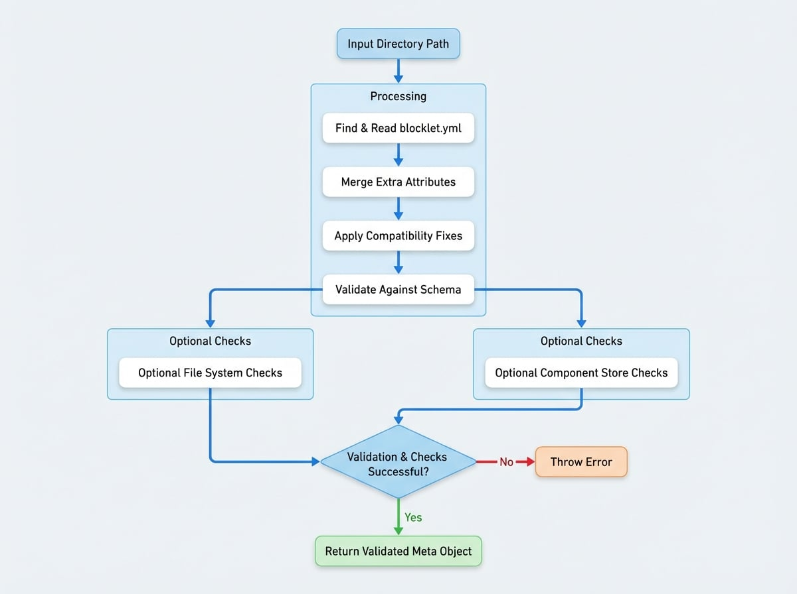

# 解析與驗證

本節為用於讀取、解析和驗證 `blocklet.yml` 檔案的函式提供了詳細的參考。這些工具是與 [Blocklet 規範](./spec.md) 搭配使用的程式化介面，可確保您的 blocklet 元資料正確、完整，並可供 Blocklet Server 和其他工具使用。

這些函式對於建構與 blocklet 互動的工具、在 CI/CD 管線中驗證設定，或以程式化方式讀取 blocklet 元資料至關重要。

## `parse`

`parse` 函式是從檔案系統讀取 blocklet 元資料的主要工具。它會在給定目錄中找到 `blocklet.yml`（或 `blocklet.yaml`）檔案，讀取其內容，套用一系列相容性修復，並根據官方 schema 驗證最終物件。

### 工作流程

解析過程遵循幾個關鍵步驟，以確保產生有效且一致的元資料物件。

<!-- DIAGRAM_IMAGE_START:flowchart:4:3 -->

<!-- DIAGRAM_IMAGE_END -->

### 簽名

```typescript
function parse(
  dir: string,
  options?: {
    ensureFiles?: boolean;
    ensureDist?: boolean;
    ensureComponentStore?: boolean;
    extraRawAttrs?: any;
    schemaOptions?: any;
    defaultStoreUrl?: string | ((component: TComponent) => string);
    fix?: boolean;
  }
): TBlockletMeta;
```

### 參數

<x-field-group>
  <x-field data-name="dir" data-type="string" data-required="true" data-desc="包含 blocklet.yml 檔案的 blocklet 目錄路徑。"></x-field>
  <x-field data-name="options" data-type="object" data-required="false" data-desc="一個可選的設定物件。">
    <x-field data-name="ensureFiles" data-type="boolean" data-default="false" data-desc="若為 true，則驗證 `logo` 和 `files` 欄位中列出的檔案是否確實存在於檔案系統中。"></x-field>
    <x-field data-name="ensureDist" data-type="boolean" data-default="false" data-desc="若為 true，則要求元資料中必須存在且有效的 `dist` 欄位。"></x-field>
    <x-field data-name="ensureComponentStore" data-type="boolean" data-default="true" data-desc="若為 true，則確保任何從 store 來源的元件都定義了 `source.store` URL。"></x-field>
    <x-field data-name="extraRawAttrs" data-type="object" data-desc="一個包含額外屬性的物件，會在驗證前合併到元資料中。可用於擴充元資料，例如在註冊中心中使用。"></x-field>
    <x-field data-name="schemaOptions" data-type="object" data-desc="傳遞給底層 Joi schema 驗證器的額外選項。"></x-field>
    <x-field data-name="defaultStoreUrl" data-type="string | function" data-desc="用作未指定 store 的元件的預設 store URL。可以是一個靜態字串或一個返回字串的函式。"></x-field>
    <x-field data-name="fix" data-type="boolean" data-default="true" data-desc="若為 true，則對元資料套用自動修復（例如，針對 `person`、`repository`、`keywords`）。"></x-field>
  </x-field>
</x-field-group>

### 返回值

返回一個經過驗證的 `TBlockletMeta` 物件。如果找不到 `blocklet.yml` 檔案、YAML 格式無效或 schema 驗證失敗，該函式將拋出一個帶有描述性訊息的 `Error`。

### 使用範例

```javascript parse-example.js icon=logos:javascript
import path from 'path';
import parse from '@blocklet/meta/lib/parse';

const blockletDir = path.join(__dirname, 'my-blocklet');

try {
  const meta = parse(blockletDir, {
    ensureFiles: true, // 確保 logo 存在
  });
  console.log('成功解析 blocklet:', meta.name, meta.version);
} catch (error) {
  console.error('解析 blocklet.yml 失敗:', error.message);
}
```

---

## `validateMeta`

當您已經有一個 blocklet 元資料物件（例如，來自資料庫或 API 回應）並且需要在不從檔案系統讀取的情況下根據 blocklet schema 對其進行驗證時，請使用 `validateMeta`。

### 簽名

```typescript
function validateMeta(
  meta: any,
  options?: {
    ensureFiles?: boolean;
    ensureDist?: boolean;
    ensureComponentStore?: boolean;
    ensureName?: boolean;
    skipValidateDidName?: boolean;
    schemaOptions?: any;
  }
): TBlockletMeta;
```

### 參數

<x-field-group>
  <x-field data-name="meta" data-type="any" data-required="true" data-desc="要驗證的原始 blocklet 元資料物件。"></x-field>
  <x-field data-name="options" data-type="object" data-required="false" data-desc="一個可選的設定物件，與 parse 類似。">
    <x-field data-name="ensureFiles" data-type="boolean" data-default="false" data-desc="若為 true，則驗證 `logo` 和 `files` 欄位中列出的檔案是否確實存在於檔案系統中。"></x-field>
    <x-field data-name="ensureDist" data-type="boolean" data-default="false" data-desc="若為 true，則要求元資料中必須存在且有效的 `dist` 欄位。"></x-field>
    <x-field data-name="ensureComponentStore" data-type="boolean" data-default="true" data-desc="若為 true，則確保任何從 store 來源的元件都定義了 `source.store` URL。"></x-field>
    <x-field data-name="ensureName" data-type="boolean" data-default="false" data-desc="若為 true，則要求 `name` 欄位必須存在。"></x-field>
    <x-field data-name="skipValidateDidName" data-type="boolean" data-default="false" data-desc="若為 true，且 blocklet 名稱是 DID 格式，它將跳過 DID 類型驗證。"></x-field>
    <x-field data-name="schemaOptions" data-type="object" data-desc="傳遞給底層 Joi schema 驗證器的額外選項。"></x-field>
  </x-field>
</x-field-group>

### 返回值

返回經過驗證和清理的 `TBlockletMeta` 物件。如果元資料物件驗證失敗，它會拋出一個 `Error`。

### 使用範例

```javascript validate-example.js icon=logos:javascript
import validateMeta from '@blocklet/meta/lib/validate';

const rawMeta = {
  name: 'my-first-blocklet',
  version: '1.0.0',
  description: 'A simple blocklet.',
  did: 'z8iZpA529j4Jk1iA...',
  // ... 其他屬性
};

try {
  const validatedMeta = validateMeta(rawMeta, { ensureName: true });
  console.log('元資料有效:', validatedMeta.title);
} catch (error) {
  console.error('無效的 blocklet 元資料:', error.message);
}
```

---

## `fixAndValidateService`

這是一個專門的輔助函式，用於驗證元資料中 `interfaces` 陣列每個條目內的 `services` 設定。主要的 `parse` 和 `validateMeta` 函式會在內部呼叫此函式，但它也被匯出，以便您在需要獨立處理服務設定時使用。

### 簽名

```typescript
function fixAndValidateService(meta: TBlockletMeta): TBlockletMeta;
```

### 參數

<x-field data-name="meta" data-type="TBlockletMeta" data-required="true" data-desc="包含要驗證的服務設定的 blocklet 元資料物件。"></x-field>

### 返回值

返回輸入的 `TBlockletMeta` 物件，其服務設定已經過驗證並可能使用預設值進行了修改。如果任何服務設定無效，它會拋出一個 `Error`。

### 使用範例

```javascript service-validate-example.js icon=logos:javascript
import { fixAndValidateService } from '@blocklet/meta/lib/validate';

const meta = {
  // ... 其他元資料屬性
  interfaces: [
    {
      type: 'web',
      name: 'publicUrl',
      path: '/',
      services: [
        {
          name: '@blocklet/service-auth',
          config: {
            // auth 服務設定
          },
        },
      ],
    },
  ],
};

try {
  const metaWithValidatedServices = fixAndValidateService(meta);
  console.log('服務設定有效。');
} catch (error) {
  console.error('無效的服務設定:', error.message);
}
```

---

## `validateBlockletEntry`

此工具函式用於驗證 blocklet 的進入點（`main` 屬性），以確保其針對其群組類型（`dapp` 或 `static`）進行了正確設定。對於 `dapp`，它會檢查所需檔案是否存在或 `engine` 設定是否有效。對於 `static` blocklet，它會確保 `main` 目錄存在。這是在解析後執行的一項關鍵檢查，以確認 blocklet 是可執行的。

### 簽名

```typescript
function validateBlockletEntry(dir: string, meta: TBlockletMeta): void;
```

### 參數

<x-field-group>
  <x-field data-name="dir" data-type="string" data-required="true" data-desc="blocklet bundle 的根目錄。"></x-field>
  <x-field data-name="meta" data-type="TBlockletMeta" data-required="true" data-desc="已解析並驗證的 blocklet 元資料物件。"></x-field>
</x-field-group>

### 返回值

此函式不返回值。如果進入點驗證失敗，它將拋出一個 `Error`，並附帶解釋問題的訊息。

### 使用範例

```javascript entry-validate-example.js icon=logos:javascript
import path from 'path';
import parse from '@blocklet/meta/lib/parse';
import validateBlockletEntry from '@blocklet/meta/lib/entry';

const blockletDir = path.join(__dirname, 'my-dapp');

try {
  const meta = parse(blockletDir);
  validateBlockletEntry(blockletDir, meta);
  console.log('Blocklet 進入點有效。');
} catch (error) {
  console.error('驗證失敗:', error.message);
}
```

---

現在您已了解如何解析和驗證元資料，您可能想探索從遠端來源擷取元資料的輔助函式。請前往 [元資料輔助函式](./api-metadata-helpers.md) 部分以了解更多資訊。