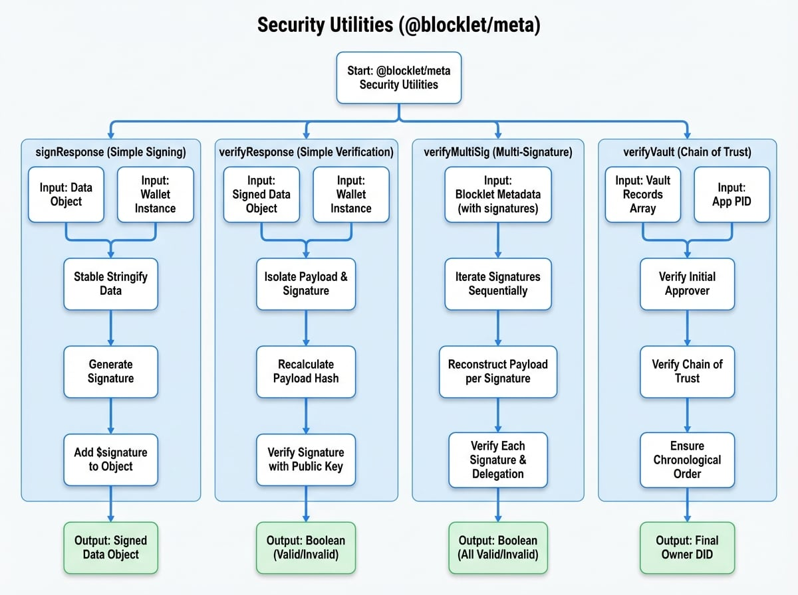

# 安全性公用程式

`@blocklet/meta` 函式庫提供了一套用於處理密碼學操作的安全性公用程式。這些函式對於確保資料的完整性和真實性至關重要，特別是用於簽署和驗證 Blocklet 中繼資料和 API 回應。它們構成了 Blocklet 生態系統內信任的基石。

本節涵蓋了用於簡單請求/回應簽署的函式，以及更複雜的多重簽章和信任鏈驗證方案。

---

## signResponse

為任何 JSON 可序列化物件新增一個密碼學簽章。此函式使用一種穩定的字串化方法 (`json-stable-stringify`)，以確保在用提供的錢包物件簽署之前，負載是一致的。產生的簽章會被新增到物件的 `$signature` 欄位下，使其易於驗證。

### 參數

<x-field-group>
  <x-field data-name="data" data-type="T extends Record<string, any>" data-required="true" data-desc="要簽署的資料物件。"></x-field>
  <x-field data-name="wallet" data-type="WalletObject" data-required="true" data-desc="一個用於產生簽章的 `@ocap/wallet` 實例。"></x-field>
</x-field-group>

### 返回值

<x-field data-name="T & { $signature: string }" data-type="object" data-desc="原始物件增加了 `$signature` 屬性，其中包含密碼學簽章字串。"></x-field>

### 範例

```javascript 簽署一個資料物件 icon=lucide:shield-check
import { signResponse } from '@blocklet/meta';
import { fromRandom } from '@ocap/wallet';

// 建立一個新錢包用於簽署
const wallet = fromRandom();

const myData = {
  user: wallet.did,
  action: 'updateProfile',
  timestamp: Date.now(),
};

const signedData = signResponse(myData, wallet);

console.log(signedData);
/*
輸出：
{
  user: 'z...',
  action: 'updateProfile',
  timestamp: 1678886400000,
  $signature: '...'
}
*/
```

---

## verifyResponse

驗證先前已簽署物件（通常使用 `signResponse`）的簽章。它會自動從 `$signature` 屬性中分離出負載，使用相同的穩定字串化方法重新計算負載的雜湊值，並使用所提供錢包的公鑰對其進行驗證。

### 參數

<x-field-group>
  <x-field data-name="signed" data-type="T & { $signature?: string }" data-required="true" data-desc="包含待驗證 `$signature` 的資料物件。"></x-field>
  <x-field data-name="wallet" data-type="WalletObject" data-required="true" data-desc="一個對應於用於簽署的金鑰對的 `@ocap/wallet` 實例。"></x-field>
</x-field-group>

### 返回值

<x-field data-name="Promise<boolean>" data-type="Promise<boolean>" data-desc="一個 promise，如果簽章有效則解析為 `true`，否則解析為 `false`。"></x-field>

### 範例

```javascript 驗證一個已簽署的物件 icon=lucide:verified
import { signResponse, verifyResponse } from '@blocklet/meta';
import { fromRandom } from '@ocap/wallet';

async function main() {
  const wallet = fromRandom();
  const myData = { user: wallet.did, action: 'updateProfile' };

  // 1. 簽署資料
  const signedData = signResponse(myData, wallet);
  console.log('Signed Data:', signedData);

  // 2. 驗證有效的簽章
  const isValid = await verifyResponse(signedData, wallet);
  console.log(`Signature is valid: ${isValid}`); // 預期：true

  // 3. 竄改資料並再次嘗試驗證
  const tamperedData = { ...signedData, action: 'grantAdminAccess' };
  const isTamperedValid = await verifyResponse(tamperedData, wallet);
  console.log(`Tampered signature is valid: ${isTamperedValid}`); // 預期：false
}

main();
```

---

## verifyMultiSig

一個用於驗證由多方簽署的 blocklet 中繼資料 (`blocklet.yml`) 的精密公用程式。它會依序處理簽章，並遵循每個簽章中的 `excludes` 和 `appended` 欄位，以正確重建各方所簽署的確切負載。這使得不同的參與者（例如，開發者、發行者、市集）能夠協作並簽署中繼資料，從而實現一個可稽核的中繼資料編寫流程。

此函式還能處理委派簽章，即一個 DID 透過 JWT（簽章物件中的 `delegation` 欄位）授權另一個 DID 代表其簽署。

### 多重簽章驗證流程

<!-- DIAGRAM_IMAGE_START:flowchart:4:3 -->

<!-- DIAGRAM_IMAGE_END -->

### 參數

<x-field-group>
  <x-field data-name="blockletMeta" data-type="TBlockletMeta" data-required="true" data-desc="完整的 blocklet 中繼資料物件，包括 `signatures` 陣列。"></x-field>
</x-field-group>

### 返回值

<x-field data-name="Promise<boolean>" data-type="Promise<boolean>" data-desc="一個 promise，如果鏈中的所有簽章根據多重簽章規則均有效，則解析為 `true`，否則解析為 `false`。"></x-field>

### 範例

```javascript 驗證具有多個簽章的 Blocklet 中繼資料 icon=lucide:pen-tool
import verifyMultiSig from '@blocklet/meta/lib/verify-multi-sig';

async function verifyMetadata() {
  const blockletMeta = {
    name: 'my-multi-sig-blocklet',
    version: '1.0.0',
    description: 'A blocklet with multiple authors.',
    author: 'did:abt:z1...',
    signatures: [
      {
        // 開發者的簽章
        signer: 'did:abt:z1...',
        pk: '...',
        sig: '...',
        // 第一個簽署者在新增 `signatures` 和 `publisherInfo` *之前* 簽署內容。
        excludes: ['signatures', 'publisherInfo'], 
      },
      {
        // 發行者的簽章，他可能會新增自己的欄位。
        signer: 'did:abt:z2...',
        pk: '...',
        sig: '...',
        // 發行者在簽署前新增了此欄位。
        appended: ['publisherInfo'], 
      },
    ],
    publisherInfo: {
      name: 'Blocklet Store',
      did: 'did:abt:z2...',
    },
  };

  const isValid = await verifyMultiSig(blockletMeta);
  console.log(`Multi-signature metadata is valid: ${isValid}`);
}

verifyMetadata();
```

---

## verifyVault

驗證「vault」的信任鏈，該 vault 代表特定應用程式上下文中一系列的所有權或控制權變更。vault 中的每個條目都必須按時間順序排序並經過密碼學簽署。對於第一個條目之後的條目，簽章必須由前一位擁有者批准，從而建立一個不可中斷、可驗證的鏈條。此機制對於安全、基於 DID 的資產或管理角色所有權轉移等功能至關重要。

### Vault 信任鏈

```d2 Vault 驗證流程
direction: down

initial-approver: {
  label: "初始批准者\n（例如，應用程式 DID）"
  shape: c4-person
}

vault-1: {
  label: "Vault 1\n擁有者：使用者 A"
  shape: rectangle
}

vault-2: {
  label: "Vault 2\n擁有者：使用者 B"
  shape: rectangle
}

vault-3: {
  label: "Vault 3\n擁有者：使用者 C"
  shape: rectangle
}

initial-approver -> vault-1: "1. 批准使用者 A 為第一位擁有者"
vault-1 -> vault-2: "2. 使用者 A 批准使用者 B 為下一位擁有者"
vault-2 -> vault-3: "3. 使用者 B 批准使用者 C 為最終擁有者"

```

### 參數

<x-field-group>
  <x-field data-name="vaults" data-type="VaultRecord[]" data-required="true" data-desc="一個 vault 記錄陣列，按 `at` 時間戳記依時間順序排序。"></x-field>
  <x-field data-name="appPid" data-type="string" data-required="true" data-desc="應用程式的 DID 或 vault 上下文的唯一識別碼。"></x-field>
  <x-field data-name="throwOnError" data-type="boolean" data-default="false" data-required="false" data-desc="如果為 `true`，函式將在驗證失敗時擲回錯誤，而不是返回空字串。"></x-field>
</x-field-group>

### 返回值

<x-field data-name="Promise<string>" data-type="Promise<string>" data-desc="一個 promise，解析為鏈中最終有效擁有者的 DID。除非 `throwOnError` 為 `true`，否則失敗時返回空字串。"></x-field>

### 範例

```javascript 驗證所有權 Vault icon=lucide:lock-keyhole
import { verifyVault } from '@blocklet/meta';

// 一個應用程式 vault 鏈的簡化範例
async function checkVault() {
  const vaults = [
    {
      pk: 'pk_user1',
      did: 'did:abt:user1',
      at: 1672531200,
      sig: 'sig_user1_commit',
      approverPk: 'pk_app',
      approverDid: 'did:abt:app',
      approverSig: 'sig_app_approve_user1',
    },
    {
      pk: 'pk_user2',
      did: 'did:abt:user2',
      at: 1672534800,
      sig: 'sig_user2_commit',
      // 由前一位擁有者（user1）批准
      approverSig: 'sig_user1_approve_user2', 
    },
  ];
  const appDid = 'did:abt:app';

  try {
    const finalOwnerDid = await verifyVault(vaults, appDid);
    if (finalOwnerDid) {
      console.log(`Vault 有效。最終擁有者：${finalOwnerDid}`);
      // 預期：Vault is valid. Final owner: did:abt:user2
    } else {
      console.error('Vault 驗證失敗。');
    }
  } catch (error) {
    console.error('Vault 驗證擲回錯誤：', error.message);
  }
}

checkVault();
```