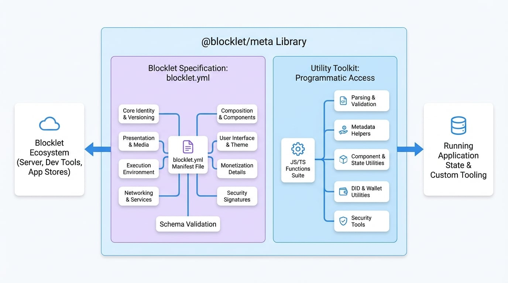

# 概述

`@blocklet/meta` 是 Blocklet 生态系统中的一个基础库，作为管理 blocklet 元数据的权威工具包。它为 `blocklet.yml` 清单文件建立了正式规范，并提供了一套全面的实用函数，用于以编程方式解析、验证、修复和与此元数据交互。

该库的核心是确保每个 blocklet 都以一致、可靠且机器可读的方式进行描述。这种标准化是整个 Blocklet 生态系统的动力，从运行你的应用程序的 Blocklet Server 到帮助你构建应用程序的开发者工具。

<!-- DIAGRAM_IMAGE_START:architecture:16:9 -->

<!-- DIAGRAM_IMAGE_END -->

本文档分为两个主要部分，反映了该库本身的双重目的。

## Blocklet 规范：`blocklet.yml`

`blocklet.yml` 文件是 blocklet 的蓝图。它是一个声明式清单，你可以在其中定义应用程序的各个方面。`@blocklet/meta` 库包含用于验证此文件的正式模式，确保 Blocklet 平台可以正确安装、配置、运行和管理你的应用程序。你可以定义的关键方面包括：

- **核心身份**：`name`、`version` 以及 blocklet 唯一的去中心化 ID（`did`）。
- **展示**：`title`、`description`、`logo` 以及用于在应用商店中展示的屏幕截图。
- **执行环境**：运行时 `engine`（例如，Node.js）、生命周期 `scripts`（如 `pre-start`）以及所需的 `environments` 变量。
- **网络与服务**：暴露的 Web `interfaces`、内部服务和所需端口。
- **组合**：要作为 `components` 包含的其他 blocklet 的列表，以实现模块化应用设计。
- **用户界面**：用于与仪表盘集成的 `navigation` 链接和用于视觉一致性的 `theme` 设置。
- **商业化**：用于设置价格和收入共享的 `payment` 详情。
- **安全**：用于验证元数据完整性和作者身份的加密 `signatures`。

## 实用工具包：编程式访问

除了定义规范，`@blocklet/meta` 还为开发者提供了一套丰富的 JavaScript/TypeScript 函数，用于处理 blocklet 元数据和状态。这个工具包对于构建与 Blocklet 生态系统交互的自定义工具、插件或复杂应用程序至关重要。

这些实用工具可以分为几个关键类别：

- **解析与验证**：像 `parse` 和 `validateMeta` 这样的函数允许你从磁盘读取 `blocklet.yml` 文件，并根据官方模式验证其内容。
- **元数据助手**：一系列用于自动修复常见格式问题、格式化 person 对象、解析仓库 URL 等的函数。
- **组件与状态实用工具**：一套强大的助手函数（`forEachBlocklet`、`findComponent`、`getAppUrl` 等），用于遍历正在运行的 blocklet 及其组件的状态，这对于构建管理仪表盘和动态应用程序至关重要。
- **DID 与钱包实用工具**：用于处理与 blocklet 关联的去中心化标识符（DID）和加密钱包的函数，例如 `toBlockletDid` 和 `getBlockletWallet`。
- **安全**：像 `signResponse` 和 `verifyResponse` 这样的工具，用于对数据进行签名和验证，以确保完整性和真实性。

## 接下来做什么？

<x-cards data-columns="3">
  <x-card data-title="开始使用" data-href="/getting-started" data-icon="lucide:rocket">
    安装该库，在几分钟内解析你的第一个 `blocklet.yml` 文件。
  </x-card>
  <x-card data-title="Blocklet 规范 (blocklet.yml)" data-href="/spec" data-icon="lucide:book-marked">
    深入了解 `blocklet.yml` 清单文件中每个字段的综合参考。
  </x-card>
  <x-card data-title="API 参考" data-href="/api" data-icon="lucide:code-2">
    浏览库中所有可用工具函数的详细文档。
  </x-card>
</x-cards>