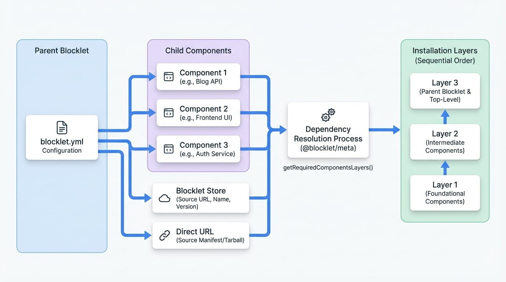

# 組合 (元件)

Blocklet 組合是一項強大的功能，可讓您透過組裝更小、獨立的 blocklet 來建構複雜的模組化應用程式。這種方法有助於提高可重用性、關注點分離和簡化維護。`blocklet.yml` 檔案中的 `components` 屬性是此功能的基石，它定義了一個 blocklet 對其他 blocklet 的依賴關係。

## 核心概念：父子關係

組合的核心是建立一種父子關係。一個主要的 blocklet (父級) 可以宣告它執行所需的一系列其他 blocklet (子級或元件)。當使用者安裝父級 blocklet 時，Blocklet Server 會自動解析、取得並安裝其所有必要的元件，從而將多個部分組合成一個單一、內聚的應用程式。

<!-- DIAGRAM_IMAGE_START:architecture:16:9 -->

<!-- DIAGRAM_IMAGE_END -->

## `components` 屬性規格

`components` 屬性是一個物件陣列，其中每個物件定義一個子 blocklet。以下是每個元件物件的關鍵欄位：

<x-field-group>
  <x-field data-name="source" data-type="object" data-required="true">
    <x-field-desc markdown>指定在哪裡尋找元件。它包含一個 `url` 或一個 `store` 和 `name`。</x-field-desc>
  </x-field>
  <x-field data-name="required" data-type="boolean" data-required="false">
    <x-field-desc markdown>如果為 `true`，則父 blocklet 在沒有此元件的情況下無法安裝或啟動。預設為 `false`。</x-field-desc>
  </x-field>
  <x-field data-name="title" data-type="string" data-required="false">
    <x-field-desc markdown>在安裝過程中建議顯示的元件標題。使用者可以覆寫此值。</x-field-desc>
  </x-field>
  <x-field data-name="description" data-type="string" data-required="false">
    <x-field-desc markdown>在安裝過程中建議的元件描述。</x-field-desc>
  </x-field>
  <x-field data-name="mountPoint" data-type="string" data-required="false">
    <x-field-desc markdown>建議掛載元件的 URL 路徑前綴。例如，用於後端服務的 `/api`。使用者可以在設定過程中更改此設定。</x-field-desc>
  </x-field>
  <x-field data-name="name" data-type="string" data-required="false" data-deprecated="true">
    <x-field-desc markdown>用於向後相容的舊欄位。建議依賴 `source` 物件中的 `name`。</x-field-desc>
  </x-field>
</x-field-group>

### 定義元件 `source`

`source` 物件是必需的，它告訴 Blocklet Server 如何定位和下載元件。它有兩種主要形式：

1.  **從 Blocklet Store (推薦)**：這是標準方法。您需要指定 store 的 URL、元件的名稱和版本範圍。
    <x-field-group>
      <x-field data-name="store" data-type="string" data-required="true" data-desc="Blocklet Store API 的 URL。"></x-field>
      <x-field data-name="name" data-type="string" data-required="true" data-desc="元件 blocklet 的唯一名稱。"></x-field>
      <x-field data-name="version" data-type="string" data-required="false" data-default="latest">
        <x-field-desc markdown>語意化版本範圍 (例如 `^1.2.3`、`~2.0.0`、`latest`)。</x-field-desc>
      </x-field>
    </x-field-group>

2.  **從直接 URL**：這允許您直接連結到元件的資訊清單 (`blocklet.yml` 或 `blocklet.json`) 或其 tarball 套件。
    <x-field-group>
      <x-field data-name="url" data-type="string | string[]" data-required="true" data-desc="單一 URL 字串或用於備援的 URL 字串陣列。"></x-field>
      <x-field data-name="version" data-type="string" data-required="false">
        <x-field-desc markdown>用於驗證連結資訊清單中指定版本的語意化版本範圍。</x-field-desc>
      </x-field>
    </x-field-group>

### `blocklet.yml` 設定範例

以下是在您的 `blocklet.yml` 檔案中宣告元件的程式碼片段範例。

```yaml blocklet.yml icon=mdi:file-document-outline
name: 'my-composite-blog'
did: 'z8iZexampleDidForCompositeBlog'
version: '1.0.0'
title: '我的組合部落格'
description: '一個由數個較小的 blocklet 建構的部落格應用程式。'

# ... 其他屬性

components:
  # 從 Blocklet Store 取得的元件 (推薦)
  - name: 'blog-api-service' # 向後相容的名稱
    required: true
    title: '部落格 API 服務'
    description: '處理所有後端邏輯和資料庫互動。'
    mountPoint: '/api/blog'
    source:
      store: 'https://store.blocklet.dev/api/blocklets'
      name: 'blog-api-service'
      version: '^1.0.0'

  # 從直接 URL 取得的元件
  - name: 'blog-frontend-ui'
    required: true
    title: '部落格使用者介面'
    mountPoint: '/'
    source:
      url: 'https://github.com/me/blog-frontend/releases/download/v2.1.0/blocklet.yml'
      version: '2.1.0'
```

此設定定義了一個依賴於另外兩個 blocklet 的部落格應用程式：一個後端 API 服務和一個前端 UI。兩者都標記為 `required`。

## 依賴解析

Blocklet 組合可以是巢狀的；一個元件可以有自己的元件。為了管理這種複雜性，系統需要解析整個依賴樹以確定正確的安裝順序。`@blocklet/meta` 函式庫為此提供了一個實用函式。

### `getRequiredComponentsLayers()`

此函式遍歷依賴圖並傳回一個表示依賴層級的二維陣列。陣列從最低層級的依賴項排序到最高層級，確保基礎元件在依賴它們的元件之前安裝。

**使用範例**

```javascript Resolving Dependency Order icon=logos:javascript
import { getRequiredComponentsLayers } from '@blocklet/meta';

// 所有可用 blocklet 及其依賴項的簡化列表
const allBlocklets = [
  {
    meta: { did: 'did:app:parent' },
    dependencies: [{ did: 'did:app:child', required: true }],
  },
  {
    meta: { did: 'did:app:child' },
    dependencies: [{ did: 'did:app:grandchild', required: true }],
  },
  {
    meta: { did: 'did:app:grandchild' },
    dependencies: [],
  },
  {
    meta: { did: 'did:app:optional_component' },
    dependencies: [],
  },
];

const layers = getRequiredComponentsLayers({
  targetDid: 'did:app:parent',
  children: allBlocklets,
});

console.log(layers);
// 預期輸出：[['did:app:grandchild'], ['did:app:child']]
// 這表示必須先安裝 'grandchild'，然後再安裝 'child'。
```

這個實用工具對於確保複雜、多層次應用程式的穩定和可預測的安裝過程至關重要。