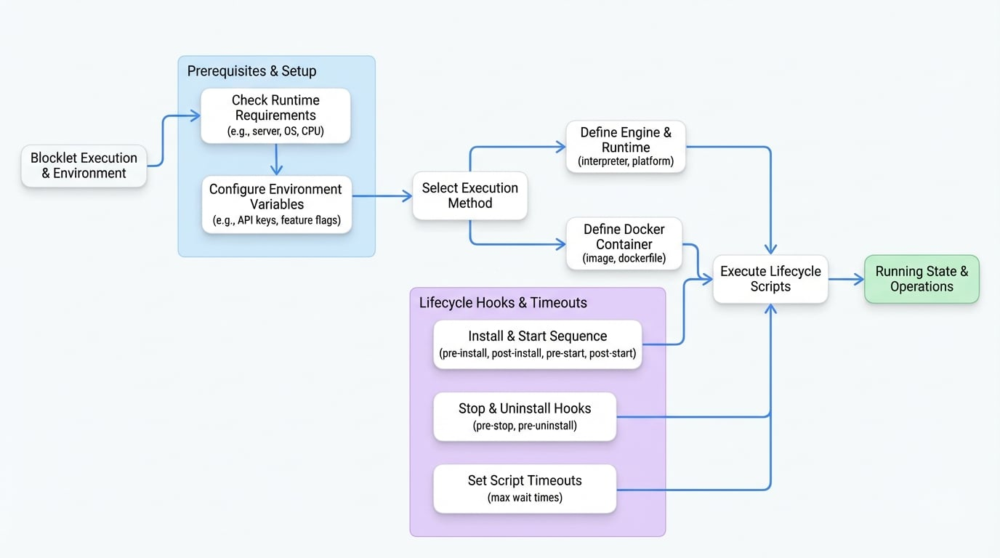

# 执行与环境

`blocklet.yml` 中的执行和环境配置是 Blocklet 运行的蓝图。它指定了必要的运行时，定义了系统要求，向用户公开了配置选项，并与 Blocklet 的生命周期挂钩。正确设置此部分对于创建可移植、健壮且用户友好的应用程序至关重要。

本节涵盖六个关键领域：`engine`、`docker`、`requirements`、`environments`、`scripts` 和 `timeout`。

## 引擎 (`engine`)

此属性指定 blocklet 的执行引擎，定义运行时及其启动方式。对于大多数基于 JavaScript 的 blocklet，您将指定 `node` 作为解释器，并且 `main` 属性（在 `blocklet.yml` 的根部定义）将作为入口点。

```yaml 一个简单的 Node.js 引擎 icon=mdi:language-yaml
name: my-node-blocklet
main: build/index.js
engine:
  interpreter: node
```

您还可以提供一个引擎配置数组以支持多个平台，这对于二进制分发是理想的选择。

```yaml 多平台引擎配置 icon=mdi:language-yaml
# ... 其他属性
engine:
  - platform: linux
    interpreter: binary
    source: ./bin/server-linux
  - platform: darwin
    interpreter: binary
    source: ./bin/server-macos
  - platform: win32
    interpreter: binary
    source: ./bin/server-win.exe
```

### 引擎属性

<x-field-group>
  <x-field data-name="interpreter" data-type="string" data-default="node">
    <x-field-desc markdown>执行 blocklet 的运行时。有效值：`node`、`blocklet`、`binary`、`bun`。</x-field-desc>
  </x-field>
  <x-field data-name="platform" data-type="string" data-required="false">
    <x-field-desc markdown>可选的操作系统平台。当 `engine` 是一个数组时，用于为不同操作系统（例如 `linux`、`darwin`、`win32`）指定配置。</x-field-desc>
  </x-field>
  <x-field data-name="source" data-type="string | object" data-required="false">
    <x-field-desc markdown>当解释器是 `blocklet` 时，引擎的来源。可以是一个 URL 字符串，或一个引用 URL 或 Blocklet Store 的对象。</x-field-desc>
  </x-field>
  <x-field data-name="args" data-type="string[]" data-default="[]" data-required="false">
    <x-field-desc markdown>传递给可执行文件的命令行参数数组。</x-field-desc>
  </x-field>
</x-field-group>

## Docker (`docker`)

作为 `engine` 属性的替代方案，您可以使用 `docker` 在容器化环境中运行您的 blocklet。这对于具有复杂依赖关系或非 JavaScript 运行时的应用程序是理想的选择。您必须提供 `image` 或 `dockerfile`。

```yaml 使用预构建的 Docker 镜像 icon=mdi:docker
docker:
  image: 'nginx:latest'
  egress: true
```

当使用 `dockerfile` 时，您还必须在根 `files` 数组中包含其路径。

```yaml 从 Dockerfile 构建 icon=mdi:docker
docker:
  dockerfile: 'Dockerfile.prod'
files:
  - 'Dockerfile.prod'
```

### Docker 属性

<x-field-group>
  <x-field data-name="image" data-type="string" data-required="false">
    <x-field-desc markdown>要使用的 Docker 镜像的名称。</x-field-desc>
  </x-field>
  <x-field data-name="dockerfile" data-type="string" data-required="false">
    <x-field-desc markdown>用于构建镜像的 Dockerfile 的路径。您不能同时使用 `image` 和 `dockerfile`。</x-field-desc>
  </x-field>
  <x-field data-name="egress" data-type="boolean" data-default="true" data-required="false">
    <x-field-desc markdown>blocklet 是否可以访问外部网络。</x-field-desc>
  </x-field>
</x-field-group>

## 运行时要求 (`requirements`)

此对象定义了 blocklet 正确运行所需的环境约束。系统将在安装前检查这些要求以确保兼容性。

```yaml 要求示例 icon=mdi:language-yaml
requirements:
  server: '>=1.16.0'
  os: '*'
  cpu: 'x64'
  nodejs: '>=18.0.0'
```

### 要求属性

<x-field-group>
  <x-field data-name="server" data-type="string">
    <x-field-desc markdown>所需的 Blocklet Server 版本的有效 SemVer 范围。默认为最新的稳定版本。</x-field-desc>
  </x-field>
  <x-field data-name="os" data-type="string | string[]" data-default="*">
    <x-field-desc markdown>兼容的操作系统。使用 `*` 表示任何系统。可以是一个字符串或一个数组（例如 `['linux', 'darwin']`）。有效平台包括 `aix`、`darwin`、`freebsd`、`linux`、`openbsd`、`sunos`、`win32`。</x-field-desc>
  </x-field>
  <x-field data-name="cpu" data-type="string | string[]" data-default="*">
    <x-field-desc markdown>兼容的 CPU 架构。使用 `*` 表示任何架构。可以是一个字符串或一个数组（例如 `['x64', 'arm64']`）。有效架构包括 `arm`、`arm64`、`ia32`、`mips`、`mipsel`、`ppc`、`ppc64`、`s390`、`s390x`、`x32`、`x64`。</x-field-desc>
  </x-field>
  <x-field data-name="nodejs" data-type="string" data-default="*">
    <x-field-desc markdown>所需的 Node.js 版本的有效 SemVer 范围。</x-field-desc>
  </x-field>
  <x-field data-name="fuels" data-type="array" data-required="false">
    <x-field-desc markdown>指定连接的钱包中某些操作所需的资产（代币）列表。</x-field-desc>
  </x-field>
  <x-field data-name="aigne" data-type="boolean" data-required="false">
    <x-field-desc markdown>如果为 `true`，表示该 blocklet 需要一个可用的 AI 引擎。</x-field-desc>
  </x-field>
</x-field-group>

## 环境变量 (`environments`)

`environments` 数组允许您定义自定义配置变量。这些变量会在安装期间或在 blocklet 的配置页面上呈现给用户，允许他们安全地输入 API 密钥、设置功能标志或自定义行为。

```yaml 环境变量定义 icon=mdi:language-yaml
environments:
  - name: 'API_KEY'
    description: '您的外部服务的秘密 API 密钥。'
    required: true
    secure: true
  - name: 'FEATURE_FLAG_BETA'
    description: '为此 blocklet 启用 beta 功能。'
    required: false
    default: 'false'
    validation: '^(true|false)$'
```

**键命名规则：**
- 名称不能以保留前缀 `BLOCKLET_`、`COMPONENT_` 或 `ABTNODE_` 开头。
- 名称只能包含字母、数字和下划线 (`_`)。

### 环境属性

<x-field-group>
  <x-field data-name="name" data-type="string" data-required="true">
    <x-field-desc markdown>环境变量的名称。</x-field-desc>
  </x-field>
  <x-field data-name="description" data-type="string" data-required="true">
    <x-field-desc markdown>关于此变量用途的用户友好描述。</x-field-desc>
  </x-field>
  <x-field data-name="default" data-type="string" data-required="false">
    <x-field-desc markdown>一个可选的默认值。如果 `secure` 为 `true`，则不能使用。</x-field-desc>
  </x-field>
  <x-field data-name="required" data-type="boolean" data-default="false" data-required="false">
    <x-field-desc markdown>用户是否必须为此变量提供值。</x-field-desc>
  </x-field>
  <x-field data-name="secure" data-type="boolean" data-default="false" data-required="false">
    <x-field-desc markdown>如果为 true，该值将被视为敏感数据（例如密码、API 密钥），以加密方式存储并在 UI 中隐藏。</x-field-desc>
  </x-field>
  <x-field data-name="validation" data-type="string" data-required="false">
    <x-field-desc markdown>一个可选的正则表达式字符串，用于验证用户的输入。</x-field-desc>
  </x-field>
  <x-field data-name="shared" data-type="boolean" data-required="false">
    <x-field-desc markdown>如果为 true，此变量可以在组件之间共享。如果 `secure` 为 `true`，则默认为 `false`。</x-field-desc>
  </x-field>
</x-field-group>

## 生命周期脚本 (`scripts`)

脚本是与 blocklet 生命周期挂钩的 shell 命令，允许您在特定阶段（如安装、启动或卸载）执行自动化任务。下图说明了安装和启动钩子的执行时机：

<!-- DIAGRAM_IMAGE_START:flowchart:16:9 -->

<!-- DIAGRAM_IMAGE_END -->

```yaml 脚本钩子示例 icon=mdi:language-yaml
scripts:
  pre-install: 'npm install --production'
  post-start: 'node ./scripts/post-start.js'
  pre-stop: 'echo "Shutting down..."'
```

### 可用钩子

| 钩子 (`kebab-case`) | 运行时间 | 
|---------------------|---------------------------------------------------------------------------|
| `dev` | 在开发模式下运行 blocklet 的命令。 |
| `e2eDev` | 在开发环境中运行端到端测试的命令。 |
| `pre-flight` | 在安装过程开始前，用于初始检查。 |
| `pre-install` | 在 blocklet 文件被复制到最终目标位置之前。 |
| `post-install` | 在 blocklet 成功安装后。 |
| `pre-start` | 在 blocklet 的主进程启动之前。 |
| `post-start` | 在 blocklet 成功启动后。 |
| `pre-stop` | 在 blocklet 停止之前。 |
| `pre-uninstall` | 在 blocklet 被卸载之前。 |
| `pre-config` | 在向用户显示配置用户界面之前。 |

## 超时 (`timeout`)

此对象允许您为关键的生命周期操作配置最大等待时间，以防止进程无限期挂起。

```yaml 超时配置 icon=mdi:language-yaml
timeout:
  start: 120  # 等待 blocklet 启动最多 120 秒
  script: 600 # 允许脚本运行最多 10 分钟
```

### 超时属性

<x-field-group>
  <x-field data-name="start" data-type="number" data-default="60">
    <x-field-desc markdown>等待 blocklet 启动的最长时间（秒）。必须在 10 到 600 之间。</x-field-desc>
  </x-field>
  <x-field data-name="script" data-type="number">
    <x-field-desc markdown>任何生命周期脚本运行的最长时间（秒）。必须在 1 到 1800 之间。</x-field-desc>
  </x-field>
</x-field-group>

---

配置好执行环境后，下一步是定义您的 blocklet 如何与外部世界通信。请前往[接口与服务](./spec-interfaces-services.md)部分，了解如何公开网页和 API 端点。