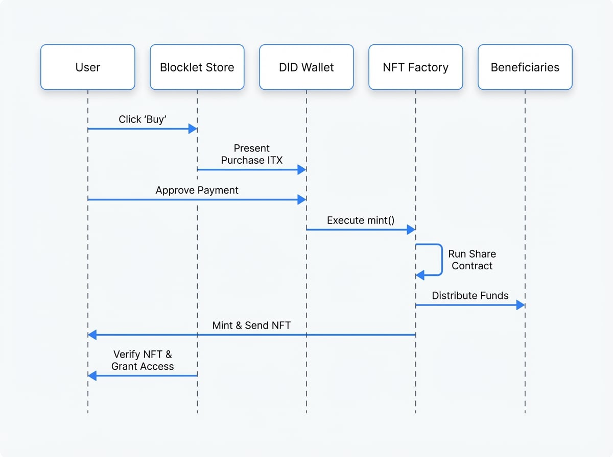

# 变现

Blocklet 开发者可以通过由 OCAP（开放能力访问协议）和 NFT 提供支持的内置支付系统将其工作变现。当用户购买一个 blocklet 时，他们会收到一个唯一的 NFT（一个 `BlockletPurchaseCredential`），作为所有权的证明。整个过程在 `blocklet.yml` 元数据中定义，主要通过 `payment` 对象。

本节详细介绍使您能够设置价格、定义收益共享模型以及了解底层 NFT 工厂工作原理的配置字段。

## `payment` 对象

`payment` 对象是所有变现配置的中心枢纽。它允许您指定价格、收益应如何共享，以及当您的 blocklet 被其他 blocklet 用作组件时应收取多少费用。

以下是 `payment` 对象的高级结构：

```yaml blocklet.yml
payment:
  price: []
  share: []
  componentPrice: []
```

### `payment.price`

此属性定义了用户购买 blocklet 的成本。价格以特定的代币指定。目前，仅支持单一的代幣价格。

<x-field-group>
  <x-field data-name="value" data-type="number" data-required="true" data-desc="blocklet 的成本。必须大于 0。"></x-field>
  <x-field data-name="address" data-type="string" data-required="true" data-desc="用于支付的代币的 DID 地址。"></x-field>
</x-field-group>

```yaml Example: Setting a Price icon=mdi:currency-usd
# blocklet.yml
payment:
  price:
    - value: 10
      address: 'z2de...'
```

### `payment.share`

此属性可实现自动收益共享。当一个 blocklet 被购买时，资金可以根据预定义的份额在多个受益人之间分配。这对于开发者团队或支付版税非常有用。

**约束条件：**
- 最多可以指定 4 个受益人。
- `share` 数组中所有 `value` 字段的总和必须等于 `1`（代表 100%）。

<x-field-group>
  <x-field data-name="name" data-type="string" data-required="true" data-desc="受益人的人类可读名称（例如，'首席开发者'、'设计师'）。"></x-field>
  <x-field data-name="address" data-type="string" data-required="true" data-desc="将接收资金的受益人的 DID 地址。"></x-field>
  <x-field data-name="value" data-type="number" data-required="true" data-desc="该受益人获得的收益部分。必须是 0 到 1 之间的值。"></x-field>
</x-field-group>

```yaml Example: 70/30 Revenue Split icon=mdi:chart-pie
# blocklet.yml
payment:
  price:
    - value: 10
      address: 'z2de...'
  share:
    - name: 'Developer'
      address: 'z1dev...'
      value: 0.7
    - name: 'Designer'
      address: 'z1design...'
      value: 0.3
```

在此示例中，对于每笔 10 个代币的购买，开发者自动收到 7 个代币，设计师收到 3 个代币。

### `payment.componentPrice`

此属性定义了当您的 blocklet 在另一个更大的 blocklet 中作为组件使用时的定价模型。这使您可以在您的工作成为更大应用程序的一部分时获得收益。

<x-field-group>
  <x-field data-name="parentPriceRange" data-type="[number, number]" data-required="false" data-desc="可选。一个包含两个元素的数组，指定此规则适用的父 blocklet 的价格范围。例如，[0, 100] 适用于成本最高为 100 的父级。"></x-field>
  <x-field data-name="type" data-type="string" data-required="true" data-desc="定价类型。可以是 'fixed' 或 'percentage'。"></x-field>
  <x-field data-name="value" data-type="number" data-required="true" data-desc="价格值。对于 'fixed'，它是一个具体金额。对于 'percentage'，它是一个 0 到 1 之间的值（例如，0.1 代表 10%）。"></x-field>
</x-field-group>

```yaml Example: Component Pricing icon=mdi:puzzle-outline
# blocklet.yml
payment:
  componentPrice:
    # 对于价格在 0 到 50 代币之间的父 blocklet，收取 5 个代币的固定费用。
    - parentPriceRange: [0, 50]
      type: 'fixed'
      value: 5

    # 对于价格高于 50 代币的父 blocklet，收取父级价格的 10%。
    - parentPriceRange: [50.01, 99999]
      type: 'percentage'
      value: 0.1
```

## `nftFactory` 字段

`nftFactory` 字段保存了 OCAP NFT Factory 的 DID 地址，该工厂负责在用户购买您的 blocklet 时铸造 `BlockletPurchaseCredential`。

**重要提示：** 您无需手动设置此字段。当您将 blocklet 发布到 Blocklet Store 时，它会由 `blocklet publish` 命令自动生成和填充。该商店使用您的 `payment` 配置来创建一个独特、安全的 NFT 工厂，并将其地址写入最终元数据中的此字段。

## 支付流程如何运作

了解变现流程有助于阐明这些字段如何协同工作。该过程被设计为安全、透明和自动化的。

<!-- DIAGRAM_IMAGE_START:sequence:4:3 -->

<!-- DIAGRAM_IMAGE_END -->

此图说明了端到端的过程：

1.  用户从 Blocklet Store 发起购买。
2.  商店向用户的 DID Wallet 提交一笔交易。
3.  用户批准后，钱包与 blocklet 元数据中指定的 `nftFactory` 进行交互。
4.  工厂执行其 `mint` 函数，这会触发内部共享合约。
5.  资金会自动分配给 `payment.share` 数组中定义的受益人。
6.  一个购买 NFT 被铸造并发送到用户的钱包，作为永久收据和许可证。
7.  Blocklet Store 验证 NFT 的所有权，并授予用户安装和使用 blocklet 的权限。

### 高级：复合 Blocklet 支付

当一个 blocklet 由其他付费组件组成时，支付系统会确保依赖链中的所有创建者都得到公平、安全的补偿。这是通过一个 `paymentIntegrity` 哈希和跨商店签名实现的。

在发布复合 blocklet 之前，开发者的 CLI 工具会分析整个组件树，计算最终的收益共享合约，并生成此支付逻辑的唯一哈希（`paymentIntegrity`）。然后，它会向托管树中付费组件的每个 Blocklet Store 请求此哈希的加密签名。这些签名被捆绑到最终的 NFT Factory 中，创建了一个防篡改的信任链，保证支付逻辑已得到所有参与商店的验证和批准。

```d2 Composite Blocklet Publish & Payment Integrity
shape: sequence_diagram

Developer-CLI: "开发者 CLI"
Store-A: "商店 A"
Store-B: "商店 B"

Developer-CLI -> Developer-CLI: "1. 分析复合 blocklet 和组件"
Developer-CLI -> Store-A: "2. 获取组件 A 的元数据"
Store-A -> Developer-CLI: "3. 返回元数据"
Developer-CLI -> Store-B: "4. 获取组件 B 的元数据"
Store-B -> Developer-CLI: "5. 返回元数据"
Developer-CLI -> Developer-CLI: "6. 计算最终共享合约和 paymentIntegrity 哈希"
Developer-CLI -> Store-A: "7. 请求 paymentIntegrity 的签名"
Store-A -> Store-A: "8. 验证完整性"
Store-A -> Developer-CLI: "9. 返回签名"
Developer-CLI -> Store-B: "10. 请求 paymentIntegrity 的签名"
Store-B -> Store-B: "11. 验证完整性"
Store-B -> Developer-CLI: "12. 返回签名"
Developer-CLI -> Developer-CLI: "13. 将签名捆绑到 NFT Factory 中"
Developer-CLI -> Store-A: "14. 发布最终的复合 blocklet 元数据"

```

---

配置好变现后，下一步是确保您的 blocklet 的元数据是安全的，并且其资源已正确定义。请继续阅读 [安全与资源](./spec-security-resources.md) 部分，了解如何为您的元数据签名和管理捆绑的资产。