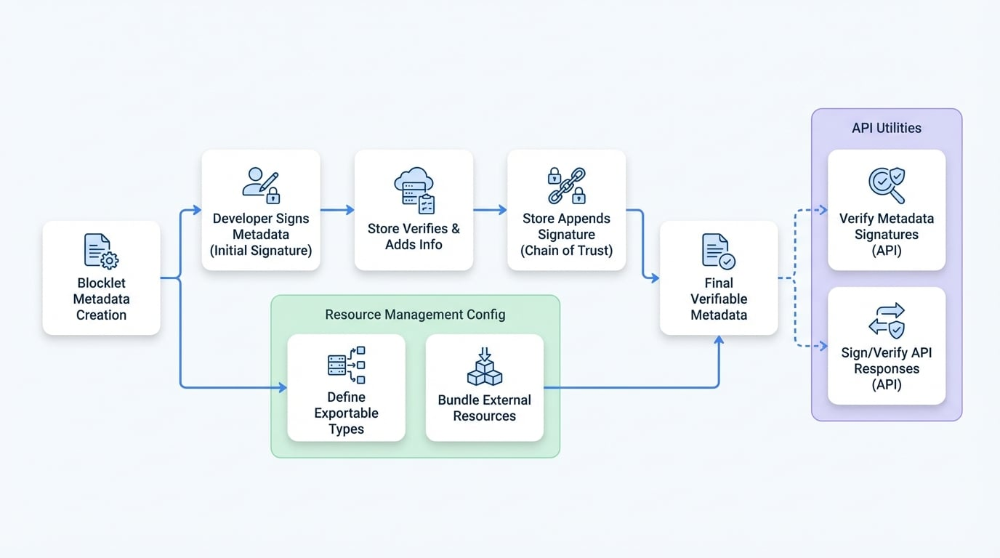

# 安全性與資源

安全性和資源管理對於創建可信賴且可互通的 Blocklet 至關重要。`blocklet.yml` 規範為此提供了兩個關鍵欄位：`signatures` 用於確保元資料的完整性和真實性，以及 `resource` 用於定義和捆綁共享資產，以便與其他 Blocklet 組合。

本節將介紹這些欄位的規範，並介紹 `@blocklet/meta` 提供的用於處理它們的實用函式。

## 簽名

`signatures` 欄位包含一個數位簽名陣列，為 Blocklet 的元資料創建一個可驗證的信任鏈。此機制可防止未經授權的修改，並確認發布者的身份，例如開發人員和 Blocklet Store。鏈中的每個簽名都會對核心元資料以及任何後續簽名進行加密簽名，確保整個修改歷史記錄都是防篡改的。

### 多重簽名流程

在發布過程中，典型的多重簽名工作流程包括開發人員簽署初始元資料，然後由 Blocklet Store 進行驗證、添加分發資訊並附加其自己的簽名。

<!-- DIAGRAM_IMAGE_START:flowchart:16:9 -->

<!-- DIAGRAM_IMAGE_END -->

### 規範

`signatures` 欄位是一個簽名物件的陣列。每個物件具有以下結構：

```yaml blocklet.yml icon=lucide:shield-check
signatures:
  - type: 'ED25519'
    name: 'dev'
    signer: 'z8qa...'
    pk: 'z28n...'
    created: '2023-10-27T10:00:00.000Z'
    sig: 'z24e...'
    excludes: []
  - type: 'ED25519'
    name: 'store'
    signer: 'z8qR...'
    pk: 'z29c...'
    created: '2023-10-27T10:05:00.000Z'
    sig: 'z25a...'
    appended:
      - 'dist'
      - 'stats'
```

<x-field-group>
  <x-field data-name="type" data-type="string" data-required="true" data-desc="用於簽名的加密演算法（例如 'ED25519'）。"></x-field>
  <x-field data-name="name" data-type="string" data-required="true" data-desc="簽名角色的人類可讀名稱（例如 'dev'、'store'）。"></x-field>
  <x-field data-name="signer" data-type="string" data-required="true" data-desc="創建簽名的實體的 DID。"></x-field>
  <x-field data-name="pk" data-type="string" data-required="true" data-desc="與簽名者 DID 對應的公鑰。"></x-field>
  <x-field data-name="created" data-type="string" data-required="true" data-desc="簽名創建時的 ISO 8601 時間戳。"></x-field>
  <x-field data-name="sig" data-type="string" data-required="true" data-desc="base58 編碼的簽名字符串。"></x-field>
  <x-field data-name="excludes" data-type="string[]" data-required="false" data-desc="一個頂層欄位名稱的陣列，用於在簽名前從元資料中排除。"></x-field>
  <x-field data-name="appended" data-type="string[]" data-required="false" data-desc="一個由該簽名者添加到元資料中的頂層欄位名稱的陣列。下一個簽名者將使用此陣列來正確驗證前一個簽名。"></x-field>
  <x-field data-name="delegatee" data-type="string" data-required="false" data-desc="如果簽名是透過委託進行的，則為受託人的 DID。"></x-field>
  <x-field data-name="delegateePk" data-type="string" data-required="false" data-desc="受託人的公鑰。"></x-field>
  <x-field data-name="delegation" data-type="string" data-required="false" data-desc="授權 `delegatee` 代表 `signer` 簽名的委託令牌 (JWT)。"></x-field>
</x-field-group>

## 資源管理

`resource` 欄位允許 Blocklet 聲明其可以導出的共享資料類型，並捆綁來自其他 Blocklet 的資源。這對於實現一個可組合和可互通的生態系統至關重要，在該生態系統中，Blocklet 可以無縫共享資料和功能。

### 規範

```yaml blocklet.yml icon=lucide:boxes
resource:
  exportApi: '/api/resources'
  types:
    - type: 'posts'
      description: 'A collection of blog posts.'
    - type: 'images'
      description: 'A gallery of images.'
  bundles:
    - did: 'z2qa...'
      type: 'user-profiles'
      public: true
```

<x-field data-name="resource" data-type="object">
  <x-field-desc markdown>包含用於定義可導出類型和捆綁資源的屬性。</x-field-desc>
  <x-field data-name="exportApi" data-type="string" data-required="false" data-desc="一個 API 端點的路徑，其他 Blocklet 可以調用此路徑以獲取導出的資源。"></x-field>
  <x-field data-name="types" data-type="object[]" data-required="false" data-desc="此 Blocklet 可導出的資源類型陣列。最多限制為 10 種類型。">
    <x-field data-name="type" data-type="string" data-required="true" data-desc="資源類型的唯一標識符（例如 'posts'、'products'）。"></x-field>
    <x-field data-name="description" data-type="string" data-required="false" data-desc="資源類型的人類可讀描述。"></x-field>
  </x-field>
  <x-field data-name="bundles" data-type="object[]" data-required="false" data-desc="從其他 Blocklet 導入的資源捆綁包陣列。">
    <x-field data-name="did" data-type="string" data-required="true" data-desc="要包含的資源捆綁包的 DID。"></x-field>
    <x-field data-name="type" data-type="string" data-required="true" data-desc="要從來源捆綁的特定資源類型。"></x-field>
    <x-field data-name="public" data-type="boolean" data-required="false" data-desc="如果為 `true`，表示捆綁的資源是公開可訪問的。"></x-field>
  </x-field>
</x-field>

## 相關 API 工具

`@blocklet/meta` 函式庫提供了一套函式來處理 Blocklet 元資料和通訊的安全方面。有關完整詳細資訊，請參閱 [安全性工具 API 參考](./api-security-utilities.md)。

### 驗證元資料簽名

`verifyMultiSig` 函式是確保 `blocklet.yml` 檔案完整性的主要工具。它處理 `signatures` 陣列，驗證鏈中的每個簽名，以確認元資料未被篡改且由聲明的實體簽署。

```javascript verifyMultiSig 範例 icon=lucide:shield-check
import verifyMultiSig from '@blocklet/meta/lib/verify-multi-sig';
import { TBlockletMeta } from '@blocklet/meta/lib/types';

async function checkMetadata(meta: TBlockletMeta) {
  const isValid = await verifyMultiSig(meta);
  if (isValid) {
    console.log('Blocklet 元資料是真實且未被篡改的。');
  } else {
    console.error('警告：Blocklet 元資料驗證失敗！');
  }
}
```

### 簽署和驗證 API 回應

為了保護 Blocklet 之間或 Blocklet 與客戶端之間的通訊安全，您可以使用 `signResponse` 和 `verifyResponse` 函式。這些輔助函式使用一個錢包物件對任何可 JSON 序列化的資料進行加密簽名和驗證，確保資料完整性和發送者真實性。

```javascript signResponse 範例 icon=lucide:pen-tool
import { signResponse, verifyResponse } from '@blocklet/meta/lib/security';
import { fromRandom } from '@ocap/wallet';

async function secureCommunicate() {
  const wallet = fromRandom(); // 您的 Blocklet 的錢包
  const data = { message: 'hello world', timestamp: Date.now() };

  // 簽署
  const signedData = signResponse(data, wallet);
  console.log('已簽署的資料：', signedData);

  // 驗證
  const isVerified = await verifyResponse(signedData, wallet);
  console.log('驗證結果：', isVerified); // true
}
```