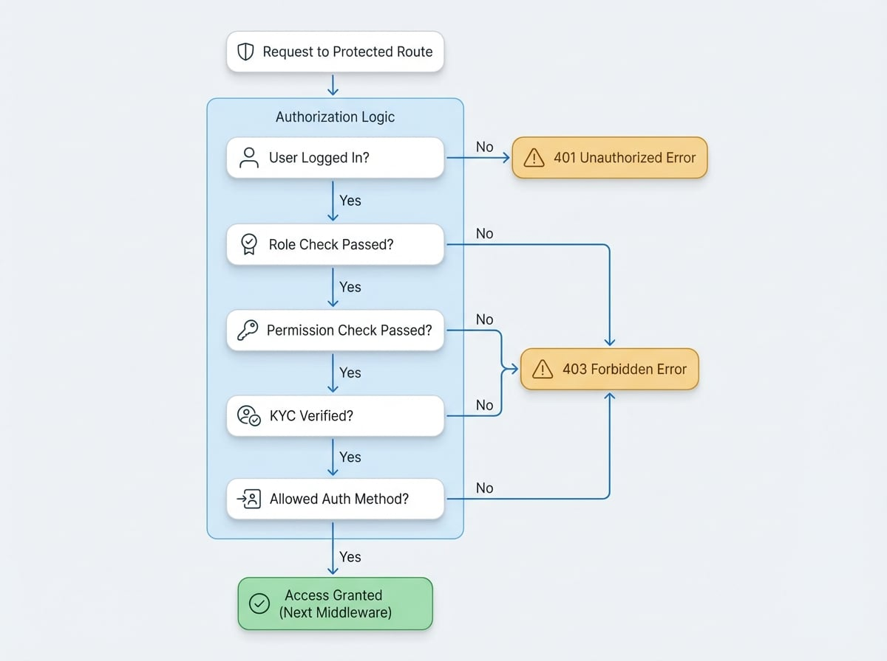

# 授權中介軟體

`auth` 中介軟體是一個功能強大的工具，可為您的 blocklet 路由增加一層授權。它與 [session 中介軟體](./authentication-session-middleware.md) 配合使用，透過驗證使用者的角色、特定權限、KYC (實名認證) 狀態以及所使用的驗證方法來保護端點。這確保只有經過授權的使用者才能存取敏感或受限的資源。

## 使用方法

若要使用 `auth` 中介軟體，請從 `@blocklet/sdk/middlewares` 匯入它，並將其應用於任何需要保護的 Express.js 路由或路由器。您可以傳遞一個設定物件來指定授權規則。

以下是一個保護僅限管理員存取路由的基本範例：

```javascript icon=lucide:shield-check title="routes/admin.js"
const auth = require('@blocklet/sdk/middlewares/auth');
const router = require('express').Router();

// 此路由僅供具有 'admin' 角色的使用者存取。
router.get('/dashboard', auth({ roles: ['admin'] }), (req, res) => {
  res.json({
    message: 'Welcome to the admin dashboard!',
    user: req.user,
  });
});

module.exports = router;
```

如果未經授權的使用者嘗試存取此路由，中介軟體將自動回應 `403 Forbidden` 錯誤。如果使用者根本沒有登入，它將回應 `401 Unauthorized` 錯誤。

## 授權流程

中介軟體會按特定順序評估授權規則。如果在任何一個環節檢查失敗，它會立即以適當的 HTTP 錯誤碼拒絕請求。

<!-- DIAGRAM_IMAGE_START:flowchart:4:3 -->

<!-- DIAGRAM_IMAGE_END -->

## 設定選項

`auth` 中介軟體接受一個設定物件，其中包含以下屬性，以定義細粒度的存取控制規則。

<x-field-group>
  <x-field data-name="roles" data-type="string[]" data-required="false">
    <x-field-desc markdown>一個包含角色名稱的陣列。使用者必須擁有其中**至少一個**角色才能被授予存取權限。如果使用者的角色不在這個清單中，中介軟體將回傳 `403 Forbidden` 錯誤。</x-field-desc>
  </x-field>
  <x-field data-name="permissions" data-type="string[]" data-required="false">
    <x-field-desc markdown>一個包含權限名稱的陣列。中介軟體會檢查與使用者角色相關聯的權限。使用者的角色必須擁有**至少一個**指定的權限。否則，它會回傳 `403 Forbidden` 錯誤。此檢查需要 [Blocklet Service](./services-blocklet-service.md) 正在執行。</x-field-desc>
  </x-field>
  <x-field data-name="kyc" data-type="('email' | 'phone')[]" data-required="false">
    <x-field-desc markdown>一個指定所需 KYC (實名認證) 驗證方法的陣列。您可以要求 `email` 驗證、`phone` 驗證或兩者皆要。如果使用者尚未完成所需的驗證步驟，中介軟體會回傳 `403 Forbidden` 錯誤，並附上訊息「kyc required」。</x-field-desc>
  </x-field>
  <x-field data-name="methods" data-type="AuthMethod[]" data-required="false">
    <x-field-desc markdown>一個包含允許的驗證方法的陣列。`SessionUser` 物件包含一個 `method` 屬性，用以指示 session 是如何建立的（例如 `loginToken`、`accessKey`、`componentCall`）。如果使用者的驗證方法不在這個清單中，中介軟體將回傳 `403 Forbidden` 錯誤。</x-field-desc>
  </x-field>
</x-field-group>

### 範例：要求多個條件

您可以組合這些選項來建立複雜的授權規則。例如，要保護一個只應對已驗證電子郵件且未使用臨時存取金鑰的付費訂閱者開放的路由：

```javascript icon=lucide:shield-check title="routes/billing.js"
const auth = require('@blocklet/sdk/middlewares/auth');
const router = require('express').Router();

router.post(
  '/update-subscription',
  auth({
    roles: ['subscriber'],
    kyc: ['email'],
    methods: ['loginToken', 'signedToken'], // 禁止透過 accessKey 存取
  }),
  (req, res) => {
    // 更新訂閱的邏輯
    res.json({ success: true, message: 'Subscription updated.' });
  }
);

module.exports = router;
```

在此範例中，使用者必須滿足所有三個條件：
1. 擁有 `subscriber` 角色。
2. 其電子郵件地址已驗證。
3. 已使用標準登入權杖或簽名權杖進行驗證，而非簡單的存取金鑰。

## 總結

`auth` 中介軟體是保護您的 blocklet 端點的必要工具。透過結合角色、權限、KYC 和驗證方法的檢查，您可以用最少的程式碼實現強大且細粒度的存取控制。

有關管理使用者和 session 的更多資訊，請參閱以下部分：
- [Session 中介軟體](./authentication-session-middleware.md)：了解如何建立使用者 session，這是此授權中介軟體的先決條件。
- [Blocklet Service](./services-blocklet-service.md)：了解如何以程式化方式管理此中介軟體所依賴的角色和權限。