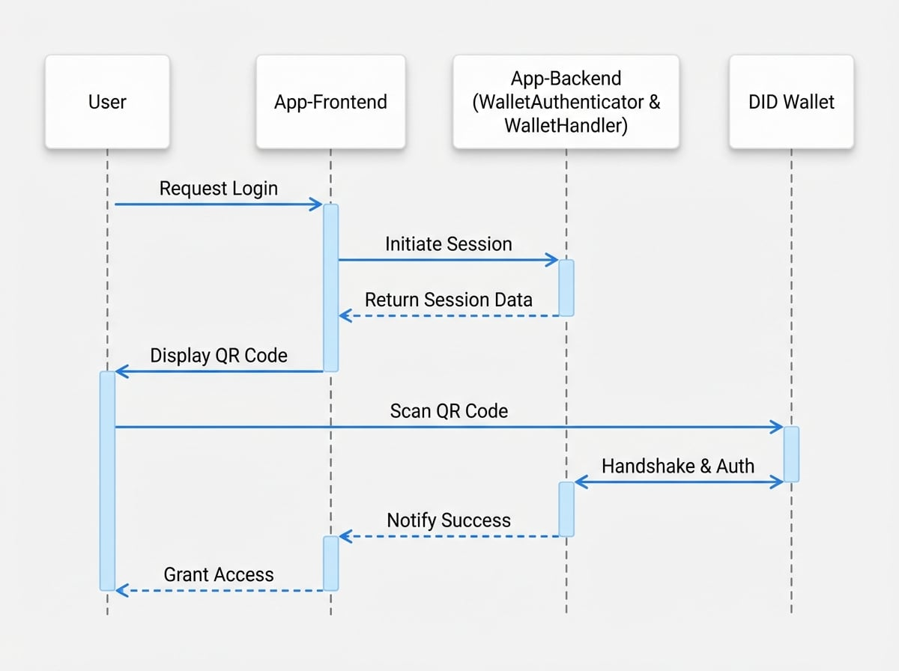

# DID Connect

Blocklet SDKは、DID Connectを使用して、分散型アイデンティティをアプリケーションに統合するための効率的な方法を提供します。これにより、ユーザーはDID Walletを使用して安全にログインし、データを管理できるようになり、パスワードレスでユーザー中心の認証体験が実現します。この機能の主要なコンポーネントは`WalletAuthenticator`と`WalletHandler`です。

これらのユーティリティは、堅牢な`@arcblock/did-connect-js`ライブラリを基盤として構築されており、Blocklet環境内でのセットアッププロセスを簡素化します。

### 仕組み

一般的なDID Connectのログインフローには、ユーザー、アプリケーションのフロントエンドとバックエンド、そしてユーザーのDID Walletが関与します。

<!-- DIAGRAM_IMAGE_START:sequence:4:3 -->

<!-- DIAGRAM_IMAGE_END -->

## 基本的なセットアップ

BlockletでのDID Connectのセットアップは簡単です。`WalletAuthenticator`と`WalletHandler`をインスタンス化し、セッションデータ用のストレージメカニズムを提供する必要があります。

以下は、Express.jsアプリケーションでの典型的なセットアップです。

```javascript Basic DID Connect Setup icon=logos:javascript
import path from 'path';
import AuthStorage from '@arcblock/did-connect-storage-nedb';
import WalletAuthenticator from '@blocklet/sdk/lib/wallet-authenticator';
import WalletHandler from '@blocklet/sdk/lib/wallet-handler';

// 1. authenticatorを初期化
export const authenticator = new WalletAuthenticator();

// 2. authenticatorとストレージソリューションでhandlerを初期化
export const handlers = new WalletHandler({
  authenticator,
  tokenStorage: new AuthStorage({
    dbPath: path.join(process.env.BLOCKLET_DATA_DIR, 'auth.db'),
  }),
});

// 3. handlerをExpressアプリにマウント
// app.use('/api/did/auth', handlers);
```

**コードの内訳:**

1.  **`WalletAuthenticator`**: このクラスはDID Connectセッションの作成と管理を担当します。ユーザーに表示されるQRコードにエンコードされるデータを生成します。
2.  **`@arcblock/did-connect-storage-nedb`**: これはセッショントークンを永続化するためのファイルベースのストレージアダプターです。Blockletのデータディレクトリ（`BLOCKLET_DATA_DIR`）内にデータを保存するため、Blockletにとって便利な選択肢です。
3.  **`WalletHandler`**: このクラスは認証ライフサイクル全体を処理します。セッションの作成、ステータスの更新（例：ユーザーがQRコードをスキャンしたとき）、およびウォレットからの最終的な認証応答を管理します。

## 設定

`WalletHandler`のコンストラクタは、その動作をカスタマイズするためのオプションオブジェクトを受け入れます。以下に主要なパラメータをいくつか示します。

<x-field-group>
  <x-field data-name="authenticator" data-type="WalletAuthenticator" data-required="true" data-desc="WalletAuthenticatorのインスタンス。"></x-field>
  <x-field data-name="tokenStorage" data-type="object" data-required="true" data-desc="セッショントークンを永続化するためのストレージインスタンス。例：'@arcblock/did-connect-storage-nedb' の AuthStorage。"></x-field>
  <x-field data-name="autoConnect" data-type="boolean" data-default="true" data-required="false">
    <x-field-desc markdown>`true` の場合、以前にウォレットを接続したことのあるリピートユーザーは、再度QRコードをスキャンすることなく自動的にログインできます。これは、ウォレットにプッシュ通知を送信することで実現されます。</x-field-desc>
  </x-field>
  <x-field data-name="connectedDidOnly" data-type="boolean" data-default="false" data-required="false">
    <x-field-desc markdown>`true` の場合、現在ログインしているユーザー（もしいる場合）のDIDのみが接続に使用できます。これは、ユーザーが既存のアカウントにウォレットをリンクする必要があるシナリオで役立ちます。</x-field-desc>
  </x-field>
</x-field-group>

### アプリケーション情報のカスタマイズ

ユーザーがQRコードをスキャンすると、DID Walletにはアプリケーションの名前、説明、アイコンなどの情報が表示されます。SDKはblockletのメタデータを使用してこれを自動的に入力します。ただし、`WalletAuthenticator`のコンストラクタに`appInfo`関数を渡すことで、この情報を上書きすることができます。

```javascript Customizing App Info icon=logos:javascript
import WalletAuthenticator from '@blocklet/sdk/lib/wallet-authenticator';

const authenticator = new WalletAuthenticator({
  async appInfo() {
    // この関数はカスタムのアプリ情報を返すことができます
    // 返されるオブジェクトはデフォルトの情報とマージされます
    return {
      name: 'My Custom App Name',
      description: 'A custom description for the DID Connect request.',
      icon: 'https://my-app.com/logo.png',
    };
  },
});
```

## 参考文献

Blocklet SDKが提供する`WalletAuthenticator`と`WalletHandler`は、より包括的な`@arcblock/did-connect-js`ライブラリの便利なラッパーです。高度なユースケース、より詳細なカスタマイズ、または基盤となる仕組みをより深く理解するためには、公式のDID Connect SDKドキュメントを参照してください。

<x-card data-title="DID Connect SDK ドキュメント" data-icon="lucide:book-open" data-href="https://www.arcblock.io/docs/did-connect-sdk/en/did-connect-sdk-overview" data-cta="続きを読む">
  強力な分散型アプリケーションを構築するための、DID ConnectプロトコルとそのJavaScript SDKの全機能をご覧ください。
</x-card>

ユーザーの認証が成功したら、次のステップはアプリケーション内でセッションを管理することです。Blocklet SDKはこの目的のために堅牢なミドルウェアを提供します。

ユーザーセッションを検証し、ルートを保護する方法については、次のセクション [セッションミドルウェア](./authentication-session-middleware.md) に進んでください。