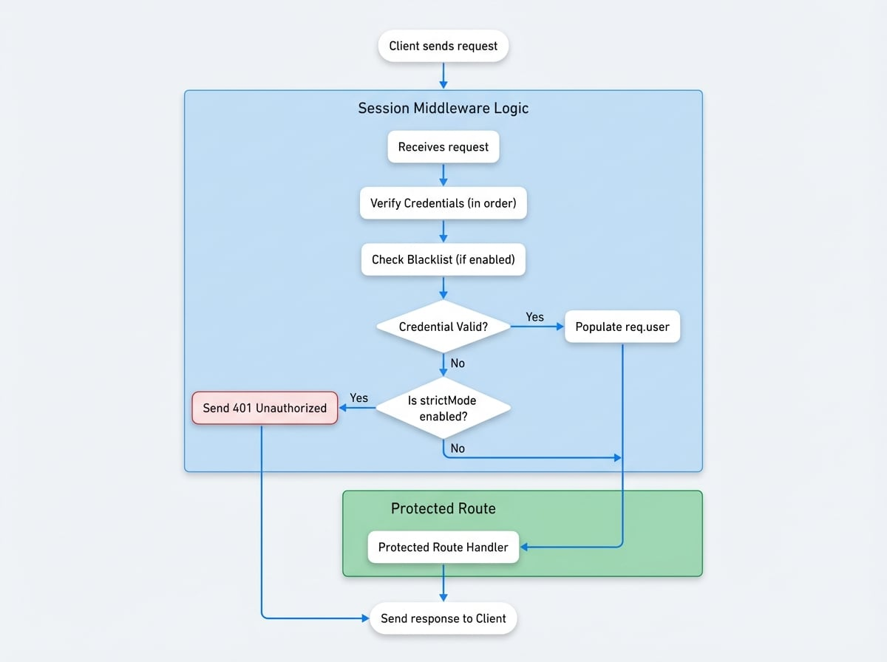

# Session 中间件

`session` 中间件是 Blocklet SDK 身份验证系统的核心组件。它充当 Express.js 路由的守门员，验证请求者的身份，并在成功验证后将 `SessionUser` 对象附加到 `req.user` 属性上。这使得后续的中间件和路由处理程序可以轻松访问经过身份验证的用户信息。

该中间件非常灵活，开箱即用支持多种身份验证策略，包括来自 [DID Connect](./authentication-did-connect.md) 的登录令牌、编程访问密钥和安全的组件间调用。

## 工作原理

session 中间件按特定优先级顺序检查传入请求中的凭证。如果找到有效的凭证，它会填充 `req.user` 并将控制权传递给下一个处理程序。如果未找到有效凭证，其行为取决于是否启用了 `strictMode`。

<!-- DIAGRAM_IMAGE_START:flowchart:4:3 -->

<!-- DIAGRAM_IMAGE_END -->

如果在 blocklet 的设置中开启了 `enableBlacklist` 功能，还会执行额外的安全检查。在验证登录令牌之前，中间件将调用服务 API 以确保该令牌未被撤销或阻止。

## 基本用法

您可以将 `session` 中间件应用于整个应用程序或需要身份验证的特定路由。

```javascript 应用 Session 中间件 icon=logos:express
import express from 'express';
import session from '@blocklet/sdk/middlewares/session';

const app = express();

// 应用于所有路由
app.use(session());

// 或应用于必须受保护的特定路由
app.get('/api/profile', session({ strictMode: true }), (req, res) => {
  // 在严格模式下，如果 req.user 不存在，中间件会已发送 401 响应。
  if (req.user) {
    res.json(req.user);
  }
});

// 一个公共路由，对登录用户行为不同
app.get('/api/info', session(), (req, res) => {
  if (req.user) {
    res.json({ message: `Hello, ${req.user.fullName}`});
  } else {
    // 在非严格模式下，对于未经身份验证的用户，req.user 是 undefined
    res.json({ message: 'Hello, guest.' });
  }
});

app.listen(3000, () => {
  console.log('Server is running on port 3000');
});
```

## 配置选项

`sessionMiddleware` 函数接受一个可选的配置对象来定制其行为。

<x-field data-name="strictMode" data-type="boolean" data-default="false" data-desc="如果为 `true`，无效或缺失的令牌将导致 `401 Unauthorized` 响应。如果为 `false`，它将调用 `next()` 而不带 `user` 对象，将请求视为未经身份验证。"></x-field>

<x-field data-name="loginToken" data-type="boolean" data-default="true" data-desc="通过标准的 JWT 登录令牌启用身份验证，通常来自 DID Connect，存在于 `login_token` cookie 中。"></x-field>

<x-field data-name="accessKey" data-type="boolean" data-default="false" data-desc="通过长期的访问密钥（例如，用于 CI/CD 或脚本）启用身份验证。这些密钥也从 `login_token` cookie 中读取。"></x-field>

<x-field data-name="componentCall" data-type="boolean" data-default="false" data-desc="为来自其他组件的安全、签名请求启用身份验证，使用类似 `x-component-sig` 的头部进行验证。"></x-field>

<x-field data-name="signedToken" data-type="boolean" data-default="false" data-desc="通过作为查询参数传递的临时、签名的 JWT 启用身份验证。"></x-field>

<x-field data-name="signedTokenKey" data-type="string" data-default="__jwt" data-desc="用于 `signedToken` 身份验证的查询参数的名称。"></x-field>

### 配置示例

<x-cards>
  <x-card data-title="严格的 API 端点" data-icon="lucide:shield-check">
    对于必须受保护的端点，`strictMode` 确保未经身份验证的请求被立即拒绝。

    ```javascript
    app.use('/api/admin', session({ strictMode: true }));
    ```
  </x-card>
  <x-card data-title="启用访问密钥" data-icon="lucide:key-round">
    要允许脚本或服务的编程访问与用户会话一起使用，请启用 `accessKey` 验证。

    ```javascript
    app.use('/api/data', session({ accessKey: true }));
    ```
  </x-card>
</x-cards>

## SessionUser 对象

当身份验证成功时，`req.user` 对象将填充以下结构。该对象提供有关经过身份验证的用户或组件的基本信息。

<x-field data-name="user" data-type="object" data-desc="成功验证后附加到 `req.user` 的 SessionUser 对象。">
  <x-field data-name="did" data-type="string" data-required="true" data-desc="用户的去中心化标识符（DID）。"></x-field>
  <x-field data-name="role" data-type="string" data-required="true" data-desc="分配给用户的角色（例如，`owner`、`admin`、`guest`）。"></x-field>
  <x-field data-name="provider" data-type="string" data-required="true" data-desc="使用的身份验证提供者（例如，`wallet`、`accessKey`）。"></x-field>
  <x-field data-name="fullName" data-type="string" data-required="true" data-desc="用户的全名或与凭证关联的备注。"></x-field>
  <x-field data-name="method" data-type="AuthMethod" data-required="true" data-desc="此会话使用的特定身份验证方法（例如，`loginToken`、`accessKey`、`componentCall`）。"></x-field>
  <x-field data-name="walletOS" data-type="string" data-required="true" data-desc="所用钱包的操作系统（如果适用）。"></x-field>
  <x-field data-name="emailVerified" data-type="boolean" data-required="false" data-desc="指示用户的电子邮件是否已验证。"></x-field>
  <x-field data-name="phoneVerified" data-type="boolean" data-required="false" data-desc="指示用户的电话是否已验证。"></x-field>
</x-field>


以下是成功登录后 `req.user` 对象可能的样子：

```json req.user 对象示例 icon=lucide:user-check
{
  "did": "z8iZgeJjzB6Q1bK2rR1BfA2J8cNEJ8cNEJ8c",
  "role": "owner",
  "fullName": "Alice",
  "provider": "wallet",
  "walletOS": "ios",
  "emailVerified": true,
  "phoneVerified": false,
  "method": "loginToken"
}
```

## 后续步骤

一旦用户通过 `session` 中间件进行身份验证，您就可以根据其角色和权限执行更精细的访问控制。请继续下一节，学习如何使用[授权中间件](./authentication-auth-middleware.md)来根据用户角色保护路由。