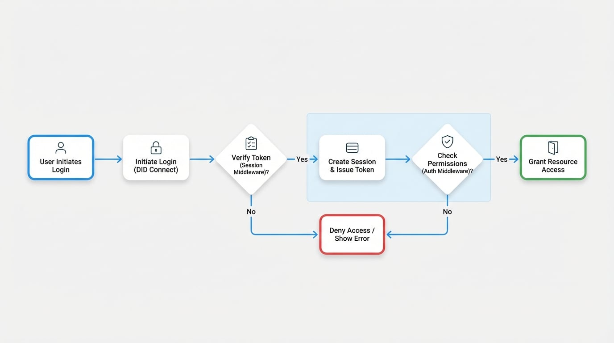

# 身份验证

在现代 Web 应用程序中，强大的身份验证和授权对于安全和用户管理至关重要。Blocklet SDK 提供了一套全面的工具，可无缝实现这些功能，利用去中心化身份（DID）提供安全且以用户为中心的体验。

本节概述了在您的 Blocklet 中管理用户身份、会话和访问控制的关键组件。您将学习如何集成 DID Connect 进行登录，使用强大的中间件验证用户会话，以及通过精细的授权规则保护您的应用程序路由。

身份验证和授权流程通常遵循以下步骤：

<!-- DIAGRAM_IMAGE_START:flowchart:16:9 -->

<!-- DIAGRAM_IMAGE_END -->

1.  **用户登录**：用户通过 DID Connect 发起登录请求。
2.  **会话创建**：成功验证身份后，将创建一个会话并向用户颁发一个令牌。
3.  **会话验证**：对于后续请求，`sessionMiddleware` 会验证用户的令牌。
4.  **访问控制**：`authMiddleware` 检查经过身份验证的用户是否具有访问所请求资源的必要角色或权限。
5.  **资源访问**：如果会话验证和授权均成功，则用户被授予对资源的访问权限。

要实现这些功能，您将主要使用三个关键模块。以下子文档为每个组件提供了详细的指南和 API 参考。

<x-cards data-columns="3">
  <x-card data-title="DID Connect" data-icon="lucide:key-round" data-href="/authentication/did-connect">
    使用 WalletAuthenticator 和 WalletHandler 集成去中心化身份以实现用户登录。
  </x-card>
  <x-card data-title="会话中间件" data-icon="lucide:shield-check" data-href="/authentication/session-middleware">
    学习使用会话中间件来验证来自登录令牌、访问密钥或安全组件调用的用户会话。
  </x-card>
  <x-card data-title="授权中间件" data-icon="lucide:lock" data-href="/authentication/auth-middleware">
    通过实施基于角色和权限的访问控制来保护您的应用程序路由。
  </x-card>
</x-cards>

通过结合使用这些工具，您可以为您的 Blocklet 构建一个安全灵活的身份验证和授权系统，确保只有经过身份验证和授权的用户才能访问受保护的资源。

请继续阅读 [DID Connect](./authentication-did-connect.md) 指南，开始实现用户登录。