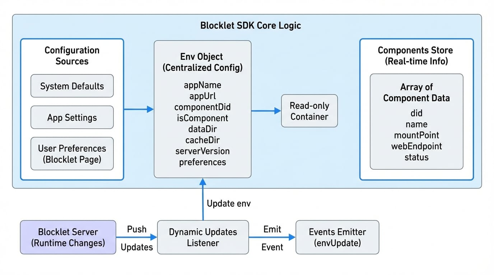

# Configuration & Environment

The Blocklet SDK provides a robust and unified way to manage configuration and environment variables for your application. It aggregates settings from multiple sources into a single, easy-to-use interface, ensuring your blocklet has access to all the necessary information, from application metadata to component-specific settings.

This section will cover the two primary exports for accessing this information: the `env` object and the `components` store.

## The `env` Object

The `env` object is a centralized, read-only container for all configuration variables available to your component at runtime. The SDK automatically populates this object by merging configuration from several sources, including default values, application-level settings, and component-specific environment files.

You can access any configuration property by simply importing `env` from the SDK.

```javascript icon=logos:javascript
import { env } from '@blocklet/sdk';

console.log(`Running in app: ${env.appName}`);
console.log(`My data directory is at: ${env.dataDir}`);

// Access user-defined preferences from the blocklet's settings page
const userApiKey = env.preferences.apiKey;
```

### Key Environment Properties

While the `env` object contains many properties, here are some of the most commonly used ones:

<x-field data-name="appName" data-type="string" data-desc="The name of the parent application."></x-field>
<x-field data-name="appUrl" data-type="string" data-desc="The full public URL of the application."></x-field>
<x-field data-name="componentDid" data-type="string" data-desc="The Decentralized ID (DID) of the current component."></x-field>
<x-field data-name="isComponent" data-type="boolean" data-desc="A flag that is `true` if the code is running within a component context."></x-field>
<x-field data-name="dataDir" data-type="string" data-desc="The absolute path to the component's dedicated data storage directory."></x-field>
<x-field data-name="cacheDir" data-type="string" data-desc="The absolute path to the component's dedicated cache directory."></x-field>
<x-field data-name="serverVersion" data-type="string" data-desc="The version of the Blocklet Server the application is running on."></x-field>
<x-field data-name="preferences" data-type="Record<string, any>" data-desc="An object containing custom configuration values set by the user from the blocklet's settings page."></x-field>


## The `components` Store

The `components` store is an array that provides real-time information about all other components running within the same application instance. This is essential for inter-component communication, allowing one component to discover the endpoints and status of another.

```javascript icon=logos:javascript
import { components } from '@blocklet/sdk';

// Find a running API service component to make a request
const apiService = components.find(c => c.name === 'api-service' && c.status === 1);

if (apiService) {
  const apiUrl = apiService.webEndpoint;
  console.log(`Found API service at: ${apiUrl}`);
  // Now you can make a request to this URL
}
```

### Component Properties

Each object in the `components` array contains detailed information about a component:

<x-field data-name="did" data-type="string" data-desc="The Decentralized ID (DID) of the component."></x-field>
<x-field data-name="name" data-type="string" data-desc="The name of the component as defined in its `blocklet.yml`."></x-field>
<x-field data-name="mountPoint" data-type="string" data-desc="The URL path where the component is mounted (e.g., `/admin`, `/api`)."></x-field>
<x-field data-name="webEndpoint" data-type="string" data-desc="The full, publicly accessible URL for the component."></x-field>
<x-field data-name="status" data-type="number" data-desc="The current status of the component (e.g., `1` for running, `0` for stopped)."></x-field>


## Configuration Loading Flow

The SDK builds the `env` object by layering configurations from different sources. Each subsequent source can override the values from the previous ones, providing a clear and predictable order of precedence.

<!-- DIAGRAM_IMAGE_START:architecture:16:9 -->

<!-- DIAGRAM_IMAGE_END -->

This layered approach provides flexibility, allowing developers and administrators to configure blocklets at different levels.

## Dynamic Updates

The configuration is not just static. The Blocklet SDK listens for runtime changes pushed by the Blocklet Server. For instance, if a user updates a setting on the blocklet's configuration page, the SDK will automatically update the `env` object and emit an event.

You can listen for these changes using the exported `events` emitter.

```javascript icon=logos:javascript
import { events, Events } from '@blocklet/sdk';

// Listen for any updates to the environment or preferences
events.on(Events.envUpdate, (updatedValues) => {
  console.log('Configuration was updated:', updatedValues);
  // You can now react to the change, e.g., re-initialize a service
});
```

This allows you to build applications that can react to configuration changes without requiring a restart.

---

Now that you understand how to access configuration and environment variables, you can explore how to use them for more specific tasks. A common use case is managing cryptographic keys and wallets, which is covered in the next section.

<x-card data-title="Next: Wallet Management" data-icon="lucide:wallet" data-href="/core-concepts/wallet" data-cta="Read More">
  Learn how to create and manage wallet instances for signing and authentication.
</x-card>