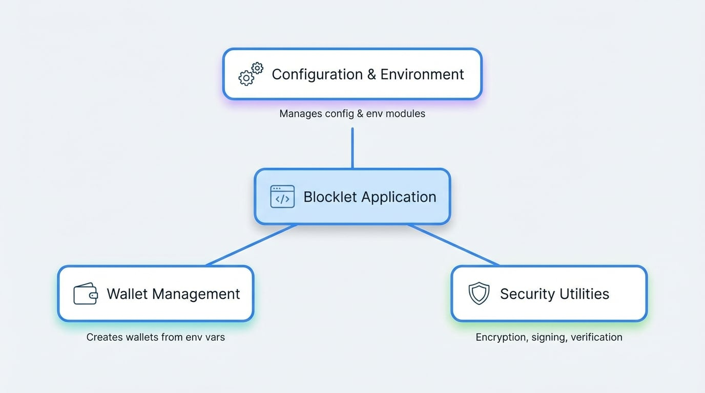

# コアコンセプト

Blocklet SDKは、構築するあらゆるアプリケーションのバックボーンとなる、いくつかの基本概念に基づいて構築されています。これらのコアピラーである設定、ウォレット管理、セキュリティを理解することは、SDKの全能力を活用して、堅牢で安全、かつスケーラブルなBlockletを作成するために不可欠です。

このセクションでは、これらの主要な領域の概要を説明します。各コンセプトは、専用のサブセクションで詳しく説明されており、以下から移動できます。

<!-- DIAGRAM_IMAGE_START:intro:16:9 -->

<!-- DIAGRAM_IMAGE_END -->

<x-cards data-columns="3">
  <x-card data-title="設定と環境" data-icon="lucide:settings" data-href="/core-concepts/configuration">
    `config` および `env` モジュールを通じてSDKが設定、環境変数、コンポーネントストアをどのように管理するかを学びます。
  </x-card>
  <x-card data-title="ウォレット管理" data-icon="lucide:wallet" data-href="/core-concepts/wallet">
    署名と認証に不可欠な、環境変数からウォレットインスタンスを作成および管理するための `getWallet` ユーティリティについて探ります。
  </x-card>
  <x-card data-title="セキュリティユーティリティ" data-icon="lucide:shield" data-href="/core-concepts/security">
    データの暗号化/復号化、レスポンス署名、署名検証など、組み込みのセキュリティ機能を理解します。
  </x-card>
</x-cards>

これらのコンセプトをマスターすることで、より複雑で安全なアプリケーションを構築できるようになります。アプリケーションがその周囲とどのように相互作用するかを理解するために、[設定と環境](./core-concepts-configuration.md)から始めることをお勧めします。