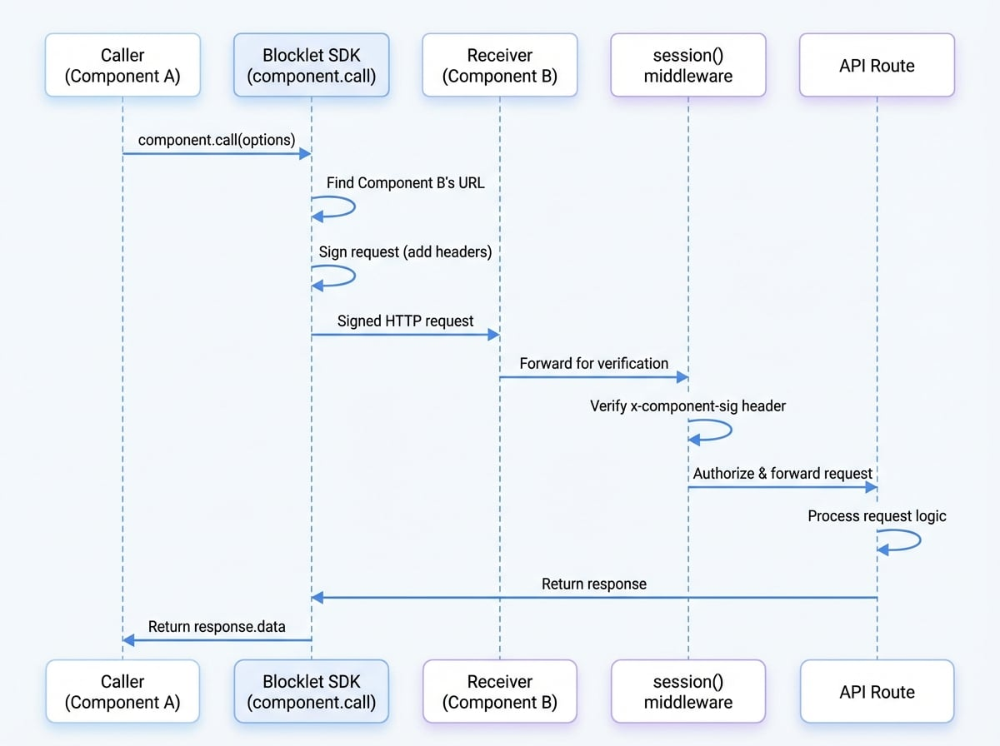

# コンポーネント間通信

複数のコンポーネントで構成される Blocklet アプリケーションでは、コンポーネント同士が安全かつ確実に通信できることが不可欠です。Blocklet SDK は、この目的のために特別に設計された高レベルのユーティリティ `component.call` を提供します。このメソッドは、サービスディスカバリ、リクエスト署名、自動リトライを処理することで、コンポーネント間の API 呼び出しを簡素化します。

このアプローチは、動的ポートや Docker ネットワーキングといった基盤環境の複雑さを抽象化し、すべての通信が認証されることを保証するため、直接的な HTTP リクエストよりも堅牢です。

## セキュアな API 呼び出しの実行

コンポーネント間通信の主要なメソッドは `component.call` です。これは HTTP クライアント (`axios`) のラッパーとして機能しますが、呼び出し元コンポーネントのアイデンティティを検証するために必要な認証ヘッダーを自動的に挿入します。

### 基本的な使用法

これは、あるコンポーネントが 'user-service' という名前の別のコンポーネントの API エンドポイントを呼び出す基本的な例です。

```javascript Calling another component icon=logos:javascript
import component from '@blocklet/sdk/component';

async function getUserProfile(userId) {
  try {
    const response = await component.call({
      name: 'user-service', // ターゲットコンポーネントの名前、DID、またはタイトル
      method: 'GET',
      path: `/api/users/${userId}`,
    });

    console.log('User Profile:', response.data);
    return response.data;
  } catch (error) {
    console.error('Failed to call user-service:', error.message);
  }
}
```

### 仕組み

`component.call` 関数は、いくつかの主要なステップを通じて通信プロセスを効率化します：

1.  **サービスディスカバリ**：アプリケーションのコンポーネントレジストリでターゲットコンポーネント（例：'user-service'）を検索し、その現在の場所とメタデータを見つけます。
2.  **エンドポイント解決**：コンポーネントに到達するための正しい内部 URL を構築し、Docker コンテナネットワーキングなどの複雑さを自動的に処理します。
3.  **リクエスト署名**：リクエストを送信する前に、特別な `x-component-*` ヘッダーを自動的に追加します。これらのヘッダーには、呼び出し元コンポーネントの秘密鍵を使用して生成された署名が含まれており、そのアイデンティティを証明します。
4.  **API 呼び出し**：設定されたメソッド、パス、データを使用して HTTP リクエストを実行します。
5.  **自動リトライ**：一時的なサーバーエラー（例：5xx ステータスコード）によりリクエストが失敗した場合、遅延を増やしながら（指数バックオフ）、リクエストを数回自動的に再試行します。

このフローにより、通信の信頼性と安全性の両方が保証されます。受信側コンポーネントは、[セッションミドルウェア](./authentication-session-middleware.md)を使用して署名を検証し、リクエストを認可できます。

<!-- DIAGRAM_IMAGE_START:sequence:4:3 -->

<!-- DIAGRAM_IMAGE_END -->

### `call` のパラメータ

`component.call` 関数は、次のプロパティを持つオプションオブジェクトを受け入れます：

<x-field-group>
  <x-field data-name="name" data-type="string" data-required="true" data-desc="呼び出すターゲットコンポーネントの名前、タイトル、または DID。"></x-field>
  <x-field data-name="method" data-type="string" data-default="POST" data-required="false" data-desc="リクエストの HTTP メソッド（例：'GET'、'POST'、'PUT'、'DELETE'）。"></x-field>
  <x-field data-name="path" data-type="string" data-required="true" data-desc="ターゲットコンポーネントの API パス（例：'/api/v1/resource'）。"></x-field>
  <x-field data-name="data" data-type="any" data-required="false">
    <x-field-desc markdown>リクエストボディ。通常、`POST`、`PUT`、または `PATCH` メソッドで使用されます。</x-field-desc>
  </x-field>
  <x-field data-name="params" data-type="any" data-required="false" data-desc="リクエスト URL に追加される URL クエリパラメータ。"></x-field>
  <x-field data-name="headers" data-type="object" data-required="false" data-desc="リクエストと共に送信されるカスタムヘッダーのオブジェクト。"></x-field>
  <x-field data-name="timeout" data-type="number" data-required="false" data-desc="リクエストのタイムアウト（ミリ秒）。"></x-field>
  <x-field data-name="responseType" data-type="string" data-required="false" data-desc="サーバーが応答するデータのタイプ。例：'stream'。"></x-field>
</x-field-group>

### 戻り値

この関数は、`data`、`status`、`headers` などのプロパティを含む `AxiosResponse` オブジェクトに解決される `Promise` を返します。

## 高度な使用法

### リトライ動作のカスタマイズ

`component.call` に 2 番目の引数を渡すことで、自動リトライロジックをカスタマイズできます。これは、エンドポイントの特定の信頼性要件に合わせて調整するのに役立ちます。

```javascript Custom Retry Options icon=lucide:refresh-cw
import component from '@blocklet/sdk/component';

const callOptions = {
  name: 'data-processor',
  method: 'POST',
  path: '/api/process',
  data: { job: 'some-long-job' },
};

const retryOptions = {
  retries: 5,       // 合計で 5 回試行
  minTimeout: 1000, // リトライ間隔は最低 1 秒
  factor: 2,        // 失敗するたびに待機時間を 2 倍にする
};

async function processData() {
  const response = await component.call(callOptions, retryOptions);
  return response.data;
}
```

`retryOptions` オブジェクトは、次のプロパティを持つことができます：

<x-field-group>
  <x-field data-name="retries" data-type="number" data-default="3" data-desc="試行する合計回数。"></x-field>
  <x-field data-name="factor" data-type="number" data-default="2" data-desc="バックオフに使用する指数係数。"></x-field>
  <x-field data-name="minTimeout" data-type="number" data-default="500" data-desc="リトライ間の最小タイムアウト（ミリ秒）。"></x-field>
  <x-field data-name="maxTimeout" data-type="number" data-default="5000" data-desc="リトライ間の最大タイムアウト（ミリ秒）。"></x-field>
  <x-field data-name="randomize" data-type="boolean" data-default="true" data-desc="タイムアウトをランダム化するかどうか。"></x-field>
  <x-field data-name="onFailedAttempt" data-type="function" data-required="false" data-desc="各失敗試行時に呼び出されるコールバック関数。"></x-field>
</x-field-group>

### ストリーム応答の処理

ストリームを返すエンドポイント（例：大きなファイルのダウンロード）の場合、`responseType: 'stream'` を設定できます。これにより、応答全体をメモリにバッファリングすることなく、データが到着したときに処理できます。

```javascript Streaming a File icon=lucide:file-down
import fs from 'fs';
import component from '@blocklet/sdk/component';

async function downloadBackup() {
  const response = await component.call({
    name: 'backup-service',
    method: 'GET',
    path: '/api/export',
    responseType: 'stream',
  });

  const writer = fs.createWriteStream('backup.zip');
  response.data.pipe(writer);

  return new Promise((resolve, reject) => {
    writer.on('finish', resolve);
    writer.on('error', reject);
  });
}
```

---

`component.call` を使用することで、堅牢で安全なマルチコンポーネントアプリケーションを簡単に構築できます。次の論理的なステップは、これらの着信呼び出しを検証してコンポーネントの API エンドポイントを保護する方法を学ぶことです。詳細については、[セッションミドルウェア](./authentication-session-middleware.md)ガイドを参照してください。