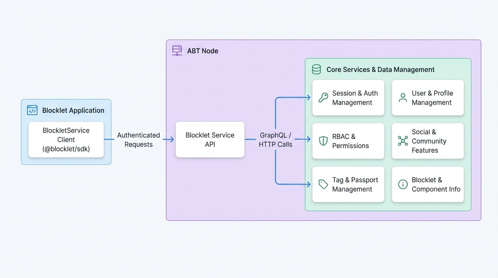

# Blocklet Service

`BlockletService`は、Blockletが基盤となるABT Nodeサービスと対話するための主要なインターフェースとして機能する強力なクライアントです。複雑なGraphQLクエリとHTTPリクエストを、クリーンでPromiseベースのJavaScript APIにラップすることで、ユーザー管理、セッション処理、ロールベースのアクセス制御（RBAC）、Blockletメタデータの取得などのタスクを簡素化します。

このサービスは、Blockletプラットフォームの全能力を活用する、安全で機能豊富なアプリケーションを構築するために不可欠です。このサービスを詳しく見る前に、[認証](./authentication.md)ガイドで説明されている概念を理解しておくと役立ちます。

### 仕組み

アプリケーション内の`BlockletService`クライアントは、ABT Node上で実行されている`blocklet-service`と通信します。すべてのリクエストはBlockletのクレデンシャルを使用して自動的に認証され、コア機能への安全なアクセスを保証します。

<!-- DIAGRAM_IMAGE_START:architecture:16:9 -->

<!-- DIAGRAM_IMAGE_END -->

## はじめに

サービスを使用するには、インポートしてインスタンス化するだけです。クライアントは、Blocklet Serverから提供される環境変数に基づいて自動的に自身を設定します。

```javascript はじめに icon=logos:javascript
import BlockletService from '@blocklet/sdk/service/blocklet';

const client = new BlockletService();

async function main() {
  const { user } = await client.getOwner();
  console.log('Blockletの所有者:', user.fullName);
}

main();
```

## セッション管理

### login

ユーザーを認証し、セッションを開始します。

**パラメータ**

<x-field data-name="params" data-type="object" data-required="true" data-desc="ログインクレデンシャルまたはデータ。"></x-field>

**戻り値**

<x-field data-name="Promise<object>" data-type="Promise<object>" data-desc="セッションとユーザー情報を含むオブジェクト。">
  <x-field data-name="user" data-type="object" data-desc="認証されたユーザーのプロファイル。"></x-field>
  <x-field data-name="token" data-type="string" data-desc="セッションのアクセストークン。"></x-field>
  <x-field data-name="refreshToken" data-type="string" data-desc="セッションを延長するためのリフレッシュトークン。"></x-field>
  <x-field data-name="visitorId" data-type="string" data-required="false" data-desc="訪問者/デバイスの一意の識別子。"></x-field>
</x-field>

### refreshSession

リフレッシュトークンを使用して期限切れのセッションを更新します。

**パラメータ**

<x-field-group>
  <x-field data-name="refreshToken" data-type="string" data-required="true" data-desc="以前のセッションからのリフレッシュトークン。"></x-field>
  <x-field data-name="visitorId" data-type="string" data-required="false" data-desc="訪問者/デバイスの一意の識別子。"></x-field>
</x-field-group>

**戻り値**

<x-field data-name="Promise<object>" data-type="Promise<object>" data-desc="新しいセッションとユーザー情報を含むオブジェクト。">
  <x-field data-name="user" data-type="object" data-desc="認証されたユーザーのプロファイル。"></x-field>
  <x-field data-name="token" data-type="string" data-desc="新しいアクセストークン。"></x-field>
  <x-field data-name="refreshToken" data-type="string" data-desc="新しいリフレッシュトークン。"></x-field>
  <x-field data-name="provider" data-type="string" data-desc="ログインプロバイダー（例：「wallet」）。"></x-field>
</x-field>

### switchProfile

ユーザーのプロファイル情報を更新します。

**パラメータ**

<x-field-group>
  <x-field data-name="did" data-type="string" data-required="true" data-desc="更新するユーザーのDID。"></x-field>
  <x-field data-name="profile" data-type="object" data-required="true" data-desc="更新するプロファイルフィールドを含むオブジェクト。">
    <x-field data-name="avatar" data-type="string" data-required="false" data-desc="新しいアバターURL。"></x-field>
    <x-field data-name="email" data-type="string" data-required="false" data-desc="新しいメールアドレス。"></x-field>
    <x-field data-name="fullName" data-type="string" data-required="false" data-desc="新しいフルネーム。"></x-field>
  </x-field>
</x-field-group>

**戻り値**

<x-field data-name="ResponseUser" data-type="Promise<object>" data-desc="更新されたユーザープロファイルを含むオブジェクト。"></x-field>

## ユーザー管理

### getUser

DIDによって単一ユーザーのプロファイルを取得します。

**パラメータ**

<x-field-group>
  <x-field data-name="did" data-type="string" data-required="true" data-desc="取得するユーザーの一意のDID。"></x-field>
  <x-field data-name="options" data-type="object" data-required="false" data-desc="クエリのオプション設定。">
    <x-field data-name="enableConnectedAccount" data-type="boolean" data-required="false" data-desc="trueの場合、ユーザーの接続済みアカウント（例：OAuthプロバイダー）に関する詳細を含めます。"></x-field>
    <x-field data-name="includeTags" data-type="boolean" data-required="false" data-desc="trueの場合、ユーザーに関連付けられたタグを含めます。"></x-field>
  </x-field>
</x-field-group>

**戻り値**

<x-field data-name="ResponseUser" data-type="Promise<object>" data-desc="ユーザーのプロファイルを含むオブジェクト。">
  <x-field data-name="user" data-type="object" data-desc="ユーザープロファイルオブジェクト。"></x-field>
</x-field>

### getUsers

フィルタリングとソートをサポートする、ページ分割されたユーザーリストを取得します。

**パラメータ**

<x-field data-name="args" data-type="object" data-required="false" data-desc="クエリ、ソート、ページネーションのオプションを含むオブジェクト。">
  <x-field data-name="paging" data-type="object" data-desc="ページネーションオプション。">
    <x-field data-name="page" data-type="number" data-desc="取得するページ番号。"></x-field>
    <x-field data-name="pageSize" data-type="number" data-desc="ページあたりのユーザー数。"></x-field>
  </x-field>
  <x-field data-name="query" data-type="object" data-desc="フィルタリング基準。">
    <x-field data-name="role" data-type="string" data-desc="ユーザーロールでフィルタリング。"></x-field>
    <x-field data-name="approved" data-type="boolean" data-desc="承認ステータスでフィルタリング。"></x-field>
    <x-field data-name="search" data-type="string" data-desc="ユーザーフィールドと照合するための検索文字列。"></x-field>
  </x-field>
  <x-field data-name="sort" data-type="object" data-desc="ソート基準。">
    <x-field data-name="updatedAt" data-type="number" data-desc="更新タイムスタンプでソート。`1`は昇順、`-1`は降順。"></x-field>
    <x-field data-name="createdAt" data-type="number" data-desc="作成タイムスタンプでソート。`1`は昇順、`-1`は降順。"></x-field>
    <x-field data-name="lastLoginAt" data-type="number" data-desc="最終ログインタイムスタンプでソート。`1`は昇順、`-1`は降順。"></x-field>
  </x-field>
</x-field>

**戻り値**

<x-field data-name="ResponseUsers" data-type="Promise<object>" data-desc="ページ分割されたユーザーオブジェクトのリスト。">
  <x-field data-name="users" data-type="TUserInfo[]" data-desc="ユーザープロファイルオブジェクトの配列。"></x-field>
  <x-field data-name="paging" data-type="object" data-desc="ページネーション情報。">
    <x-field data-name="total" data-type="number" data-desc="ユーザーの総数。"></x-field>
    <x-field data-name="pageSize" data-type="number" data-desc="ページあたりのユーザー数。"></x-field>
    <x-field data-name="page" data-type="number" data-desc="現在のページ番号。"></x-field>
  </x-field>
</x-field>

### getUsersCount

ユーザーの総数を取得します。

**戻り値**

<x-field data-name="ResponseGetUsersCount" data-type="Promise<object>" data-desc="ユーザー総数を含むオブジェクト。">
  <x-field data-name="count" data-type="number" data-desc="ユーザーの総数。"></x-field>
</x-field>

### getUsersCountPerRole

各ロールのユーザー数を取得します。

**戻り値**

<x-field data-name="ResponseGetUsersCountPerRole" data-type="Promise<object>" data-desc="ロールごとのユーザー数を含むオブジェクト。">
  <x-field data-name="counts" data-type="TKeyValue[]" data-desc="各オブジェクトが `key` (ロール名) と `value` (ユーザー数) を持つオブジェクトの配列。"></x-field>
</x-field>

### getOwner

Blockletの所有者のプロファイルを取得します。

**戻り値**

<x-field data-name="ResponseUser" data-type="Promise<object>" data-desc="所有者のユーザープロファイルを含むオブジェクト。"></x-field>

### updateUserApproval

ユーザーのBlockletへのアクセスを承認または取り消します。

**パラメータ**

<x-field-group>
  <x-field data-name="did" data-type="string" data-required="true" data-desc="更新するユーザーのDID。"></x-field>
  <x-field data-name="approved" data-type="boolean" data-required="true" data-desc="承認するには `true`、取り消すには `false` に設定します。"></x-field>
</x-field-group>

**戻り値**

<x-field data-name="ResponseUser" data-type="Promise<object>" data-desc="更新されたユーザープロファイルを含むオブジェクト。"></x-field>

### updateUserTags

ユーザーに関連付けられたタグを更新します。

**パラメータ**

<x-field data-name="args" data-type="object" data-required="true">
  <x-field data-name="did" data-type="string" data-required="true" data-desc="ユーザーのDID。"></x-field>
  <x-field data-name="tags" data-type="number[]" data-required="true" data-desc="ユーザーに関連付けるタグIDの配列。"></x-field>
</x-field>

**戻り値**

<x-field data-name="ResponseUser" data-type="Promise<object>" data-desc="更新されたユーザープロファイルを含むオブジェクト。"></x-field>

### updateUserExtra

ユーザーの追加メタデータを更新します。

**パラメータ**

<x-field data-name="args" data-type="object" data-required="true">
  <x-field data-name="did" data-type="string" data-required="true" data-desc="ユーザーのDID。"></x-field>
  <x-field data-name="remark" data-type="string" data-required="false" data-desc="ユーザーに関する備考やメモ。"></x-field>
  <x-field data-name="extra" data-type="string" data-required="false" data-desc="カスタムデータを保存するためのJSON文字列。"></x-field>
</x-field>

**戻り値**

<x-field data-name="ResponseUser" data-type="Promise<object>" data-desc="更新されたユーザープロファイルを含むオブジェクト。"></x-field>

### updateUserInfo

ユーザーの一般情報を更新します。有効なユーザーセッションクッキーが必要です。

**パラメータ**

<x-field-group>
  <x-field data-name="userInfo" data-type="object" data-required="true" data-desc="更新するユーザーフィールドを含むオブジェクト。ユーザーの`did`を含める必要があります。"></x-field>
  <x-field data-name="options" data-type="object" data-required="true" data-desc="ヘッダーを含むリクエストオプション。">
    <x-field data-name="headers" data-type="object" data-required="true">
      <x-field data-name="cookie" data-type="string" data-required="true" data-desc="ユーザーのセッションクッキー。"></x-field>
    </x-field>
  </x-field>
</x-field-group>

**戻り値**

<x-field data-name="ResponseUser" data-type="Promise<object>" data-desc="更新されたユーザープロファイルを含むオブジェクト。"></x-field>

### updateUserAddress

ユーザーの住所を更新します。有効なユーザーセッションクッキーが必要です。

**パラメータ**

<x-field-group>
  <x-field data-name="args" data-type="object" data-required="true" data-desc="ユーザーのDIDと住所詳細を含むオブジェクト。">
    <x-field data-name="did" data-type="string" data-required="true" data-desc="ユーザーのDID。"></x-field>
    <x-field data-name="address" data-type="object" data-required="false" data-desc="ユーザーの住所。">
      <x-field data-name="country" data-type="string" data-desc="国"></x-field>
      <x-field data-name="province" data-type="string" data-desc="州/都道府県"></x-field>
      <x-field data-name="city" data-type="string" data-desc="市"></x-field>
      <x-field data-name="postalCode" data-type="string" data-desc="郵便番号"></x-field>
      <x-field data-name="line1" data-type="string" data-desc="住所1"></x-field>
      <x-field data-name="line2" data-type="string" data-desc="住所2"></x-field>
    </x-field>
  </x-field>
  <x-field data-name="options" data-type="object" data-required="true" data-desc="ヘッダーを含むリクエストオプション。">
    <x-field data-name="headers" data-type="object" data-required="true">
      <x-field data-name="cookie" data-type="string" data-required="true" data-desc="ユーザーのセッションクッキー。"></x-field>
    </x-field>
  </x-field>
</x-field-group>

**戻り値**

<x-field data-name="ResponseUser" data-type="Promise<object>" data-desc="更新されたユーザープロファイルを含むオブジェクト。"></x-field>

## ユーザーセッション

### getUserSessions

ユーザーのアクティブなセッションのリストを取得します。

**パラメータ**

<x-field data-name="args" data-type="object" data-required="false" data-desc="クエリとページネーションのオプションを含むオブジェクト。">
  <x-field data-name="paging" data-type="object" data-desc="ページネーションオプション。"></x-field>
  <x-field data-name="query" data-type="object" data-desc="フィルタリング基準。">
    <x-field data-name="userDid" data-type="string" data-desc="ユーザーDIDでフィルタリング。"></x-field>
    <x-field data-name="status" data-type="string" data-desc="セッションステータスでフィルタリング。"></x-field>
  </x-field>
</x-field>

**戻り値**

<x-field data-name="ResponseUserSessions" data-type="Promise<object>" data-desc="ページ分割されたユーザーセッションのリスト。">
  <x-field data-name="list" data-type="TUserSession[]" data-desc="セッションオブジェクトの配列。"></x-field>
  <x-field data-name="paging" data-type="object" data-desc="ページネーション情報。"></x-field>
</x-field>

### getUserSessionsCount

オプションのフィルタリング付きで、ユーザーセッションの総数を取得します。

**パラメータ**

<x-field data-name="args" data-type="object" data-required="false" data-desc="クエリオプションを含むオブジェクト。">
  <x-field data-name="query" data-type="object" data-desc="フィルタリング基準。">
    <x-field data-name="userDid" data-type="string" data-desc="ユーザーDIDでフィルタリング。"></x-field>
  </x-field>
</x-field>

**戻り値**

<x-field data-name="ResponseUserSessionsCount" data-type="Promise<object>" data-desc="セッション数を含むオブジェクト。">
  <x-field data-name="count" data-type="number" data-desc="セッションの総数。"></x-field>
</x-field>

## ソーシャル＆コミュニティ

### getUserFollowers

特定のユーザーをフォローしているユーザーのリストを取得します。有効なユーザーセッションクッキーが必要です。

**パラメータ**

<x-field-group>
  <x-field data-name="args" data-type="object" data-required="true" data-desc="クエリオプション。">
    <x-field data-name="userDid" data-type="string" data-required="true" data-desc="フォロワーを取得する対象のユーザーのDID。"></x-field>
    <x-field data-name="paging" data-type="object" data-required="false" data-desc="ページネーションオプション。"></x-field>
  </x-field>
  <x-field data-name="options" data-type="object" data-required="true" data-desc="ヘッダーを含むリクエストオプション。">
    <x-field data-name="headers" data-type="object" data-required="true">
      <x-field data-name="cookie" data-type="string" data-required="true" data-desc="ユーザーのセッションクッキー。"></x-field>
    </x-field>
  </x-field>
</x-field-group>

**戻り値**

<x-field data-name="ResponseUserFollows" data-type="Promise<object>" data-desc="ページ分割されたフォロワーユーザーのリスト。"></x-field>

### getUserFollowing

特定のユーザーがフォローしているユーザーのリストを取得します。有効なユーザーセッションクッキーが必要です。

**パラメータ**

<x-field-group>
  <x-field data-name="args" data-type="object" data-required="true" data-desc="クエリオプション。">
    <x-field data-name="userDid" data-type="string" data-required="true" data-desc="フォローリストを取得する対象のユーザーのDID。"></x-field>
    <x-field data-name="paging" data-type="object" data-required="false" data-desc="ページネーションオプション。"></x-field>
  </x-field>
  <x-field data-name="options" data-type="object" data-required="true" data-desc="ヘッダーを含むリクエストオプション。">
    <x-field data-name="headers" data-type="object" data-required="true">
      <x-field data-name="cookie" data-type="string" data-required="true" data-desc="ユーザーのセッションクッキー。"></x-field>
    </x-field>
  </x-field>
</x-field-group>

**戻り値**

<x-field data-name="ResponseUserFollows" data-type="Promise<object>" data-desc="フォローされているユーザーのページ分割されたリスト。"></x-field>

### getUserFollowStats

ユーザーのフォロワー数とフォロー数を取得します。有効なユーザーセッションクッキーが必要です。

**パラメータ**

<x-field-group>
  <x-field data-name="args" data-type="object" data-required="true" data-desc="クエリオプション。">
    <x-field data-name="userDids" data-type="string[]" data-required="true" data-desc="ユーザーDIDの配列。"></x-field>
  </x-field>
  <x-field data-name="options" data-type="object" data-required="true" data-desc="ヘッダーを含むリクエストオプション。">
    <x-field data-name="headers" data-type="object" data-required="true">
      <x-field data-name="cookie" data-type="string" data-required="true" data-desc="ユーザーのセッションクッキー。"></x-field>
    </x-field>
  </x-field>
</x-field-group>

**戻り値**

<x-field data-name="ResponseUserRelationCount" data-type="Promise<object>" data-desc="フォロワー数とフォロー数を含むオブジェクト。"></x-field>

### checkFollowing

あるユーザーが他の1人以上のユーザーをフォローしているかどうかを確認します。

**パラメータ**

<x-field data-name="args" data-type="object" data-required="true">
  <x-field data-name="followerDid" data-type="string" data-required="true" data-desc="潜在的なフォロワーのDID。"></x-field>
  <x-field data-name="userDids" data-type="string[]" data-required="true" data-desc="確認対象のユーザーDIDの配列。"></x-field>
</x-field>

**戻り値**

<x-field data-name="ResponseCheckFollowing" data-type="Promise<object>" data-desc="キーがユーザーDID、値がフォロー状況を示すブール値のオブジェクト。"></x-field>

### followUser

あるユーザーが別のユーザーをフォローするようにします。

**パラメータ**

<x-field data-name="args" data-type="object" data-required="true">
  <x-field data-name="followerDid" data-type="string" data-required="true" data-desc="フォローするユーザーのDID。"></x-field>
  <x-field data-name="userDid" data-type="string" data-required="true" data-desc="フォローされるユーザーのDID。"></x-field>
</x-field>

**戻り値**

<x-field data-name="GeneralResponse" data-type="Promise<object>" data-desc="成功または失敗を示す一般的なレスポンスオブジェクト。"></x-field>

### unfollowUser

あるユーザーが別のユーザーのフォローを解除するようにします。

**パラメータ**

<x-field data-name="args" data-type="object" data-required="true">
  <x-field data-name="followerDid" data-type="string" data-required="true" data-desc="フォローを解除するユーザーのDID。"></x-field>
  <x-field data-name="userDid" data-type="string" data-required="true" data-desc="フォローを解除されるユーザーのDID。"></x-field>
</x-field>

**戻り値**

<x-field data-name="GeneralResponse" data-type="Promise<object>" data-desc="成功または失敗を示す一般的なレスポンスオブジェクト。"></x-field>

### getUserInvites

特定のユーザーによって招待されたユーザーのリストを取得します。有効なユーザーセッションクッキーが必要です。

**パラメータ**

<x-field-group>
  <x-field data-name="args" data-type="object" data-required="true" data-desc="クエリオプション。">
    <x-field data-name="userDid" data-type="string" data-required="true" data-desc="招待者のDID。"></x-field>
    <x-field data-name="paging" data-type="object" data-required="false" data-desc="ページネーションオプション。"></x-field>
  </x-field>
  <x-field data-name="options" data-type="object" data-required="true" data-desc="ヘッダーを含むリクエストオプション。">
    <x-field data-name="headers" data-type="object" data-required="true">
      <x-field data-name="cookie" data-type="string" data-required="true" data-desc="ユーザーのセッションクッキー。"></x-field>
    </x-field>
  </x-field>
</x-field-group>

**戻り値**

<x-field data-name="ResponseUsers" data-type="Promise<object>" data-desc="ページ分割された招待ユーザーのリスト。"></x-field>

## タグ管理

### getTags

利用可能なすべてのユーザータグのリストを取得します。

**パラメータ**

<x-field data-name="args" data-type="object" data-required="false">
  <x-field data-name="paging" data-type="object" data-required="false" data-desc="ページネーションオプション。"></x-field>
</x-field>

**戻り値**

<x-field data-name="ResponseTags" data-type="Promise<object>" data-desc="ページ分割されたタグオブジェクトのリスト。">
  <x-field data-name="tags" data-type="TTag[]" data-desc="タグオブジェクトの配列。"></x-field>
  <x-field data-name="paging" data-type="object" data-desc="ページネーション情報。"></x-field>
</x-field>

### createTag

新しいユーザータグを作成します。

**パラメータ**

<x-field data-name="args" data-type="object" data-required="true">
  <x-field data-name="tag" data-type="object" data-required="true">
    <x-field data-name="title" data-type="string" data-required="true" data-desc="タグのタイトル。"></x-field>
    <x-field data-name="description" data-type="string" data-required="false" data-desc="タグの説明。"></x-field>
    <x-field data-name="color" data-type="string" data-required="false" data-desc="タグの16進数カラーコード。"></x-field>
  </x-field>
</x-field>

**戻り値**

<x-field data-name="ResponseTag" data-type="Promise<object>" data-desc="新しく作成されたタグを含むオブジェクト。"></x-field>

### updateTag

既存のユーザータグを更新します。

**パラメータ**

<x-field data-name="args" data-type="object" data-required="true">
  <x-field data-name="tag" data-type="object" data-required="true">
    <x-field data-name="id" data-type="number" data-required="true" data-desc="更新するタグのID。"></x-field>
    <x-field data-name="title" data-type="string" data-required="false" data-desc="新しいタイトル。"></x-field>
    <x-field data-name="description" data-type="string" data-required="false" data-desc="新しい説明。"></x-field>
    <x-field data-name="color" data-type="string" data-required="false" data-desc="新しい色。"></x-field>
  </x-field>
</x-field>

**戻り値**

<x-field data-name="ResponseTag" data-type="Promise<object>" data-desc="更新されたタグを含むオブジェクト。"></x-field>

### deleteTag

ユーザータグを削除します。

**パラメータ**

<x-field data-name="args" data-type="object" data-required="true">
  <x-field data-name="tag" data-type="object" data-required="true">
    <x-field data-name="id" data-type="number" data-required="true" data-desc="削除するタグのID。"></x-field>
  </x-field>
</x-field>

**戻り値**

<x-field data-name="ResponseTag" data-type="Promise<object>" data-desc="削除されたタグを含むオブジェクト。"></x-field>

## ロールベースのアクセス制御（RBAC）

### getRoles

利用可能なすべてのロールのリストを取得します。

**戻り値**

<x-field data-name="ResponseRoles" data-type="Promise<object>" data-desc="ロールのリストを含むオブジェクト。">
  <x-field data-name="roles" data-type="TRole[]" data-desc="ロールオブジェクトの配列。"></x-field>
</x-field>

### getRole

名前によって単一のロールを取得します。

**パラメータ**

<x-field data-name="name" data-type="string" data-required="true" data-desc="ロールの一意の名前。"></x-field>

**戻り値**

<x-field data-name="ResponseRole" data-type="Promise<object>" data-desc="ロールの詳細を含むオブジェクト。"></x-field>

### createRole

新しいロールを作成します。

**パラメータ**

<x-field data-name="args" data-type="object" data-required="true">
  <x-field data-name="name" data-type="string" data-required="true" data-desc="ロールの一意の識別子（例：`editor`）。"></x-field>
  <x-field data-name="title" data-type="string" data-required="true" data-desc="人間が読めるタイトル（例：`Content Editor`）。"></x-field>
  <x-field data-name="description" data-type="string" data-required="false" data-desc="ロールの目的の簡単な説明。"></x-field>
</x-field>

**戻り値**

<x-field data-name="ResponseRole" data-type="Promise<object>" data-desc="新しく作成されたロールを含むオブジェクト。"></x-field>

### updateRole

既存のロールを更新します。

**パラメータ**

<x-field-group>
  <x-field data-name="name" data-type="string" data-required="true" data-desc="更新するロールの名前。"></x-field>
  <x-field data-name="updates" data-type="object" data-required="true" data-desc="更新するフィールドを含むオブジェクト。">
    <x-field data-name="title" data-type="string" data-required="false" data-desc="新しいタイトル。"></x-field>
    <x-field data-name="description" data-type="string" data-required="false" data-desc="新しい説明。"></x-field>
  </x-field>
</x-field-group>

**戻り値**

<x-field data-name="ResponseRole" data-type="Promise<object>" data-desc="更新されたロールを含むオブジェクト。"></x-field>

### deleteRole

ロールを削除します。

**パラメータ**

<x-field data-name="name" data-type="string" data-required="true" data-desc="削除するロールの名前。"></x-field>

**戻り値**

<x-field data-name="GeneralResponse" data-type="Promise<object>" data-desc="成功または失敗を示す一般的なレスポンスオブジェクト。"></x-field>

### getPermissions

利用可能なすべての権限のリストを取得します。

**戻り値**

<x-field data-name="ResponsePermissions" data-type="Promise<object>" data-desc="権限のリストを含むオブジェクト。">
  <x-field data-name="permissions" data-type="TPermission[]" data-desc="権限オブジェクトの配列。"></x-field>
</x-field>

### getPermissionsByRole

特定のロールに付与されたすべての権限を取得します。

**パラメータ**

<x-field data-name="role" data-type="string" data-required="true" data-desc="ロールの名前。"></x-field>

**戻り値**

<x-field data-name="ResponsePermissions" data-type="Promise<object>" data-desc="ロールの権限リストを含むオブジェクト。"></x-field>

### createPermission

新しい権限を作成します。

**パラメータ**

<x-field data-name="args" data-type="object" data-required="true">
  <x-field data-name="name" data-type="string" data-required="true" data-desc="権限の一意の名前（例：`post:create`）。"></x-field>
  <x-field data-name="description" data-type="string" data-required="false" data-desc="権限が許可する内容の説明。"></x-field>
</x-field>

**戻り値**

<x-field data-name="ResponsePermission" data-type="Promise<object>" data-desc="新しく作成された権限を含むオブジェクト。"></x-field>

### updatePermission

既存の権限を更新します。

**パラメータ**

<x-field-group>
  <x-field data-name="name" data-type="string" data-required="true" data-desc="更新する権限の名前。"></x-field>
  <x-field data-name="updates" data-type="object" data-required="true">
    <x-field data-name="description" data-type="string" data-required="false" data-desc="権限の新しい説明。"></x-field>
  </x-field>
</x-field-group>

**戻り値**

<x-field data-name="ResponsePermission" data-type="Promise<object>" data-desc="更新された権限を含むオブジェクト。"></x-field>

### deletePermission

権限を削除します。

**パラメータ**

<x-field data-name="name" data-type="string" data-required="true" data-desc="削除する権限の名前。"></x-field>

**戻り値**

<x-field data-name="GeneralResponse" data-type="Promise<object>" data-desc="成功または失敗を示す一般的なレスポンスオブジェクト。"></x-field>

### grantPermissionForRole

ロールに権限を割り当てます。

**パラメータ**

<x-field-group>
  <x-field data-name="role" data-type="string" data-required="true" data-desc="ロールの名前。"></x-field>
  <x-field data-name="permission" data-type="string" data-required="true" data-desc="付与する権限の名前。"></x-field>
</x-field-group>

**戻り値**

<x-field data-name="GeneralResponse" data-type="Promise<object>" data-desc="成功または失敗を示す一般的なレスポンスオブジェクト。"></x-field>

### revokePermissionFromRole

ロールから権限を取り消します。

**パラメータ**

<x-field-group>
  <x-field data-name="role" data-type="string" data-required="true" data-desc="ロールの名前。"></x-field>
  <x-field data-name="permission" data-type="string" data-required="true" data-desc="取り消す権限の名前。"></x-field>
</x-field-group>

**戻り値**

<x-field data-name="GeneralResponse" data-type="Promise<object>" data-desc="成功または失敗を示す一般的なレスポンスオブジェクト。"></x-field>

### updatePermissionsForRole

ロールの既存のすべての権限を新しいセットに置き換えます。

**パラメータ**

<x-field-group>
  <x-field data-name="role" data-type="string" data-required="true" data-desc="ロールの名前。"></x-field>
  <x-field data-name="permissions" data-type="string[]" data-required="true" data-desc="ロールに設定する権限名の配列。"></x-field>
</x-field-group>

**戻り値**

<x-field data-name="ResponseRole" data-type="Promise<object>" data-desc="更新されたロールを含むオブジェクト。"></x-field>

### hasPermission

ロールが特定の権限を持っているかどうかを確認します。

**パラメータ**

<x-field-group>
  <x-field data-name="role" data-type="string" data-required="true" data-desc="確認するロールの名前。"></x-field>
  <x-field data-name="permission" data-type="string" data-required="true" data-desc="検証する権限の名前。"></x-field>
</x-field-group>

**戻り値**

<x-field data-name="BooleanResponse" data-type="Promise<object>" data-desc="ブール値の `result` プロパティを持つオブジェクト。">
  <x-field data-name="result" data-type="boolean" data-desc="ロールが権限を持っている場合は `true`、そうでない場合は `false`。"></x-field>
</x-field>

## パスポート管理

### issuePassportToUser

ユーザーに新しいパスポートを発行し、ロールを割り当てます。

**パラメータ**

<x-field data-name="args" data-type="object" data-required="true">
  <x-field data-name="userDid" data-type="string" data-required="true" data-desc="パスポートを受け取るユーザーのDID。"></x-field>
  <x-field data-name="role" data-type="string" data-required="true" data-desc="このパスポートで割り当てるロール。"></x-field>
</x-field>

**戻り値**

<x-field data-name="ResponseUser" data-type="Promise<object>" data-desc="新しいパスポートを含む、更新されたユーザープロファイルを含むオブジェクト。"></x-field>

### enableUserPassport

以前に取り消されたユーザーのパスポートを有効にします。

**パラメータ**

<x-field data-name="args" data-type="object" data-required="true">
  <x-field data-name="userDid" data-type="string" data-required="true" data-desc="ユーザーのDID。"></x-field>
  <x-field data-name="passportId" data-type="string" data-required="true" data-desc="有効にするパスポートのID。"></x-field>
</x-field>

**戻り値**

<x-field data-name="ResponseUser" data-type="Promise<object>" data-desc="更新されたユーザープロファイルを含むオブジェクト。"></x-field>

### revokeUserPassport

ユーザーのパスポートを取り消します。

**パラメータ**

<x-field data-name="args" data-type="object" data-required="true">
  <x-field data-name="userDid" data-type="string" data-required="true" data-desc="ユーザーのDID。"></x-field>
  <x-field data-name="passportId" data-type="string" data-required="true" data-desc="取り消すパスポートのID。"></x-field>
</x-field>

**戻り値**

<x-field data-name="ResponseUser" data-type="Promise<object>" data-desc="更新されたユーザープロファイルを含むオブジェクト。"></x-field>

### removeUserPassport

ユーザーのパスポートを永久に削除します。

**パラメータ**

<x-field data-name="args" data-type="object" data-required="true">
  <x-field data-name="userDid" data-type="string" data-required="true" data-desc="ユーザーのDID。"></x-field>
  <x-field data-name="passportId" data-type="string" data-required="true" data-desc="削除するパスポートのID。"></x-field>
</x-field>

**戻り値**

<x-field data-name="GeneralResponse" data-type="Promise<object>" data-desc="成功または失敗を示す一般的なレスポンスオブジェクト。"></x-field>

## Blockletとコンポーネント情報

### getBlocklet

現在のBlockletのメタデータと状態を取得します。

**パラメータ**

<x-field-group>
  <x-field data-name="attachRuntimeInfo" data-type="boolean" data-default="false" data-required="false" data-desc="`true`の場合、CPUやメモリ使用量などのランタイム情報を含めます。"></x-field>
  <x-field data-name="useCache" data-type="boolean" data-default="true" data-required="false" data-desc="`false`の場合、キャッシュをバイパスして最新のデータを取得します。"></x-field>
</x-field-group>

**戻り値**

<x-field data-name="ResponseBlocklet" data-type="Promise<object>" data-desc="Blockletの状態とメタデータを含むオブジェクト。"></x-field>

### getComponent

現在のBlocklet内の特定のコンポーネントの状態をDIDによって取得します。

**パラメータ**

<x-field data-name="did" data-type="string" data-required="true" data-desc="取得するコンポーネントのDID。"></x-field>

**戻り値**

<x-field data-name="ComponentState" data-type="Promise<object>" data-desc="コンポーネントの状態とメタデータを含むオブジェクト。"></x-field>

### getTrustedDomains

フェデレーションログインのための信頼できるドメインのリストを取得します。

**戻り値**

<x-field data-name="string[]" data-type="Promise<string[]>" data-desc="信頼できるドメインURLの配列。"></x-field>

### getVault

Blockletのvault情報を取得し、検証します。

**戻り値**

<x-field data-name="vault" data-type="Promise<string>" data-desc="検証が成功した場合のvault文字列。"></x-field>

### clearCache

パターンに基づいてノード上のキャッシュデータをクリアします。

**パラメータ**

<x-field data-name="args" data-type="object" data-required="false">
  <x-field data-name="pattern" data-type="string" data-required="false" data-desc="削除するキャッシュキーに一致するパターン。"></x-field>
</x-field>

**戻り値**

<x-field data-name="ResponseClearCache" data-type="Promise<object>" data-desc="削除されたキャッシュキーのリストを含むオブジェクト。">
  <x-field data-name="removed" data-type="string[]" data-desc="キャッシュから削除されたキーの配列。"></x-field>
</x-field>

## アクセスキー管理

### createAccessKey

プログラムによるアクセスのための新しいアクセスキーを作成します。

**パラメータ**

<x-field data-name="params" data-type="object" data-required="true">
  <x-field data-name="remark" data-type="string" data-required="false" data-desc="アクセスキーの説明。"></x-field>
  <x-field data-name="passport" data-type="string" data-required="false" data-desc="キーに関連付けるロール/パスポート。デフォルトは「guest」。"></x-field>
</x-field>

**戻り値**

<x-field data-name="ResponseCreateAccessKey" data-type="Promise<object>" data-desc="新しく作成されたアクセスキーとシークレットを含むオブジェクト。"></x-field>

### getAccessKey

単一のアクセスキーの詳細を取得します。

**パラメータ**

<x-field data-name="params" data-type="object" data-required="true">
  <x-field data-name="accessKeyId" data-type="string" data-required="true" data-desc="取得するアクセスキーのID。"></x-field>
</x-field>

**戻り値**

<x-field data-name="ResponseAccessKey" data-type="Promise<object>" data-desc="アクセスキーの詳細を含むオブジェクト。"></x-field>

### getAccessKeys

アクセスキーのリストを取得します。

**パラメータ**

<x-field data-name="params" data-type="object" data-required="false">
  <x-field data-name="paging" data-type="object" data-required="false" data-desc="ページネーションオプション。"></x-field>
</x-field>

**戻り値**

<x-field data-name="ResponseAccessKeys" data-type="Promise<object>" data-desc="ページ分割されたアクセスキーオブジェクトのリスト。"></x-field>

### verifyAccessKey

アクセスキーが有効かどうかを検証します。

**パラメータ**

<x-field data-name="params" data-type="object" data-required="true">
  <x-field data-name="accessKeyId" data-type="string" data-required="true" data-desc="検証するアクセスキーのID。"></x-field>
</x-field>

**戻り値**

<x-field data-name="ResponseAccessKey" data-type="Promise<object>" data-desc="有効な場合、アクセスキーの詳細を含むオブジェクト。"></x-field>

---

`BlockletService`をマスターしたら、次にユーザーにメッセージを送信する方法を探求したくなるかもしれません。[通知サービス](./services-notification-service.md)ガイドで詳細をご覧ください。