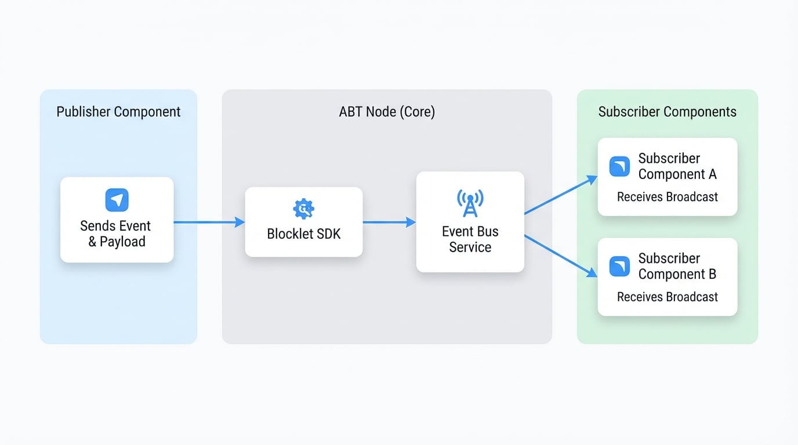

# 事件匯流排

事件匯流排提供了一個強大的發布-訂閱機制，允許您的 blocklet 內部，甚至跨不同 blocklet（在同一個 ABT Node 實例內）的元件以解耦的方式相互通訊。這非常適合用於廣播全系統的狀態變更或事件，而不需要元件之間有直接的依賴關係。

[通知服務](./services-notification-service.md) 是設計用於向使用者發送有針對性的訊息，而事件匯流排則是設計用於內部的、元件對元件的通訊。

### 運作原理

事件匯流排促進了一個非同步通訊流程：

1.  一個 **發布者** 元件發送一個帶有特定名稱和負載的事件。
2.  Blocklet SDK 將此事件發送到在 ABT Node 中運行的中央事件匯流排服務。
3.  事件匯流排服務接著將此事件廣播給所有正在監聽該事件類型的 **訂閱者** 元件。

此過程在下圖中視覺化呈現：

<!-- DIAGRAM_IMAGE_START:architecture:16:9 -->

<!-- DIAGRAM_IMAGE_END -->

## API 參考

### publish

將一個事件發布到事件匯流排，使其對所有已訂閱的監聽器可用。這是一個非同步操作。

#### 參數

<x-field-group>
  <x-field data-name="name" data-type="string" data-required="true">
    <x-field-desc markdown>事件的名稱，例如 `user.created` 或 `order.shipped`。</x-field-desc>
  </x-field>
  <x-field data-name="event" data-type="object" data-required="true">
    <x-field-desc markdown>一個包含事件詳細資訊的物件。</x-field-desc>
    <x-field data-name="id" data-type="string" data-required="false">
        <x-field-desc markdown>事件的唯一 ID。如果未提供，將會自動生成一個。</x-field-desc>
    </x-field>
    <x-field data-name="time" data-type="string" data-required="false">
        <x-field-desc markdown>事件發生時的 ISO 8601 時間戳。預設為當前時間。</x-field-desc>
    </x-field>
    <x-field data-name="data" data-type="object" data-required="true">
        <x-field-desc markdown>事件的主要負載。它可以包含任何可 JSON 序列化的資料。此物件中的 `object_type` 和 `object_id` 欄位將被提升到頂層事件物件中，以便於篩選。</x-field-desc>
    </x-field>
  </x-field>
</x-field-group>

#### 範例

```javascript 發布使用者建立事件 icon=logos:javascript
import eventbus from '@blocklet/sdk/service/eventbus';

async function createUser(userData) {
  // ... 在資料庫中建立使用者的邏輯
  const newUser = { id: 'user_123', name: 'John Doe' };

  try {
    await eventbus.publish('user.created', {
      data: {
        object_type: 'User',
        object_id: newUser.id,
        object: newUser,
        source_system: 'admin_panel',
      },
    });
    console.log('使用者建立事件發布成功。');
  } catch (error) {
    console.error('發布事件失敗：', error);
  }

  return newUser;
}
```

### subscribe

註冊一個回呼函式，以便在從事件匯流排收到事件時執行。請注意，一個元件不會收到它自己發布的事件。

#### 參數

<x-field-group>
  <x-field data-name="cb" data-type="(event: TEvent) => void" data-required="true">
    <x-field-desc markdown>一個回呼函式，當收到事件時，將會以事件物件作為參數來調用它。</x-field-desc>
  </x-field>
</x-field-group>


#### 事件物件結構 (`TEvent`)

回呼函式接收單一參數：事件物件。此物件具有基於 CloudEvents 規範的標準化結構。

<x-field-group>
  <x-field data-name="id" data-type="string" data-required="true" data-desc="事件實例的唯一識別碼。"></x-field>
  <x-field data-name="source" data-type="string" data-required="true">
    <x-field-desc markdown>發布事件的元件的 DID。</x-field-desc>
  </x-field>
  <x-field data-name="type" data-type="string" data-required="true">
    <x-field-desc markdown>事件的名稱（例如 `user.created`）。</x-field-desc>
  </x-field>
  <x-field data-name="time" data-type="string" data-required="true">
    <x-field-desc markdown>事件建立時的 ISO 8601 時間戳。</x-field-desc>
  </x-field>
  <x-field data-name="spec_version" data-type="string" data-required="true" data-desc="CloudEvents 規範版本，例如 '1.0.0'。"></x-field>
  <x-field data-name="object_type" data-type="string" data-required="false">
    <x-field-desc markdown>事件資料中主要物件的類型（例如 `User`）。</x-field-desc>
  </x-field>
  <x-field data-name="object_id" data-type="string" data-required="false">
    <x-field-desc markdown>事件資料中主要物件的 ID。</x-field-desc>
  </x-field>
  <x-field data-name="data" data-type="object" data-required="true">
    <x-field-desc markdown>事件的詳細負載。</x-field-desc>
      <x-field data-name="type" data-type="string" data-desc="資料的內容類型，預設為 'application/json'。"></x-field>
      <x-field data-name="object" data-type="any" data-desc="實際的資料負載。"></x-field>
      <x-field data-name="previous_attributes" data-type="any" data-desc="對於更新事件，這可能包含變更前物件的狀態。"></x-field>
  </x-field>
</x-field-group>

#### 範例

```javascript 訂閱事件 icon=logos:javascript
import eventbus from '@blocklet/sdk/service/eventbus';

const handleEvent = (event) => {
  console.log(`收到類型為 ${event.type} 的事件`);
  console.log('事件詳情：', event);

  if (event.type === 'user.created') {
    console.log(`一個新使用者已建立，ID 為：${event.object_id}`);
    // 更新 UI 或執行其他操作
  }
};

eventbus.subscribe(handleEvent);

console.log('正在從事件匯流排監聽事件...');
```

### unsubscribe

移除先前註冊的事件監聽器。在元件卸載或不再需要監聽事件時調用此函式至關重要，以防止記憶體洩漏。

#### 參數

<x-field-group>
  <x-field data-name="cb" data-type="(event: TEvent) => void" data-required="true">
    <x-field-desc markdown>傳遞給 `subscribe` 的**完全相同**的回呼函式引用。</x-field-desc>
  </x-field>
</x-field-group>

#### 範例

為了正確取消訂閱，您必須保留對原始回呼函式的引用。

```javascript 完整的訂閱生命週期 icon=logos:javascript
import eventbus from '@blocklet/sdk/service/eventbus';

// 1. 定義處理函式
const onUserEvent = (event) => {
  console.log(`收到使用者事件：${event.type}`);
};

// 2. 訂閱事件匯流排
eventbus.subscribe(onUserEvent);
console.log('已訂閱使用者事件。');

// ... 在應用程式生命週期的後期（例如，元件卸載時）

// 3. 使用相同的函式引用取消訂閱
eventbus.unsubscribe(onUserEvent);
console.log('已取消訂閱使用者事件。');
```