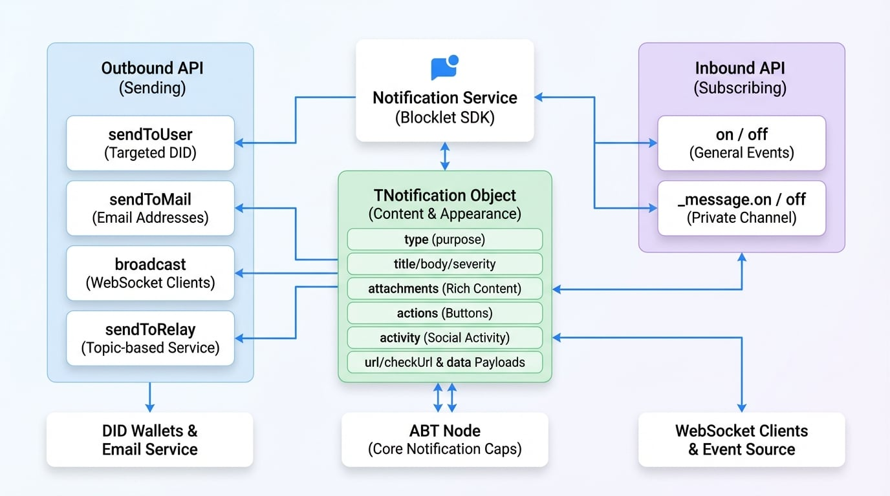

# 通知サービス

通知サービスはBlocklet SDKのコアコンポーネントであり、アプリケーションがさまざまな種類の通知をユーザーに送信したり、リアルタイムイベントを購読したりできるようにします。このサービスは、基盤となるABT Nodeの通知機能へのインターフェースとして機能し、単純なユーザーメッセージから、DID Wallet、メール、その他のチャネルに配信されるリッチでインタラクティブな通知まで、すべてを処理します。

重要なイベントについてユーザーに警告する必要がある場合でも、トランザクションメールを送信する必要がある場合でも、接続されているすべてのクライアントにメッセージをブロードキャストする必要がある場合でも、通知サービスは統一された簡単なAPIを提供します。

<!-- DIAGRAM_IMAGE_START:architecture:16:9 -->

<!-- DIAGRAM_IMAGE_END -->

## APIリファレンス

### sendToUser

DIDによって識別される1人または複数のユーザーに直接通知を送信します。これは、ターゲットを絞ったユーザーコミュニケーションの主要な方法です。

#### パラメータ

<x-field-group>
  <x-field data-name="receiver" data-type="string | string[]" data-required="true">
    <x-field-desc markdown>受信者のDID。単一のDID文字列、DIDの配列、またはblockletの全ユーザーに送信するための `*` を指定できます。</x-field-desc>
  </x-field>
  <x-field data-name="notification" data-type="TNotification | TNotification[]" data-required="true">
    <x-field-desc markdown>送信する通知オブジェクトまたは通知オブジェクトの配列。詳細な構造については、[通知オブジェクト (`TNotification`)](#the-notification-object-tnotification) セクションを参照してください。</x-field-desc>
  </x-field>
  <x-field data-name="options" data-type="TSendOptions" data-required="false">
    <x-field-desc markdown>通知を送信するための追加オプション。</x-field-desc>
    <x-field data-name="keepForOfflineUser" data-type="boolean" data-desc="trueの場合、通知は保存され、ユーザーがオンラインになったときに配信されます。"></x-field>
    <x-field data-name="locale" data-type="string" data-desc="通知のロケール（例：'en'、'zh'）。"></x-field>
    <x-field data-name="channels" data-type="('app' | 'email' | 'push' | 'webhook')[]" data-desc="通知を配信するチャネルを指定します。"></x-field>
    <x-field data-name="ttl" data-type="number" data-desc="メッセージの生存期間（分単位、0-7200）。この時間が経過すると、メッセージは失効します。"></x-field>
    <x-field data-name="allowUnsubscribe" data-type="boolean" data-desc="trueの場合、ユーザーはこのタイプの通知の購読を解除できます。"></x-field>
  </x-field>
</x-field-group>

#### 戻り値

<x-field data-name="Promise<object>" data-type="Promise" data-desc="送信が成功すると、サーバーからのレスポンスオブジェクトで解決されるPromise。"></x-field>

#### 例

```javascript Send a simple notification icon=logos:javascript
import notification from '@blocklet/sdk/service/notification';

async function notifyUser(userDid) {
  try {
    const result = await notification.sendToUser(userDid, {
      type: 'notification',
      title: 'Hello from SDK!',
      body: 'This is a test notification sent to a specific user.',
      severity: 'info',
    });
    console.log('Notification sent successfully:', result);
  } catch (error) {
    console.error('Failed to send notification:', error);
  }
}
```

#### レスポンス例

```json
{
  "status": "ok",
  "message": "1人のユーザーに通知が送信されました。"
}
```

### sendToMail

1人または複数の受信者にメールで通知を送信します。通知オブジェクトの構造は `sendToUser` と同じです。

#### パラメータ

<x-field-group>
  <x-field data-name="receiver" data-type="string | string[]" data-required="true" data-desc="単一のメールアドレスまたはメールアドレスの配列。"></x-field>
  <x-field data-name="notification" data-type="TNotification" data-required="true" data-desc="通知オブジェクト。`title` はメールの件名として使用され、`body` または `attachments` がメールの本文を構成します。"></x-field>
  <x-field data-name="options" data-type="TSendOptions" data-required="false" data-desc="`sendToUser` と同じ送信オプション。"></x-field>
</x-field-group>

#### 戻り値

<x-field data-name="Promise<object>" data-type="Promise" data-desc="サーバーからのレスポンスオブジェクトで解決されるPromise。"></x-field>

#### 例

```javascript Send an email notification icon=logos:javascript
import notification from '@blocklet/sdk/service/notification';

async function emailUser(userEmail) {
  try {
    const result = await notification.sendToMail(userEmail, {
      type: 'notification',
      title: 'Your Weekly Report is Ready',
      body: 'Please log in to your dashboard to view the report.',
    });
    console.log('Email sent successfully:', result);
  } catch (error) {
    console.error('Failed to send email:', error);
  }
}
```

#### レスポンス例

```json
{
  "status": "ok",
  "message": "メールは正常に送信されました。"
}
```

### broadcast

特定のWebSocketチャネルに接続されているクライアントにメッセージをブロードキャストします。デフォルトでは、blockletのパブリックチャネルに送信します。

#### パラメータ

<x-field-group>
  <x-field data-name="notification" data-type="TNotificationInput" data-required="true" data-desc="ブロードキャストする通知オブジェクト。"></x-field>
  <x-field data-name="options" data-type="object" data-required="false">
    <x-field-desc markdown>ブロードキャストを制御するためのオプション。</x-field-desc>
    <x-field data-name="channel" data-type="string">
      <x-field-desc markdown>ブロードキャストするチャネル。デフォルトはblockletのパブリックチャネルで、`getAppPublicChannel(did)` で取得できます。</x-field-desc>
    </x-field>
    <x-field data-name="event" data-type="string" data-default="message" data-desc="クライアント側で発行するイベント名。"></x-field>
    <x-field data-name="socketId" data-type="string" data-desc="指定された場合、この特定のソケット接続にのみメッセージを送信します。"></x-field>
    <x-field data-name="userDid" data-type="string" data-desc="指定された場合、このDIDで認証されたソケットにのみメッセージを送信します。"></x-field>
  </x-field>
</x-field-group>

#### 戻り値

<x-field data-name="Promise<object>" data-type="Promise" data-desc="サーバーのレスポンスで解決されるPromise。"></x-field>

#### 例

```javascript Broadcast a message icon=logos:javascript
import notification from '@blocklet/sdk/service/notification';

function broadcastUpdate() {
  notification.broadcast(
    {
      type: 'passthrough',
      passthroughType: 'system_update',
      data: { message: 'A new version is available. Please refresh.' },
    },
    { event: 'system-update' }
  );
}
```

#### レスポンス例

```json
{
  "status": "ok",
  "message": "ブロードキャストが送信されました。"
}
```

### sendToRelay

リレーサービスを介して特定のトピックにメッセージを送信し、異なるコンポーネント間、あるいは異なるblocklet間でのリアルタイムなトピックベースの通信を可能にします。

#### パラメータ

<x-field-group>
  <x-field data-name="topic" data-type="string" data-required="true" data-desc="イベントを公開するトピック。"></x-field>
  <x-field data-name="event" data-type="string" data-required="true" data-desc="送信されるイベントの名前。"></x-field>
  <x-field data-name="data" data-type="any" data-required="true" data-desc="イベントのペイロードデータ。"></x-field>
</x-field-group>

#### 戻り値

<x-field data-name="Promise<object>" data-type="Promise" data-desc="サーバーのレスポンスで解決されるPromise。"></x-field>

#### 例

```javascript Send a relay message icon=logos:javascript
import notification from '@blocklet/sdk/service/notification';

async function publishNewArticle(article) {
  try {
    await notification.sendToRelay('articles', 'new-published', {
      id: article.id,
      title: article.title,
    });
    console.log('Relay message sent.');
  } catch (error) {
    console.error('Failed to send relay message:', error);
  }
}
```

#### レスポンス例

```json
{
  "status": "ok",
  "message": "リレーメッセージが送信されました。"
}
```

### on

ABT Nodeからプッシュされる、内部blockletイベントやチーム関連イベントなどの一般的なイベントを購読します。通知サービスはこの機能のために `EventEmitter` インターフェースを使用します。

#### パラメータ

<x-field-group>
  <x-field data-name="event" data-type="string" data-required="true" data-desc="リッスンするイベントの名前。"></x-field>
  <x-field data-name="callback" data-type="Function" data-required="true" data-desc="イベントが発行されたときに実行する関数。"></x-field>
</x-field-group>

#### 例

```javascript Listen for team member removal icon=logos:javascript
import notification from '@blocklet/sdk/service/notification';
import { TeamEvents } from '@blocklet/constant';

function onMemberRemoved(data) {
  console.log('Team member removed:', data.user.did);
  // アプリケーションの状態を更新するロジックを追加
}

// イベントを購読
notification.on(TeamEvents.MEMBER_REMOVED, onMemberRemoved);
```

### off

`on` で以前に追加されたイベントリスナーを削除します。

#### パラメータ

<x-field-group>
  <x-field data-name="event" data-type="string" data-required="true" data-desc="リッスンを停止するイベントの名前。"></x-field>
  <x-field data-name="callback" data-type="Function" data-required="true" data-desc="削除する特定のリスナー関数。"></x-field>
</x-field-group>

#### 例

```javascript
// 前の例の購読を解除するには
// notification.off(TeamEvents.MEMBER_REMOVED, onMemberRemoved);
```

### _message.on

これは、blockletのプライベートメッセージチャネルに直接送信されるメッセージ専用の特殊なリスナーです。blocklet自体を対象とした直接の応答やコマンドを処理するのに役立ちます。

#### パラメータ

<x-field-group>
  <x-field data-name="event" data-type="string" data-required="true" data-desc="リッスンする受信メッセージの `type`。"></x-field>
  <x-field data-name="callback" data-type="Function" data-required="true" data-desc="指定されたタイプのメッセージが受信されたときに実行する関数。"></x-field>
</x-field-group>

#### 例

```javascript Listen for direct messages icon=logos:javascript
import notification from '@blocklet/sdk/service/notification';

function handleDirectMessage(response) {
  console.log('Received direct message:', response);
}

// messageChannelからの'message'イベントは、response.typeをイベント名として発行されます
// 例：response.typeが'payment_confirmation'の場合、ここでのイベントは'payment_confirmation'です
notification._message.on('payment_confirmation', handleDirectMessage);
```

### _message.off

`_message.on` で追加されたダイレクトメッセージリスナーを削除します。

#### パラメータ

<x-field-group>
  <x-field data-name="event" data-type="string" data-required="true" data-desc="リッスンを停止するメッセージタイプ。"></x-field>
  <x-field data-name="callback" data-type="Function" data-required="true" data-desc="削除する特定のリスナー関数。"></x-field>
</x-field-group>

## 通知オブジェクト (`TNotification`)

通知オブジェクトは、通知のコンテンツと外観を定義する柔軟なデータ構造です。その構造は、さまざまなユースケースに合わせてカスタマイズできます。

<x-field-group>
  <x-field data-name="type" data-type="'notification' | 'connect' | 'feed' | 'hi' | 'passthrough'" data-required="true">
    <x-field-desc markdown>通知の主要なタイプで、その全体的な目的と構造を決定します。</x-field-desc>
  </x-field>
  <x-field data-name="title" data-type="string" data-desc="通知のタイトル。`notification` タイプで使用されます。"></x-field>
  <x-field data-name="body" data-type="string" data-desc="通知の主要なコンテンツ/本文。`notification` タイプで使用されます。"></x-field>
  <x-field data-name="severity" data-type="'normal' | 'success' | 'error' | 'warning'" data-desc="重要度レベル。ウォレットでの通知の外観に影響を与える可能性があります。`notification` タイプで使用されます。"></x-field>
  <x-field data-name="attachments" data-type="TNotificationAttachment[]">
    <x-field-desc markdown>リッチコンテンツの添付ファイルの配列。これらはDID Wallet内でブロックとしてレンダリングされます。</x-field-desc>
    <x-field data-name="type" data-type="string" data-required="true">
      <x-field-desc markdown>添付ファイルのタイプ。`asset`、`vc`、`token`、`text`、`image`、`divider`、`transaction`、`dapp`、`link`、または `section` を指定できます。</x-field-desc>
    </x-field>
    <x-field data-name="data" data-type="object">
      <x-field-desc markdown>添付ファイルのデータペイロード。タイプによって異なります（例：`text` タイプの添付ファイルには `text` プロパティがあります）。</x-field-desc>
    </x-field>
  </x-field>
  <x-field data-name="actions" data-type="TNotificationAction[]">
    <x-field-desc markdown>通知と共に表示されるアクションボタンの配列。</x-field-desc>
    <x-field data-name="name" data-type="string" data-required="true" data-desc="アクションの識別子。"></x-field>
    <x-field data-name="title" data-type="string" data-desc="ボタンに表示されるテキスト。"></x-field>
    <x-field data-name="link" data-type="string" data-desc="ボタンがクリックされたときに開くURL。"></x-field>
  </x-field>
  <x-field data-name="activity" data-type="TNotificationActivity">
    <x-field-desc markdown>コメントやフォローなどのソーシャルアクティビティを記述するオブジェクト。これは、ソーシャルインタラクションを構造化された方法で表現する方法です。</x-field-desc>
    <x-field data-name="type" data-type="'comment' | 'like' | 'follow' | 'tips' | 'mention' | 'assign' | 'un_assign'" data-required="true" data-desc="アクティビティのタイプ。"></x-field>
    <x-field data-name="actor" data-type="string" data-required="true" data-desc="アクションを実行したユーザーのDID。"></x-field>
    <x-field data-name="target" data-type="TActivityTarget" data-required="true" data-desc="アクションが実行されたオブジェクト（例：ブログ投稿）。"></x-field>
  </x-field>
  <x-field data-name="url" data-type="string" data-desc="`connect` タイプで必須。DID ConnectセッションのURL。"></x-field>
  <x-field data-name="checkUrl" data-type="string" data-desc="`connect` タイプで任意。セッションステータスを確認するためのURL。"></x-field>
  <x-field data-name="feedType" data-type="string" data-desc="`feed` タイプで必須。フィードのタイプを識別する文字列。"></x-field>
  <x-field data-name="passthroughType" data-type="string" data-desc="`passthrough` タイプで必須。パススルーデータのタイプを識別する文字列。"></x-field>
  <x-field data-name="data" data-type="object" data-desc="`feed` および `passthrough` タイプで必須。これらのタイプのデータペイロード。"></x-field>
</x-field-group>