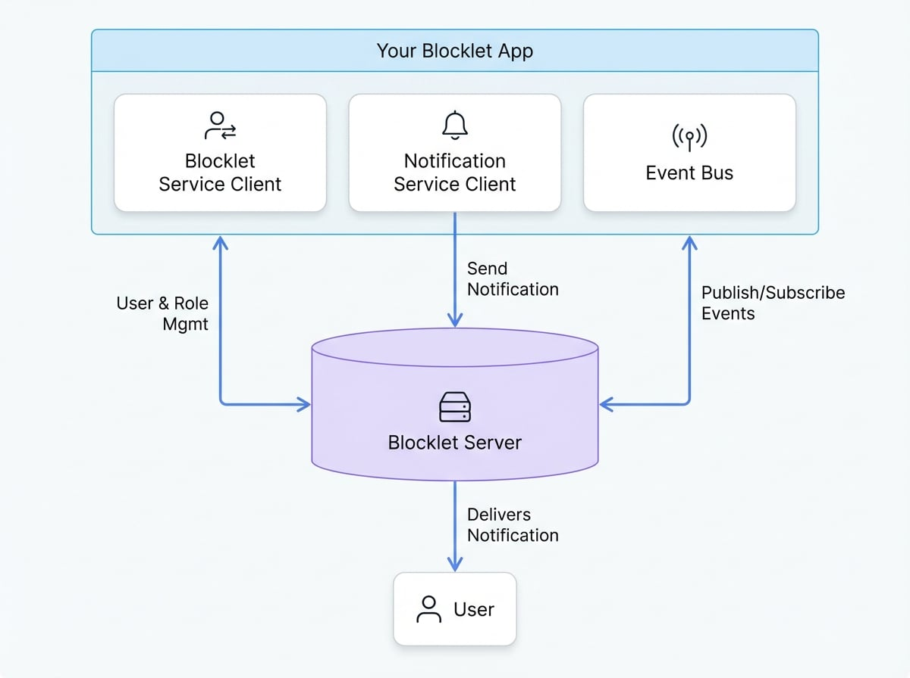

# 服务

Blocklet SDK 提供了一套强大的服务客户端，从而简化了直接 API 调用的复杂性。这些客户端提供了一个清晰的编程接口，用于与核心 Blocklet 功能进行交互，例如用户管理、实时通知和组件间事件处理。通过使用这些服务，您可以用更少的代码构建更健壮、功能更丰富的应用程序。

这些服务充当您的应用程序和底层 Blocklet Server 之间的桥梁，为您处理身份验证、请求格式化和错误处理。

<!-- DIAGRAM_IMAGE_START:architecture:4:3 -->

<!-- DIAGRAM_IMAGE_END -->

探索 SDK 提供的核心服务：

<x-cards data-columns="3">
  <x-card data-title="Blocklet 服务" data-icon="lucide:user-cog" data-href="/services/blocklet-service">
    以编程方式管理用户、角色、权限和访问密钥。它还提供了检索 Blocklet 元数据和组件信息的方法。
  </x-card>
  <x-card data-title="通知服务" data-icon="lucide:bell-ring" data-href="/services/notification-service">
    通过发送实时通知和处理传入消息与您的用户互动。支持直接向用户发送消息和公共频道广播。
  </x-card>
  <x-card data-title="事件总线" data-icon="lucide:bus-front" data-href="/services/event-bus">
    实现事件驱动的架构。发布自定义事件并订阅来自其他组件的事件，从而实现解耦、可扩展的通信。
  </x-card>
</x-cards>

这些服务是构建交互式和集成式 Blocklet 应用程序的支柱。请深入每个服务的专属部分，以了解其全部功能并查看实际示例。

---

接下来，让我们探索如何使用 [Blocklet 服务](./services-blocklet-service.md) 来管理应用程序的用户和设置。