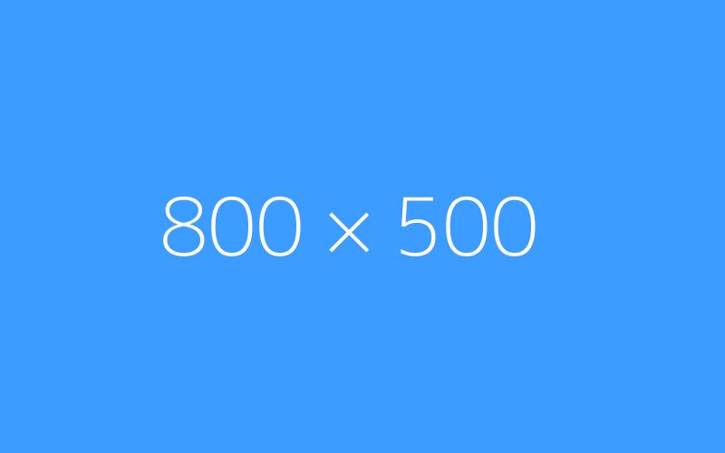

## html

  
  <h3>Virtual whiteboard for sketching hand-drawn like diagrams. Collaborative and end-to-end encrypted.</h3>
  

    
    
  

  
Ask questions or hang out on our <a target="_blank" href="https://discord.gg/UexuTaE">discord.gg/UexuTaE</a>.

## task list

- [ ] One
- [X] Two
- [ ] Three
- [X] Four

## 链接

- 本地链接

  [index.html](./index.html)
  [index.html](index.html)
  [锚点](#图片)

- 远程链接

  [https://github.com/skypesky/leetcode-for-javascript/edit/master/README.md](https://github.com/skypesky/leetcode-for-javascript/edit/master/README.md)
  [https://github.com/skypesky/leetcode-for-javascript/edit/master/README.md#带锚点](https://github.com/skypesky/leetcode-for-javascript/edit/master/README.md#带锚点)
  [https://github.com/skypesky/leetcode-for-javascript/edit/master/README.md?q=233](https://github.com/skypesky/leetcode-for-javascript/edit/master/README.md?q=233)

## 图片

- 本地图片

  

- 远程图片

  

## 视频

- 本地视频

  <video controls height='100%' width='100%' src="./public/videos/joke.mp4"></video>
  

- 远程视频

  <video controls height='100%' width='100%' src="https://encooacademy.oss-cn-shanghai.aliyuncs.com/activity/OpenBrowser.mp4"></video>
  <iframe src="//player.bilibili.com/player.html?aid=540082845&bvid=BV1mi4y1b76M&cid=172799113&page=1" scrolling="no" border="0" frameborder="no" framespacing="0" allowfullscreen="true"> </iframe>
  <iframe src="://player.bilibili.com/player.html?aid=540082845&bvid=BV1mi4y1b76M&cid=172799113&page=1" scrolling="no" border="0" frameborder="no" framespacing="0" allowfullscreen="true"> </iframe>

## Table of Contents

- [Launch on Blocklet Server](#launch-on-blocklet-server)
- [Visuals](#visuals)
- [Development](#development)
- [Requirement](#requirement)
  - [Clone and install dependencies](#clone-and-install-dependencies)
  - [Configuration](#configuration)
  - [Start debug](#start-debug)
  - [Deploy to local Blocklet Server](#deploy-to-local-blocklet-server)
- [License](#license)

